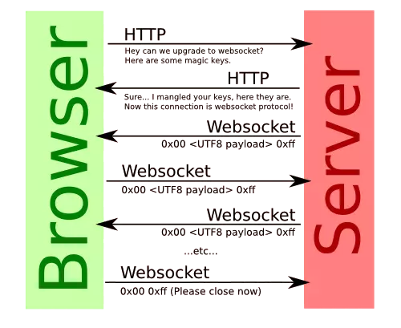
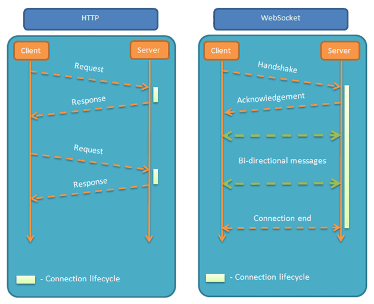

<h1 style="color:orange">Socket</h1>
<h2 style="color:orange">1. socket là gì?</h2>
 Socket là điểm cuối end-point tại liên kết truyền thông 2 chiều (two-way communication) và biểu diễn kết nối giữa Server – Client (Ví dụ client là 1 socket, server là 1 socket). Những lớp Socket hiện đang ràng buộc với 1 cổng port (thể hiện là 1 con số cụ thể) để những tầng TCP (hay TCP Layer) hoàn toàn có thể định danh được ứng dụng mà dữ liệu gửi đến.

 Gọi là socket vì nó đi theo cặp như 2 đầu của một ổ cắm vậy. Sử dụng socket để mở kết nối giữa client và server.Nếu không sử dụng socket, ta vẫn có một cách khác để cập nhật dữ liệu đó là liên tục gửi/nhận các request/response trong một khoảng thời gian nhất định, ví dụ cứ sau mỗi 2s ta lại cho ứng dụng check api xem dữ liệu có gì thay đổi không, nếu có thì cập nhật vào ứng dụng. Tuy nhiên các xử lí này khá là "ngáo" vì nó gây mệt cho cả chính client và server.

 Socket hoạt động ở tầng 4 của mô hình OSI (Transport layer)

 Như chúng ta đã biết thì có những port được server service quy định dùng cho các dịch vụ quy định (Assigned Numbers Authority). (Port 80 dùng cho giao thức HTTP, 20 dùng cho FTP, 22 dùng cho SSH, 25 dùng cho SMTP, ...ect).

Quá trình khởi tạo kết nối tới Gmail sẽ diễn ra như sau:

- Client có địa chỉ IP1 đang có port 5000 rảnh dỗi và quyết định sử dụng cặp (IP, Port) = (IP1, 5000) để kết nối tới web server có địa chỉ IP2 và port 80 (để chạy giao thức HTTP => lấy về giao diện trang web)
- Sau khi client được server xác thực thành công và đã có đủ thông tin cần thiết, nó sẽ mở cổng số 25 cho địa chỉ IP2. Lưu ý là client không hề gửi request đi mà chỉ mở port 25 cho web server.
- Khi có email mới, server sẽ kiểm tra xem kết nối tới (IP1, 25) có còn sống hay không, nếu có thì nó sẽ gửi thông báo về cho client.
<h3 style="color:orange">1.1. Cơ chế hoạt động socket</h3>
Hiện tại, chức năng chính của socket là kết nối giữa client và server thông qua UDP, TCP/IP để có thể truyền cũng như nhận dữ liệu thông qua internet.

Hiện tại giao diện của lập trình ứng dụng mạng chỉ có thể hoạt động nếu như đã có những thông tin liên quan tới thông số IP cũng như port của hai ứng dụng cần phải trao đổi dữ liệu.

Như vậy hai ứng dụng đang cần truyền thông tin bắt buộc phải đáp ứng được những điều kiện cơ bản sau đây thì socket mới hoạt động, cụ thể:

Hai ứng dụng hoàn toàn có thể nằm cùng trên một máy hay hai máy khác nhau.
Đối với trường hợp nếu như hai ứng dụng cùng trên một máy thì hiệu số cổng bắt buộc không được trùng với nhau.
<h3 style="color:orange">1.2. Các loại hình socket cơ bản</h3>

- `Stream socket` hay còn được biết tới với một tên gọi khá quen thuộc thuộc đó chính là Socket hướng kết nối, là Socket hoạt động qua giao thức Transmission Control Protocol (TCP).  
Hiện tại Stream Socket chỉ có thể hoạt động nếu như client và server đã kết nối cùng với nhau. Ngoài ra ngược lại thì đây cũng chính là định nghĩa dành cho câu hỏi sau: “Giao thức TCP là gì?” 
Đây chính là Socket hoạt động qua giao thức Transmission Control Protocol (TCP)

- `Datagram Socket` còn được biết tới với một tên gọi khác đó chính là một Socket không hướng kết nối. Theo đó đây là Socket hoạt động qua giao thức User Datagram Protocol (UDP).  
Nó hoàn toàn có thể hoạt động tốt nhất ngay cả khi không có thiết lập kết nối của hai máy với nhau. Như vậy nói cách khác thì đây cũng là định nghĩa dành cho câu hỏi là: “Giao thức UDP là gì?” 
Datagram Socket là gì? Đây là định nghĩa dành cho câu hỏi là: “Giao thức UDP là gì?”

- `Unix socket` đây chính là một điểm giao tiếp hỗ trợ thực hiện trao đổi giữa những ứng dụng khác nhau `trên cùng một` máy tính. Tất cả mọi hoạt động sẽ được diễn ra ngay tại nhân hệ điều hành. Chính vì vậy mà tốc độ truyền tải cũng như kết nối giữa những ứng dụng sẽ trở nên hiệu quả, nhanh và nhẹ hơn rất nhiều. 
Hiện tại Unix socket hoàn toàn có thể tránh được những bước kiểm tra hay routing. Do đó mà quá trình truyền tin cũng sẽ dễ dàng và đảm bảo hơn. Đối với trường hợp nhận ứng dụng nằm trên các máy chủ khác nhau thì sẽ không thể nào kết nối nhờ vào Unix socket. 
Hiện tại Unix socket hoàn toàn có thể tránh được những bước kiểm tra hay routing.
- `Websocket`:
<h2 style="color:orange">2. Websocket</h2>

WebSocket hay Web Socket là một giao thức truyền tải được sử dụng trong giao tiếp máy trạm và máy chủ hay client-server. Giao thức WebSocket ra đời nhằm mục đích khắc phục nhược điểm độ trễ khá cao của `HTTP – HyperText Transfer Protocol` – Giao thức truyền tải siêu văn bản.

 
<h3 style="color:orange">2.1. Websocket có công dụng gì</h3>

- WebSocket là một phương thức giúp máy trạm và máy chủ có thể giao tiếp thời gian thực 2 chiều với nhau.
- Khả năng giảm độ trễ của mạng đến mức tối đa và vượt trội hơn HTTP. Nếu bạn phát triển các ứng dụng thời gian thực như: sàn tiền ảo, Game, chat hay video call,… sử dụng WebSocket sẽ mang lại trải nghiệm tối ưu nhất cho người dùng.
- Khả năng giảm kích thước header HTTP lên đến 1000 lần! Nếu một request HTTP có header nặng 871 byte, khi sử dụng WebSocket, khối lượng header của request chỉ còn 2 byte.
<h3 style="color:orange">2.2. HTTP là gì</h3>
HTTP là giao thức truyền tải một chiều. Trong giao thức này, máy khách sẽ gửi yêu cầu và máy chủ gửi phản hồi ngược lại.

Ví dụ, khi người dùng gửi 1 yêu cầu đến máy chủ theo dạng HTTP hoặc HTTPS (HTTP có mức độ bảo mật cao hơn). Sau khi nhận được yêu cầu, máy chủ sẽ gửi phản hồi ngược lại cho máy khách. Khi thực hiện phản hồi xong, kết nối sẽ bị đóng lại.

Vì vậy, mỗi lần gửi yêu cầu HTTP sẽ tạo một kết nối mới giữa máy chủ và máy khách.
<h2 style="color:orange">3. So sánh Websocket và HTTP</h2>
Ưu điểm:

- Đây là một công nghệ được phát triển nhằm mục đích khắc phục độ trễ của HTTP. Vì vậy, WebSocket có độ trễ thấp.
- Hỗ trợ giảm header xuống mức tối đa
- Truyền và nhận dữ liệu trực tiếp, không cần thông qua các tầng bổ sung.
Nhược điểm:
- Truyền tải dữ liệu bằng WebSocket sẽ có thể phát sinh một số lỗi
- WebSocket còn mới, chưa thể tương thích với toàn bộ các trình duyệt web. 

 
Điểm giống nhau là cả WebSocket và HTTP đều là những giao thức hỗ trợ việc truyền tải thông tin giữa máy chủ và máy trạm. Mục đích của các nhà phát triển khi tạo ra WebSocket là nhằm để khắc phục được nhược điểm độ trễ cao của HTTP. Đều sử dụng giao thức TCP.

Điểm khác biệt lớn nhất được liên tục được nhắc trong bài đó chính là WebSocket có tốc độ truyền tải nhanh và độ trễ thấp hơn nhiều so với HTTP.

Như bên trên ảnh, bạn sẽ thấy ngay được điểm khác biệt giữa WebSocket và HTTP chính là sự giao tiếp giữa máy chủ và máy khách.

HTTP là giao thức 1 chiều dựa theo giao thức TCP, bạn có thể tạo ra các kết nối dựa vào request HTTP, sau khi kết nối được thực hiện xong và được phản hồi lại, quá trình sẽ kết thúc và đóng lại.

Trong khi đó, WebSocket là một giao thức truyền tải 2 chiều giữa máy chủ và máy khách. Dữ liệu có thể truyền 2 chiều giữa máy khách – máy chủ hoặc máy chủ – máy khách dựa trên những kết nối đã được thiết lập.
<h2 style="color:orange">4. Ứng dụng</h2>
HTTP là giao thức 1 chiều dựa theo giao thức TCP, bạn có thể tạo ra các kết nối dựa vào request HTTP, sau khi kết nối được thực hiện xong và được phản hồi lại, quá trình sẽ kết thúc và đóng lại.

Trong khi đó, WebSocket là một giao thức truyền tải 2 chiều giữa máy chủ và máy khách. Dữ liệu có thể truyền 2 chiều giữa máy khách – máy chủ hoặc máy chủ – máy khách dựa trên những kết nối đã được thiết lập.

Hầu hết các ứng dụng theo thời gian thực – real-time đều đang ứng dụng WebSocket để truyền và nhận dữ liệu trên 1 kênh liên lạc duy nhất.

Trong khi đó, HTTP được ứng dụng và sử dụng vào các dịch vụ ứng dụng RESTful đơn giản, chủ yếu là nhận thông tin 1 chiều về server để xử lý => phản hồi => đóng kết nối.

Đối với các ứng dụng cần phải thường xuyên hoặc liên tục cập nhật thông tin, WebSocket sẽ là ưu tiên hàng đầu vì WebSocket có kết nối nhanh hơn, độ trễ thấp hơn so với HTTP.

Khi bạn muốn giữ lại một kết nối trong khoảng thời gian cụ thể hoặc bạn chỉ có nhu cầu sử dụng kết nối để truyền dữ liệu, HTTP sẽ chính là lựa chọn ưu tiên hơn dành cho bạn.

Có thể nói rằng, WebSocket là một công nghệ “xịn” có độ trễ rất thấp và phù hợp cho những dự án, những tác vụ cần phải nhanh ví dụ như:
- Ứng dụng theo thời gian thực
- Game Online
- Ứng dụng chat
<h2 style="color:orange">4.1 Ứng dụng chat</h2>
Với các ứng dụng chat, nhắn tin, độ trễ sẽ không cần thiết phải tối ưu hoá tốt nhất trong thời gian thực. Tuy nhiên, những ứng dụng nhắn tin, chat luôn có một độ trễ nhất định có thể chấp nhận được. 

`WebSocket có phải là phiên bản thay thế cho HTTP hay không?` 
Không, bạn có thể hiểu WebSocket là một phần mở rộng cho HTTP. Trong thực tế, WebSocket sẽ sử dụng cho các ứng dụng được xây dựng bằng JavaScript và cần phải cập nhật dữ liệu liên tục theo thời gian thực. Ví dụ thực tế như các game online.