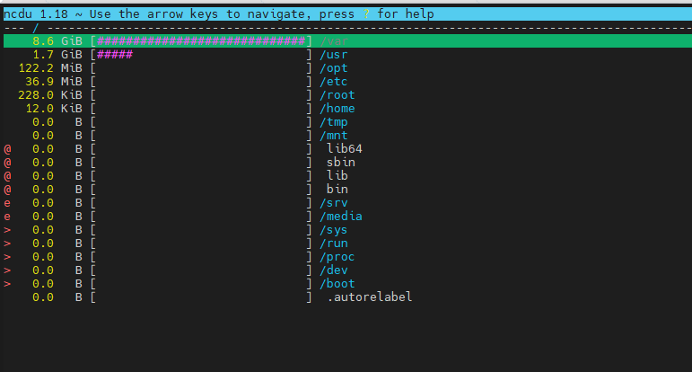

<h1 style="color:orange">Mấy lưu ý hay hay</h1>
<h2 style="color:orange">2. Tìm file chiếm nhiều ổ cứng nhất</h2>
Tìm lệnh phân vùng nào đang chiếm nhiều tài nguyên ổ cứng

    $ ncdu -x /phân vùng cần tìm
    vd: $ ncdu -x /         #tìm trong phân vùng root
 
Trong hình thì có thể thấy phân vùng /var đang chiếm nhiều disk nhất 

Tiếp theo tìm top 10 file có dung lượng lớn nhất

    $ du -ah <directory_path> | sort -rh | head -n <number_of_files>
    VD:
    $ du -ah /var/log | sort -rh | head -n 10