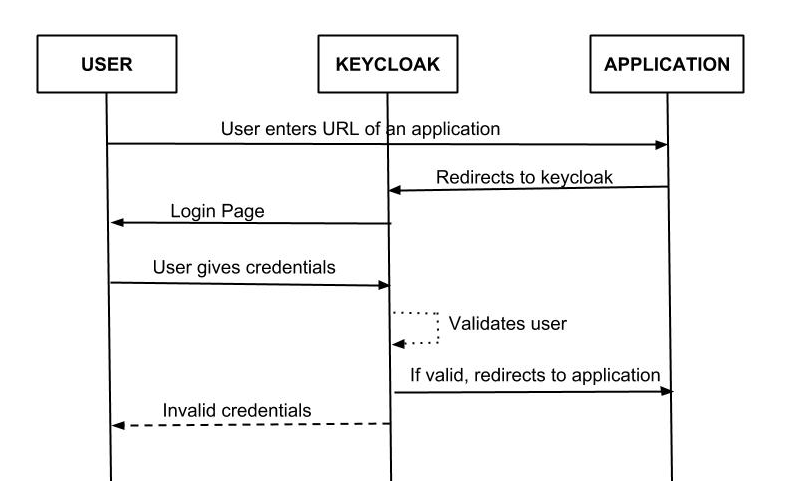
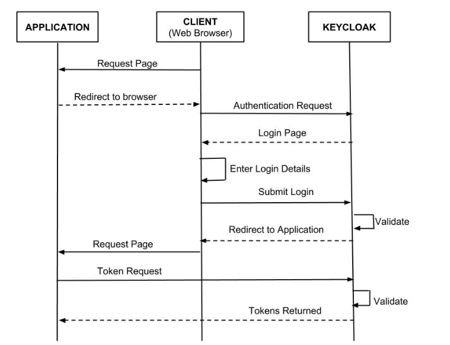
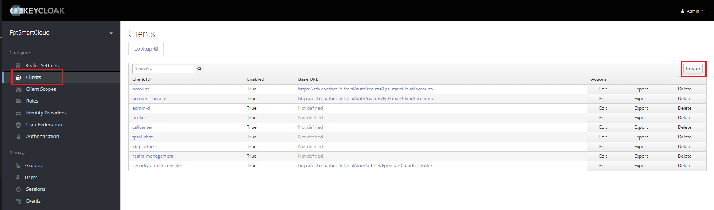
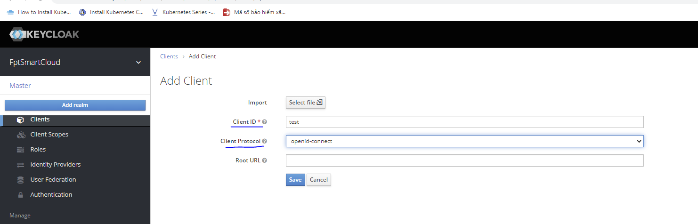
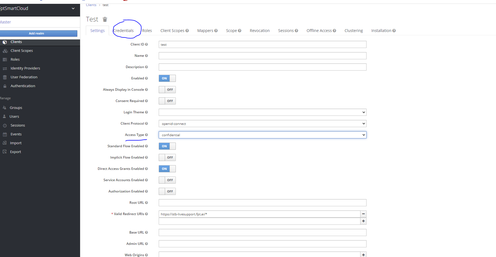
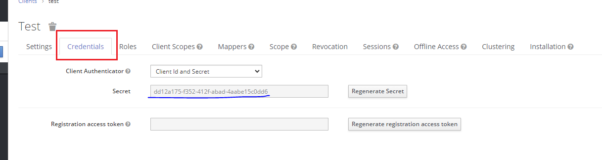
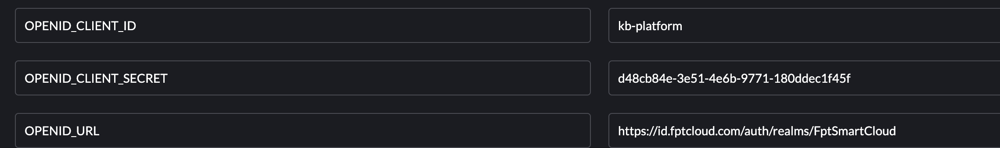

<h1 style="color:orange">Keycloak concept</h1>
Keycloak là hệ thống quản lý xác thực và ủy quyền mã nguồn mở, được phát triển bởi Red Hat (2013). Nó cung cấp các tính năng như Single Sign-On (SSO), quản lý người dùng và vai trò, quản lý phiên, cung cấp dịch vụ OAuth 2.0 và OpenID Connect, và nhiều tính năng khác liên quan đến bảo mật và xác thực.

Keycloak được sử dụng để xây dựng và quản lý hệ thống xác thực phức tạp, cho phép người dùng đăng nhập và truy cập vào các ứng dụng và dịch vụ một cách an toàn và tiện lợi. Nó hỗ trợ nhiều giao thức xác thực như OAuth 2.0, OpenID Connect, SAML và LDAP, giúp tích hợp và quản lý người dùng từ nhiều nguồn khác nhau.
<h2 style="color:orange">1. Keycloak hoạt động ntn?</h2>
<h3 style="color:orange">1.1. Keycloak auth2.0</h3>

 
- User truy cập browser application -> user sẽ được redirect đến authentication page của keycloak. Sau khi nhập user và pass, keycloak redirect user về application với code valid trong 1 thời gian ngắn.
- Application dùng code này để giao tiếp với keycloak với application ID và application secret, keycloak trả lời với access token, ID token và refresh token. Application sẽ chỉ cần 1 trong nhũng token này để check user, nếu user valid thì sẽ được truy cập.
<h3 style="color:orange">1.2. Keycloak OpenID connect (OIDC)</h3>
OIDC là phương thức authen là bản mở rộng của OAuth 2.0, là bản hoàn thiện hơn:

- User(client) truy cập application. Application nhận thấy user chưa truy cập -> redirect user đến keycloak để được authen. Application truyền 1 call-back URL như 1 query parameter mà keycloak sẽ dùng để hoàn thành authen.
- Keycloak authen user rồi tạo ra 1 code tạm thời, ngắn hạn. Keycloak redirect trở lại application sử dụng call-back URL được cung cấp trước đó và thêm vào code tạm thời.

(Đoạn này ko biết dịch)
The application extracts the temporary code and makes a background out of band REST invocation to keycloak to exchange the code for an identity, access and refresh token. Once this temporary code has been used to obtain the tokens, it can never be used again. This prevents potential replay attacks.

 
<h3 style="color:orange">1.3. Cấu hình application sử dụng keycloak để authen</h3>
Trên keycloak vào 1 realm bất kì. VD: FptSmartCloud -> client -> create

 

Nhập Client ID, CLient Protocol để openid-connect
 

Chỉnh `Access-Type` thành `confidential` sẽ hiện phần ` Credentials` để config.
 

Lưu ý: trong phần `Valid Redirect URIs` phải cấu hình domain của application để keycloak nhận diện. (Bước này DNS của keycloak phải nhận diện được các domain này).
 
`Valid Redirect URIs` là phần owner keycloak khai báo xem những trusted domain nào có thể redirect đến keycloak. Để tránh TH những app với domain ko có trong danh sách cũng redirect đến keycloak.

Sang phần credentials để lấy `Client_secret`
 

Để cấu hình application có thể redirect authen tới keycloak. Trên app có phần cấu hình. VD:

 
- Ở đây client_ID là đã nhập ở trên là test
- Client secret trong phần credential
- openid_url là API của keycloak đến realm: 

       {{server}}/auth/realms/{{realm}}/
Ví dụ: https://stb-chatbot-id.fpt.ai/auth/realms/FptSmartCloud
