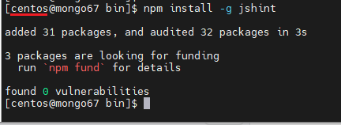

<h1 style="color:orange">Install npm package</h1>
<h2 style="color:orange">1. Prerequisite</h2>
Để cài npm package trên centos, cần nodejs và npm. Cài đặt;

    # yum install -y gcc-c++ make
    # curl -sL https://rpm.nodesource.com/setup_16.x | sudo -E bash -
Lưu ý: nodejs version 18 không cài được trên centos7. Nếu đã nhỡ cài repo của nodejs18:

    # curl -sL https://rpm.nodesource.com/setup_18.x | sudo -E bash - 
    Undo bằng lệnh
    # yum clean all
Tiếp tục cài nodejs:

    # sudo yum install nodejs 
Kiểm tra

    # node -v
    v16.20.0
    # npm -v
    8.19.4
<h2 style="color:orange">2. Cài đặt npm cho user khác root</h2>

Tham khảo: https://docs.npmjs.com/resolving-eacces-permissions-errors-when-installing-packages-globally 
Trên thư mục home của user khác root

    # mkdir ~/.npm-global
    # npm config set prefix '~/.npm-global'
Thêm dòng sau vào profile user:

    # vim ~/.bashrc
    thêm vào
    export PATH=~/.npm-global/bin:$PATH
    # bash
Kiểm tra:

    # npm install -g jshint
 
<h2 style="color:orange">3. Install trên ubuntu</h2>

    # curl -sL https://deb.nodesource.com/setup_18.x | sudo -E bash -
    # sudo apt-get install -y nodejs
Để uninstall

    # sudo apt-get purge nodejs npm
    # sudo apt-get autoremove