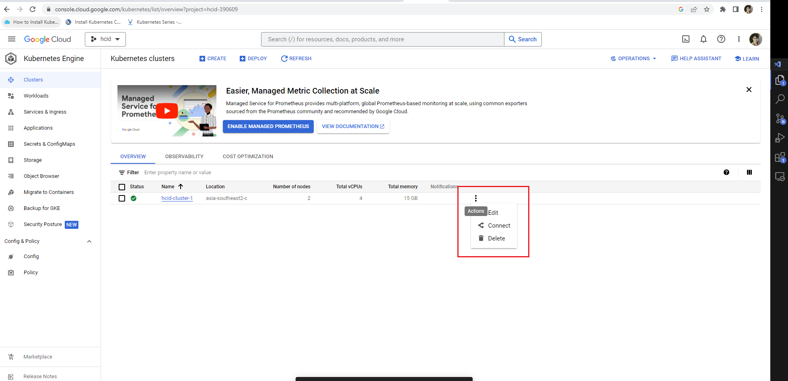

<h1 style="color:orange">Truy cập cụm gcloud</h1>

Cài gcloud CLI để kết nối đến Gcloud. Tham khảo link: https://cloud.google.com/sdk/docs/install
<h2 style="color:orange">1. Cấu hình gcloud</h2>

 
Để thay đổi cấu hình gcloud, sử dụng gcloud set config.
<h2 style="color:orange">2. Sử dụng gcloud</h2>

1. Để sử dụng gcloud đầu tiên phải tạo VPC network cho project của mình trước.

 
2. Sau đó tạo Bastion để có thể kết nối đến các host trong cùng VPC: 
https://cloud.google.com/compute/docs/connect/ssh-using-bastion-host

3. Tạo các VM. Những câu lệnh tương tác với VM

       # gcloud compute instances list
       # gcloud compute instances start/stop VM1 VM2 VM3
4. Tạo k8s cluster: https://cloud.google.com/kubernetes-engine/docs/how-to/private-clusters

Câu lệnh thao tác với k8s cluster, resize VM theo nhu cầu (ví dụ ở dưới là 3 node):

    # gcloud container clusters resize hcid-cluster-1 --node-pool default-pool --num-nodes 3 --location asia-southeast2-c
5. Tạo registry trên gcloud: https://cloud.google.com/artifact-registry/docs/repositories/create-repos
<h2 style="color:orange">2.1. Kết nối với cụm k8s</h2>

 
 
Để connect tới cụm k8s (yêu cầu cài SDK trước). Ví dụ: 
 
Config sẽ được tạo trực tiếp vào config của kubectl, chứ không phải dưới dạng file kubeconfig.

    # kubectl config view
Để unset effect của câu lệnh kết nối đến k8s cluster gcloud:

    # kubectl config unset users.<user_name>
    # kubectl config unset contexts.<context_name>
    # kubectl config unset clusters.<cluster_name>
Để lấy file kubeconfig của current context-view:

    # kubectl config view --minify
