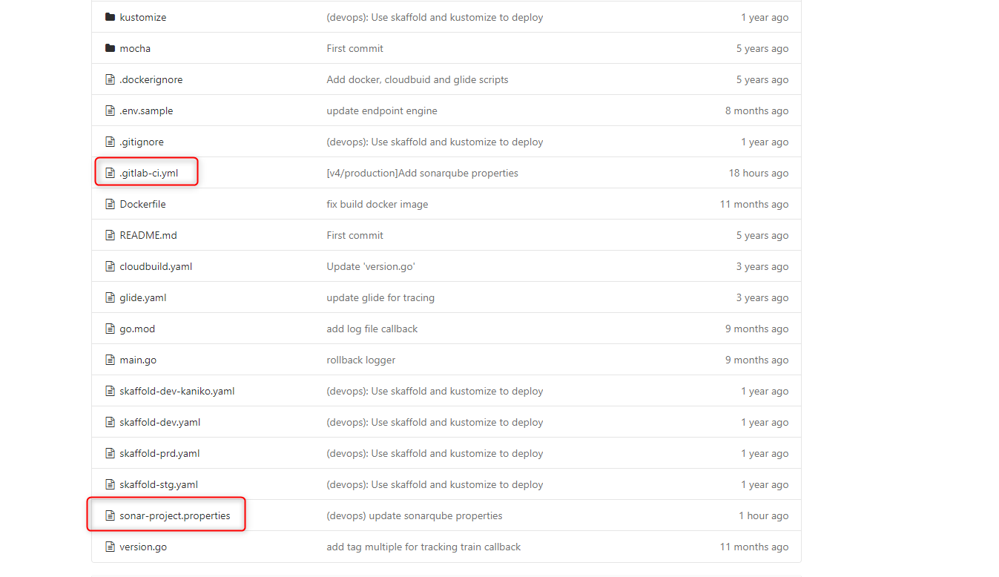

<h1 style="color:orange">Gitlab-runner install</h1>
Bài toán là như thế này nhé
Đại loại là đang cố gắng tạo một workflow khi mà đẩy commit lên nhánh v35/prod của bl35 với lại msgr-ls thì hệ thống sẽ tự scan

Anh cũng ko rõ chính xác nó sẽ scan những cái gì
Nhưng đại loại là có scan và có gửi thông tin về cho server
Chắc là extract được báo cáo
Việc của mình là phải thiết lập được Flow
Thế thì trên Gitlab nó có cái CI/CD

Chuẩn bị 
server cài gitlab-runner

Tham khảo: https://www.fosstechnix.com/how-to-install-gitlab-runner-on-ubuntu/

<h2 style="color:orange">2. Tạo Sonar Scaner project</h2>

Đăng nhập vào https://aisonar02.fci.vn/

Create project -> Manually 
 
Điền thông tin project 
 
Setup -> Gitlab CI
 
Làm theo tuần tự các bước như trong hướng dẫn 
 
Lưu ý đến step 2, sau khi `generate token` thì quản lý token sẽ ở trong phần User `My Account` -> Security 
 
 
<h2 style="color:orange">2. Chạy thử gitlab pipeline</h2>

Sau khi tiến hành tạo project trên sonarqube xong thì sẽ phải push 2 file `.gitlab-ci.yml` và `sonar-project.properties` lên repo main của gitlab (trùng với repo main ta khai báo khi tạo project). 
 

Yêu cầu để chạy được là repo này phải có sẵn runner (hướng dẫn cài runner trong phần 1) 
 
Yêu cầu cấu hình Variables như hướng dẫn khi tạo project (Settings -> CI/CD). 
 

Chạy runner quét code: CI/CD -> Pipelines -> Run pipeline: kết quả hiển thị `passed` màu xanh -> thành công 
 
Kết quả quét code hiển thị trên sonarqube. 
 
<h2 style="color:orange">3. Troubleshoot</h2>

Lưu ý nếu chạy pipeline bị stuck, hiển thị lỗi đỏ `allow to fail`. 
Vào Settings -> CI/CD -> Runners -> config Runners 
 
Tích vào Run untagged jobs -> Save changes
 