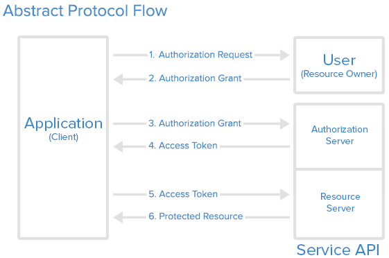

<h1 style="color:orange">OAuth</h1>
OAuth (Open Authorization) là một giao thức ủy quyền các ứng dụng có thể chia sẻ tài nguyên với nhau một cách an toàn mà không cần chia sẻ các thông tin tài khoản và mật khẩu. Ví dụ bạn nói với Facebook rằng bạn đồng ý cho ESPN.com truy cập vào profile của bạn hay đăng bài trên dòng thời gian mà không cần đưa mật khẩu Facebook của bạm cho ESPN.com. Nó sẽ giảm thiểu rủi ro khi trang ESPN.com bị vi phạm, mật khẩu Facebook của bạn vẫn được an toàn.

OAuth không chia sẻ thông tin mật khẩu, thay vào đó, nó sử dụng authorization tokens để cung cấp định danh giữa consumers (ESPN.com) và service providers (Facebook).
<h2 style="color:orange">1. Qúa trình phát triển</h2>
Năm 2006, Twitter đưa ra chuẩn OAuth đầu tiên có tên là OpenID, điểm yếu đó là yêu cầu người dùng phải cung cấp thông tin cá nhân (username + password). 
Năm 2010, phát hành phiên bản chính thức đầu tiên của Oauth 1.0 (RFC 5849). 
Sau đó lỗi bảo mật nghiêm trọng được phát hiện với tên gọi Session Fixation cho phép Hacker chiếm quyền truy cập vào tài nguyên của người dùng. 
Năm 2012, OAuth2 ra đời, tuy vẫn còn những lỗi bảo mật như dùng hiện vẫn đang được sử dụng khá rộng rãi.
<h2 style="color:orange">2. Các khái niệm trong OAuth</h2>

- `Resource Owner:` chủ sở hữu các dữ liệu ta muốn chia sẻ. Chẳng hạn, bạn muốn chia sẻ thông tin Email - Username Facebook cho 1 bên có chức năng đăng nhập bằng Facebook, thì ở đây, thông tin Email - Username này là tài nguyên cần chia sẻ (resource), còn bạn chính là Resource Owner.
- `Resource Server:` nơi chứa thông tin dữ liệu cần chia sẻ. Server này phải có khả năng nhận và trả lời các yêu cầu (request) truy xuất dữ liệu. Trong ví dụ trên, Resource Server là Facebook.
- `Client:` là những chương trình, ứng dụng có nhu cầu muốn sử dụng tài nguyên được chia sẻ. (ESPN.com)
- `Authorization Server:` đối tượng quyết định việc cấp quyền truy cập vào dữ liệu cho Client. Như trong ví dụ trên, đấy chính là Authorization Server của Facebook.
<h2 style="color:orange">3. Luồng hoạt động OAuth</h2>

 
Có 3 vai trò chính trong một OAuth transaction: User, Application, và Service API. Trong ví dụ dưới đây, Joe là User, Bitly là Appllication, và Twitter là Service API quản lý an toàn tài nguyên cho Joe. Joe muốn Bitly đăng một link trong tream của anh ây. Dưới đây là luồng hoạt động:

`Bước 1` – User thể hiện ý định

- Joe (User): “Này, Bitly, tôi muốn anh đăng đường link này lên Twitter stream của tôi.” 
- Bitly (Application): “Tuyệt! Để tôi đi xin phép.” 
`Bước 2` – Application nhận được quyền

- Bitly: “Tôi có 1 user muốn tôi đăng bài trên stream của anh ấy. Tôi có thể có một request token không?” 
- Twitter (Service API): “Chắc chắn rồi. Đây là một token và một secret.” Secret được sử dụng để phòng chống request forgery. Application sử dụng secret để chứng thực các request với service provider rằng nó thực sự đến từ consumer Application. 
`Bước 3` – User được chuyển hướng đến Service Provider

- Bitly: “OK, Joe. Tôi đang gửi bạn đến Twitter và bạn có thể chấp nhận. Bạn hãy mang theo token này.” 
- Joe: “OK!” <Bitly điều hướng Joe đến Twitter để ủy quyền> 
Đây là một phần đáng sợ. Nếu Bitly là một công ty mờ ám, nó có thể bật lên một cửa sổ trông giống Twitter để lừa username và password của bạn. Luôn luôn chắc chắn kiểm tra URL bạn được điều hướng đến thực sự là service provider (trong trường hợp này là Twitter).

`Bước 4` – User cho phép

- Joe: “Twitter, tôi muốn ủy quyền request token mà Bitly đưa cho tôi.” 
- Twitter: “OK, để chắc chắn, bạn muốn ủy quyền cho Bitly làm việc X, Y, và Z với tài khoản Twitter của bạn?” 
- Joe: “Vâng!” 
- Twitter: “OK, Bạn có thể quay trở lại Bitly và nói với họ rằng họ được phép sử dụng request token của họ.” Twitter đánh dấu request token là “good-to-go,” và khi Application yêu cầu truy cập, nó sẽ được chấp nhận. 
`Bước 5` – Application có được Access Token

- Bitly: “Twitter, tôi có thể đổi request token này lấy access token không?” 
- Twitter: “Chắc chắn rồi. Đây là access token và secret của bạn.” 
`Bước 6` – Application truy cập Protected Resource

- Bitly: “Tôi muốn đăng link này lên stream của Joe. Đây là access token của tôi!” 
- Twitter: “Đã xong!” 

Trong kịch bản như trên, Joe không bao giờ phải chia sẻ thông tin đăng nhập Twitter với Bitly. Anh ấy chỉ cần ủy quyền truy cập bằng OAuth một cách an toàn. Bất cứ lúc nào, Joe cũng có thể đăng nhập vào Twitter và kiểm tra quyền truy cập mà anh ta đã cấp và thu hồi token cho Application cụ thể mà không ảnh hưởng đến Application khác. OAuth cũng có thể cho phép phân quyền ở mức độ chi tiết, ví dụ bạn có thể cho phép Bitly đăng bài trên tài khoản Twitter của bạn, nhưng hạn chế Linkedln ở quyền read-only.
<h1 style="color:orange">OpenID Connect</h1>
Nếu như Oauth đóng vai trò Authorization thì OpenID có thể nói đóng vai trò Authentication. OpenID Connect được build sử dụng luồng Oauth 2.0 
OpenID connect đóng vai trò như SSO protocol
<h2 style="color:orange">So sánh OpenID Connect và SAML</h2>
<h3 style="color:orange">1. Lịch sử hình thành và phát triển</h3>

`SAML`:
- Ra đời năm 2001
- Sử dụng chuẩn XML được tạo bơi OASIS (Organization for the Advancement of Structured Information Standards)
- Initially designed for enterprise Single Sign-On (SSO) 

`OpenID Connect`:
- Introduced in 2014 as an identity layer built on top of the OAuth 2.0 protocol.
JSON-based standard managed by the OpenID Foundation.
A successor to OpenID 2.0 but radically different in design and goals.
<h3 style="color:orange">2. Protocol format</h3>

`SAML`:
- XML based
- Dựa trên chũ kí XML và mã hóa XML 

`OpenID connect`:
- JSON
- Sử dụng Json web token (JWT) để xác thực
- Hưởng lợi từ bản chất nhẹ của JSON, khiến cho nó phù hợp với điện thoại và các web app.
<h3 style="color:orange">3. Use case</h3>

`SAML`: Chủ yếu sử dụng cho SSO của các app trong 1 tập đoàn 
`OpenID connect`: thiết kế cho web và các ứng dụng điện thoại 
- Cung cấp token định danh cho applications
- Dùng cho: authorization, token, userinfo, revocation
<h3 style="color:orange">4. Tính bảo mật</h3>

- `SAML`: Dùng XML signature và XML encryption
- `OpenID connect`: dùng JWT, có thể kí và optionally encrypted.