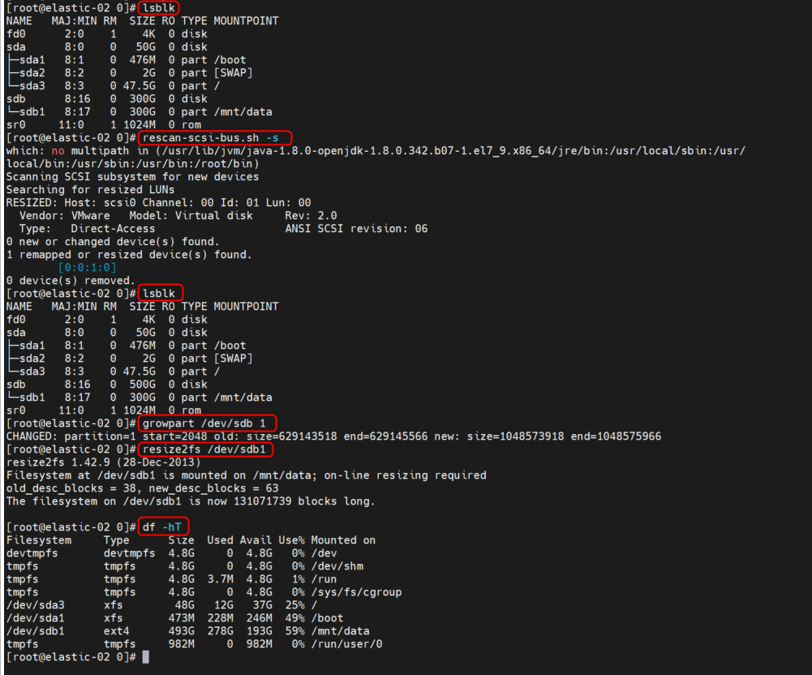

<h1 style="color:orange">Tăng dung lượng disk</h1>
Tăng dung lượng ổ đĩa mount. Ví dụ: Ổ đĩa được mount vào phân vùng /dev/sb1. Sau khi tăng dung lượng ổ đĩa mount từ 300G -> 500G. Chạy các lệnh:

    # rescan-scsi-bus.sh -s
    # growpart /dev/sdb 1
    # resize2fs /dev/sdb1
Lệnh đầu là để quét xem có thay đổi gì về device hay không. Nó sẽ nhận cái 300GB --> 500GB 
Lệnh thứ hai là resize partition 1 của /dev/sdb 
Cái cuối cùng thì resize filesystem (ở đây là ext4) 

Nếu là xfs thì:

    # sudo xfs_growfs /dev/sda3

 