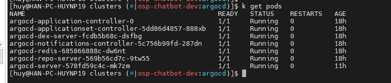
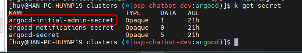
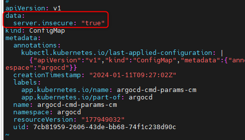
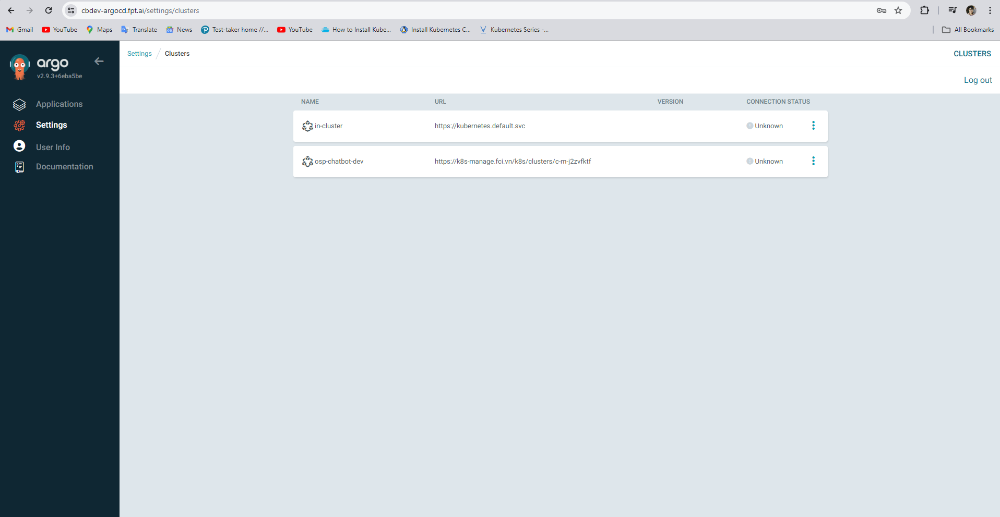
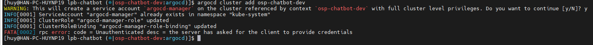
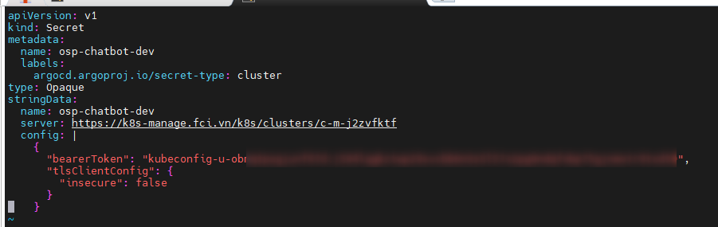
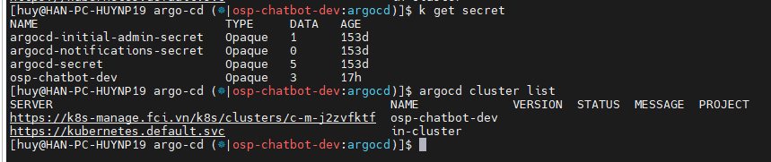

<h1 style="color:orange">Argocd install</h1>
ArgoCD là một mã nguồn mở container-native workflow engine phục vụ việc deploy service trên Kubernetes.
<h2 style="color:orange">1. Cài đặt argocd CLI</h2>
Argocd cũng giống như kubectl, là 1 dạng client kết nối đến k8s cluster thông qua file .kube/k8s-cluster.yaml

Cài đặt tham khảo docs của hãng: https://argo-cd.readthedocs.io/en/stable/cli_installation/

    # sudo curl -sSL -o argocd-linux-amd64 https://github.com/argoproj/argo-cd/releases/latest/download/argocd-linux-amd64
    # sudo install -m 555 argocd-linux-amd64 /usr/local/bin/argocd
    # rm argocd-linux-amd64
<h2 style="color:orange">2. Cài đặt argocd</h2>

Tham khảo: https://argo-cd.readthedocs.io/en/stable/getting_started/

    # kubectl create namespace argocd
    # kubectl apply -n argocd -f https://raw.githubusercontent.com/argoproj/argo-cd/stable/manifests/install.yaml
Đợi 5p:

<br>
Argocd chạy trong deploy argocd-server. Để lấy initial password để kết nối đến argocd:

    # argocd admin initial-password -n argocd
hoặc có thể lấy password trong secret `argocd-initial-admin-secret`:<br>
<br>
Sau khi đổi pass trên argocd xong có thể xóa secret này.
<h2 style="color:orange">3. Cài đặt ingress cho argocd</h2>

Tham khảo: https://argo-cd.readthedocs.io/en/stable/operator-manual/ingress/#option-2-multiple-ingress-objects-and-hosts

```
apiVersion: networking.k8s.io/v1
kind: Ingress
metadata:
  name: argocd-server-ingress
  namespace: argocd
  annotations:
    nginx.ingress.kubernetes.io/force-ssl-redirect: "true"
    nginx.ingress.kubernetes.io/ssl-passthrough: "true"
spec:
  ingressClassName: nginx
  rules:
  - host: argocd.example.com
    http:
      paths:
      - path: /
        pathType: Prefix
        backend:
          service:
            name: argocd-server
            port:
              name: https
```
Lưu ý, nếu expose argocd qua ingress thì API server phải chạy với TLS disabled. Thêm config `server.insecure: "true"` vào `argocd-cmd-params-cm`

    # kubectl edit cm argocd-cmd-params-cm
<br>
Restart deploy để ăn config mới
 
    # kubectl rollout restart deploy/argocd-server
<h2 style="color:orange">4. Add cluster vào argocd</h2>
Trên UI của argocd không có nút add cluster, phải thực hiện add bằng CLI

<br>

    # 
    # kubectl config set-context --namespace=argocd
    # argocd cluster add tên_context
Theo docs:
``` 
The above command installs a ServiceAccount (argocd-manager), into the kube-system namespace of that kubectl context, and binds the service account to an admin-level ClusterRole. Argo CD uses this service account token to perform its management tasks (i.e. deploy/monitoring).
```
Tuy nhiên, đối với những cluster k8s được quản lý bằng rancher khi add sẽ có lỗi này:

<br>
Để sửa, tham khảo: https://gist.github.com/janeczku/b16154194f7f03f772645303af8e9f80

Vì khi kết nối đến cluster rancher sẽ ko có token, phải lưu token vào trong secret resource của argocd
```
To manage external clusters, Argo CD stores the credentials of the external cluster as a Kubernetes Secret in the argocd namespace. This secret contains the K8s API bearer token associated with the argocd-manager ServiceAccount created during argocd cluster add, along with connection options to that API server
```
Để add cluster vào argocd, tạo file manifest:
   
    # vim ./secret.yaml
paste vào
```
apiVersion: v1
kind: Secret
metadata:
  name: osp-chatbot-dev
  labels:
    argocd.argoproj.io/secret-type: cluster
type: Opaque
stringData:
  name: osp-chatbot-dev
  server: https://k8s-manage.fci.vn/k8s/clusters/c-m-j2zvfktf
  config: |
    {
      "bearerToken": "<authentication token>",
      "tlsClientConfig": {
        "insecure": false,
        "caData": "<base64 encoded certificate>"
      }
    }
```
Trong đó:
- `bearerToken` là token lấy từ file kubeconfig kết nối tới rancher
- `caData` là CA root để check cert của domain k8s: k8s-manage.fci.vn (nếu domain dùng cert xịn thì ko cần config này)

<br>
```
# k apply -f secret.yaml 
```
<br>
