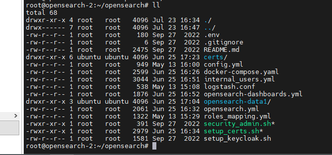
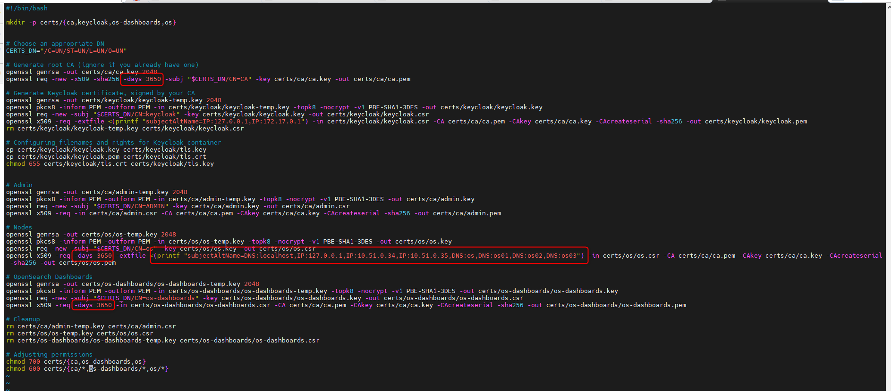
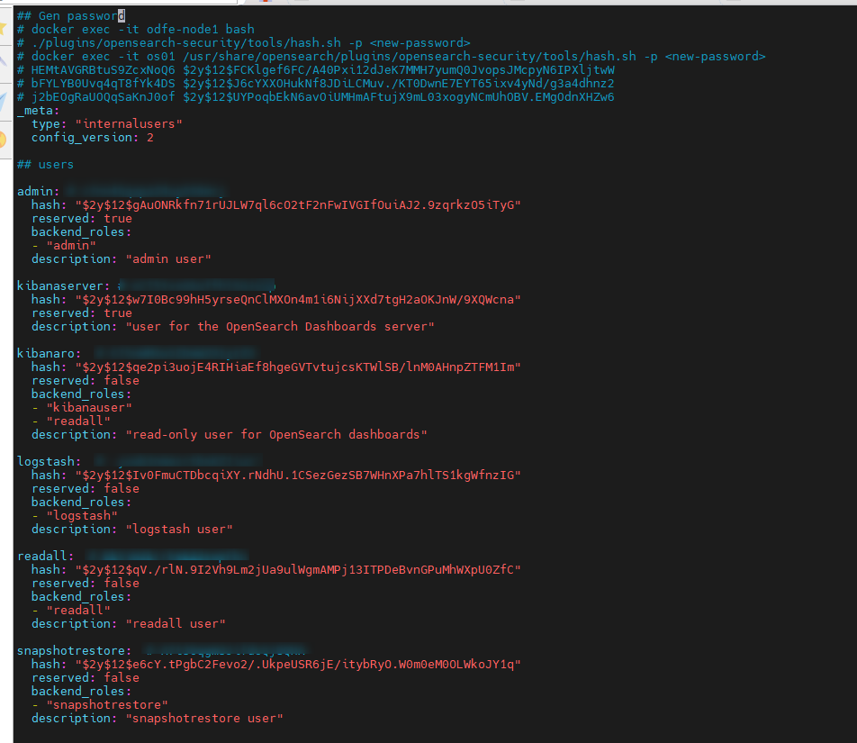
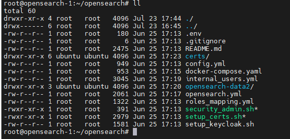

<h1 style="color:orange">Opensearch install</h1>
Opensearch là bản elasticsearch 7.10 được AWS kéo về tunning và chia sẻ opensource. Opensearch bao gồm các tính năng bản basic của 7.10 và 1 số tính năng trả phí.

Hướng dẫn cài đặt opensearch với docker
<h2 style="color:orange">1. Chuẩn bị</h2>

- Cài đặt opensearch trên OS: ubuntu 20.04
- docker-compose
- python3.8

Cài đặt opensearch bằng docker trên 2 node:
- 10.51.0.35: opensearch (master,data,ingest), opensearch-dashboard, logstash
- 10.51.0.34: opensearch (master,data,ingest)
<h2 style="color:orange">2. Cài đặt opensearch</h2>
<h3 style="color:orange">2.1. Trên node 10.51.0.35</h3>
Tạo thư mục chạy opensearch

    # mkdir /root/opensearch && cd /root/opensearch
    # mkdir /root/opensearch/opensearch-data1
    # chown -R 1000:1000 /root/opensearch/opensearch-data1
    # chmod +x setup_certs.sh
    # chmod +x security_admin.sh
Thư mục opensearch-data1 này sẽ được sử dụng để mount data từ container `os01` trong file docker-compose. Tạo các file sau:

<br>
Nội dung file `config.yml`:
```
_meta:
  type: "config"
  config_version: 2
config:
  dynamic:
    authc:
      basic_internal_auth_domain:
        http_enabled: true
        transport_enabled: true
        order: 0
        http_authenticator:
          type: basic
          challenge: false
        authentication_backend:
          type: intern

      openid_auth_domain:
        http_enabled: true
        transport_enabled: true
        order: 1
        http_authenticator:
          type: openid
          challenge: false
          config:
            openid_connect_idp:
              enable_ssl: false
              verify_hostnames: false
              pemtrustedcas_filepath: /usr/share/opensearch/config/certificates/ca/ca.pem
            subject_key: preferred_username
            roles_key: roles
            openid_connect_url: https://cbstag-id.fpt.ai/auth/realms/FptSmartCloud/.well-known/openid-configuration
        authentication_backend:
          type: noop
```
Với opensearch sử dụng keycloak để làm SSO.<br>

Nội dung file `docker-compose.yaml`:
```
version: "3"
services:
  os01:
    image: opensearchproject/opensearch:2.13.0
    container_name: os01
    environment:
      OPENSEARCH_JAVA_OPTS: "-Xms1G -Xmx1G" # minimum and maximum Java heap size, recommend setting both to 50% of system RAM
      node.name: os01
      DISABLE_INSTALL_DEMO_CONFIG: "true"
      JAVA_HOME: /usr/share/opensearch/jdk
    ulimits:
      memlock:
        soft: -1
        hard: -1
    volumes:
      - ./opensearch.yml:/usr/share/opensearch/config/opensearch.yml
      - ./config.yml:/usr/share/opensearch/config/opensearch-security/config.yml
      - ./certs:/usr/share/opensearch/config/certificates:ro
      - ./opensearch-data1:/usr/share/opensearch/data
      - './internal_users.yml:/usr/share/opensearch/config/opensearch-security/internal_users.yml'
      - './roles_mapping.yml:/usr/share/opensearch/plugins/opensearch-security/securityconfig/roles_mapping.yml'
    ports:
      - 9200:9200
      - 9300:9300
  dashboards:
    image: opensearchproject/opensearch-dashboards:2.13.0
    container_name: dashboards
    ports:
      - 5601:5601
    volumes:
      - ./certs:/usr/share/opensearch-dashboards/config/certificates:ro
      - ./opensearch-dashboards.yml:/usr/share/opensearch-dashboards/config/opensearch_dashboards.yml
    environment:
      DISABLE_INSTALL_DEMO_CONFIG: "true"
      NODE_TLS_REJECT_UNAUTHORIZED: 0
  logstash-opensearch:
    image: opensearchproject/logstash-oss-with-opensearch-output-plugin:7.16.3
    container_name: logstash
    restart: always
    volumes:
      - ./logstash.conf:/usr/share/logstash/pipeline/logstash-opensearch.conf
    depends_on:
      - os01
```
Nội dung file `opensearch.yml`:
```
cluster.name: os-cluster
network.host: 0.0.0.0
network.publish_host: 10.51.0.35

bootstrap.memory_lock: "true" # along with the memlock settings below, disables swapping

discovery.seed_hosts: 10.51.0.34:9300,10.51.0.35:9300
cluster.initial_master_nodes: 10.51.0.35
cluster.routing.allocation.disk.threshold_enabled: true
cluster.routing.allocation.disk.watermark.low: 93%
cluster.routing.allocation.disk.watermark.high: 95%

plugins.security.ssl.transport.pemkey_filepath: certificates/os/os.key # relative path
plugins.security.ssl.transport.pemcert_filepath: certificates/os/os.pem
plugins.security.ssl.http.pemkey_filepath: certificates/os/os.key
plugins.security.ssl.http.pemcert_filepath: certificates/os/os.pem

plugins.security.allow_unsafe_democertificates: true
plugins.security.ssl.http.enabled: true
plugins.security.ssl.http.pemtrustedcas_filepath: certificates/ca/ca.pem
plugins.security.ssl.transport.enabled: true
plugins.security.ssl.transport.pemtrustedcas_filepath: certificates/ca/ca.pem
plugins.security.ssl.transport.enforce_hostname_verification: false
plugins.security.restapi.roles_enabled: ["all_access"]

plugins.security.audit.type: internal_opensearch
plugins.security.system_indices.enabled: true
plugins.security.system_indices.indices: [".opendistro-alerting-config", ".opendistro-alerting-alert*", ".opendistro-anomaly-results*", ".opendistro-anomaly-detector*", ".opendistro-anomaly-checkpoints", ".opendistro-anomaly-detection-state", ".opendistro-reports-*", ".opendistro-notifications-*", ".opendistro-notebooks", ".opendistro-asynchronous-search-response*"]
plugins.security.audit.config.disabled_rest_categories: AUTHENTICATED, opensearch_SECURITY_INDEX_ATTEMPT
plugins.security.audit.config.disabled_transport_categories: GRANTED_PRIVILEGES
plugins.security.audit.config.enable_rest: false
plugins.security.audit.config.enable_transport: false

plugins.security.authcz.admin_dn:
  - 'CN=ADMIN,O=UN,L=UN,ST=UN,C=UN'
plugins.security.nodes_dn:
  - 'CN=os,O=UN,L=UN,ST=UN,C=UN'
```

Tạo cert:

    # ./setup_certs.sh
Lưu ý trong file setup_certs.sh phải sửa IP theo đúng những node mà opensearch chạy trên; hạn của cert thì để 10 năm, nếu ko có option này sẽ tạo mặc định hạn 30 ngày:<br>
<br>

Tạo các password:

    # docker-compose up -d os01
    # docker exec -it os01 /usr/share/opensearch/plugins/opensearch-security/tools/hash.sh -p <new-password>
Sau đó paste vào file internal_user.yaml:<br>
<br>
Setup password cho opensearch:

    # ./security_admin.sh
Check log xem os01 đã function chưa.

Tiếp tục tạo và chạy container logstash và opensearch-dashboard:

    # docker-compose up -d
<h3 style="color:orange">2.2. Trên node 10.51.0.34</h3>
Tạo thư mục chạy opensearch

    # mkdir /root/opensearch && cd /root/opensearch
    # mkdir /root/opensearch/opensearch-data2
    # chown -R 1000:1000 /root/opensearch/opensearch-data2
Với các file:<br>
<br>
Nội dung file `docker-compose.yaml`:
```
version: "3"
services:
  os02:
    image: opensearchproject/opensearch:2.13.0
    container_name: os02
    environment:
      OPENSEARCH_JAVA_OPTS: "-Xms1G -Xmx1G" # minimum and maximum Java heap size, recommend setting both to 50% of system RAM
      node.name: os02
      DISABLE_INSTALL_DEMO_CONFIG: "true"
      JAVA_HOME: /usr/share/opensearch/jdk
    ulimits:
      memlock:
        soft: -1
        hard: -1
    volumes:
      - ./opensearch.yml:/usr/share/opensearch/config/opensearch.yml
      - ./config.yml:/usr/share/opensearch/config/opensearch-security/config.yml
      - ./certs:/usr/share/opensearch/config/certificates:ro
      - ./opensearch-data2:/usr/share/opensearch/data
      - './internal_users.yml:/usr/share/opensearch/config/opensearch-security/internal_users.yml'
      - './roles_mapping.yml:/usr/share/opensearch/plugins/opensearch-security/securityconfig/roles_mapping.yml'
    ports:
      - 9200:9200
      - 9300:9300
```
Nội dung file `opensearch.yml`:
```
cluster.name: os-cluster
network.host: 0.0.0.0
network.publish_host: 10.51.0.34

bootstrap.memory_lock: "true" # along with the memlock settings below, disables swapping

discovery.seed_hosts: 10.51.0.34:9300,10.51.0.35:9300
cluster.initial_master_nodes: 10.51.0.35
cluster.routing.allocation.disk.threshold_enabled: true
cluster.routing.allocation.disk.watermark.low: 93%
cluster.routing.allocation.disk.watermark.high: 95%

plugins.security.ssl.transport.pemkey_filepath: certificates/os/os.key # relative path
plugins.security.ssl.transport.pemcert_filepath: certificates/os/os.pem
plugins.security.ssl.http.pemkey_filepath: certificates/os/os.key
plugins.security.ssl.http.pemcert_filepath: certificates/os/os.pem

plugins.security.allow_unsafe_democertificates: true
plugins.security.ssl.http.enabled: true
plugins.security.ssl.http.pemtrustedcas_filepath: certificates/ca/ca.pem
plugins.security.ssl.transport.enabled: true
plugins.security.ssl.transport.pemtrustedcas_filepath: certificates/ca/ca.pem
plugins.security.ssl.transport.enforce_hostname_verification: false
plugins.security.restapi.roles_enabled: ["all_access"]

plugins.security.audit.type: internal_opensearch
plugins.security.system_indices.enabled: true
plugins.security.system_indices.indices: [".opendistro-alerting-config", ".opendistro-alerting-alert*", ".opendistro-anomaly-results*", ".opendistro-anomaly-detector*", ".opendistro-anomaly-checkpoints", ".opendistro-anomaly-detection-state", ".opendistro-reports-*", ".opendistro-notifications-*", ".opendistro-notebooks", ".opendistro-asynchronous-search-response*"]
plugins.security.audit.config.disabled_rest_categories: AUTHENTICATED, opensearch_SECURITY_INDEX_ATTEMPT
plugins.security.audit.config.disabled_transport_categories: GRANTED_PRIVILEGES
plugins.security.audit.config.enable_rest: false
plugins.security.audit.config.enable_transport: false

plugins.security.authcz.admin_dn:
  - 'CN=ADMIN,O=UN,L=UN,ST=UN,C=UN'
plugins.security.nodes_dn:
  - 'CN=os,O=UN,L=UN,ST=UN,C=UN'
```
Tạo container:

    # docker-compose up -d
    # docker log -f 