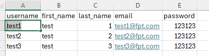
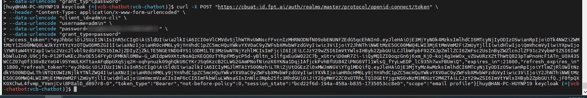
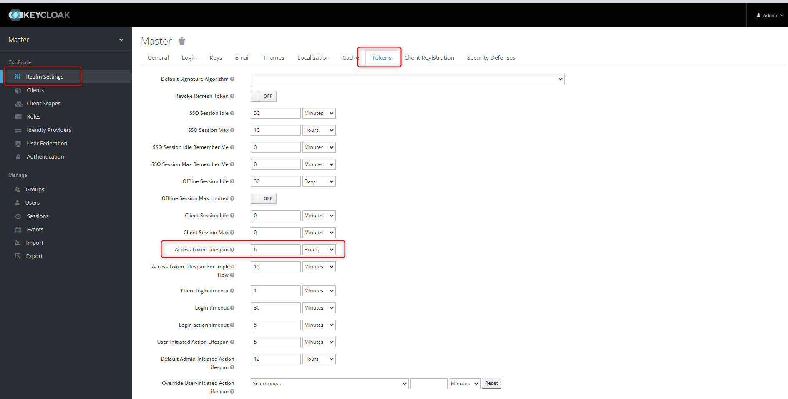
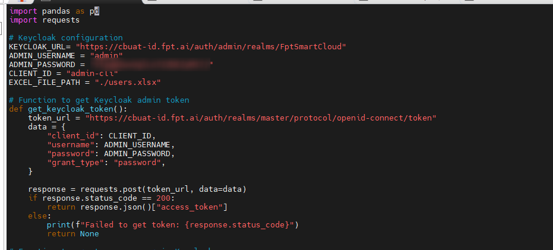
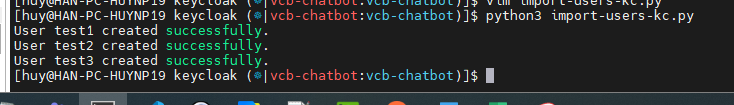

<h1 style="color:orange">Add bulk user keycloak</h1>
Keycloak version: 12.0.4
python: 3.8

Sử dụng python để curl vào API của keycloak để tạo số lượng user lớn
<h2 style="color:orange">1. Tạo file users.xlsx</h2>

Tạo file users.xlsx với nội dung:<br>
<br>
<h2 style="color:orange">2. Tạo file import-users-kc.py</h2>

    # vim import-users-kc.py

```
import pandas as pd
import requests

# Keycloak configuration
KEYCLOAK_URL= "https://cbuat-id.fpt.ai/auth/admin/realms/FptSmartCloud"
ADMIN_USERNAME = "admin"
ADMIN_PASSWORD = "<password>"
CLIENT_ID = "admin-cli"
EXCEL_FILE_PATH = "./users.xlsx"

# Function to get Keycloak admin token
def get_keycloak_token():
    token_url = "https://cbuat-id.fpt.ai/auth/realms/master/protocol/openid-connect/token"
    data = {
        "client_id": CLIENT_ID,
        "username": ADMIN_USERNAME,
        "password": ADMIN_PASSWORD,
        "grant_type": "password",
    }

    response = requests.post(token_url, data=data)
    if response.status_code == 200:
        return response.json()["access_token"]
    else:
        print(f"Failed to get token: {response.status_code}")
        return None

# Function to create a new user in Keycloak
def create_user(token, user_data):
    headers = {
        "Authorization": f"Bearer {token}",
        "Content-Type": "application/json",
    }
    users_url = f"{KEYCLOAK_URL}/users"
    response = requests.post(users_url, headers=headers, json=user_data)

    if response.status_code == 201:
        print(f"User {user_data['username']} created successfully.")
    else:
        print(f"Failed to create user {user_data['username']}: {response.status_code}, {response.text}")

# Main function to read Excel file and create users
def add_users_from_excel(excel_file_path):
    # Read the Excel file
    df = pd.read_excel(excel_file_path)

    # Get Keycloak token
    token = get_keycloak_token()
    if not token:
        return

    # Iterate over rows in the Excel file
    for index, row in df.iterrows():
        user_data = {
            "username": row["username"],
            "firstName": row["first_name"],
            "lastName": row["last_name"],
            "email": row["email"],
            "enabled": True,
            "emailVerified": True,
            "credentials": [
                {
                    "type": "password",
                    "value": row["password"],
                    "temporary": False
                }
            ]
        }
        # Create user in Keycloak
        create_user(token, user_data)

if __name__ == "__main__":
    add_users_from_excel(EXCEL_FILE_PATH)
```

Trong đó, script sử dụng cơ chế lấy token của keycloak bằng câu lệnh (lấy token với user admin ở realm master):
```
curl -X POST "https://cbuat-id.fpt.ai/auth/realms/master/protocol/openid-connect/token" \
--header "Content-Type: application/x-www-form-urlencoded" \
--data-urlencode "client_id=admin-cli" \
--data-urlencode "username=admin" \
--data-urlencode "password=<password>" \
--data-urlencode "grant_type=password"
```

<br>
mặc định expire trong 60s. Tuy nhiên có thể chỉnh bằng cách Realm Settings -> Tokens -> Access Token Lifespan<br>
<br>

<br>
với KEYCLOAK_URL là realm tạo tk
<h2 style="color:orange">3. Chạy lệnh</h2>

```
python3 import-users-kc.py
```
<br>