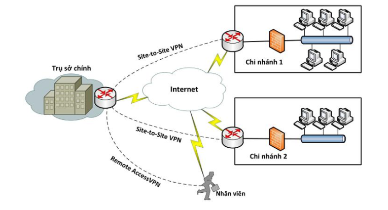
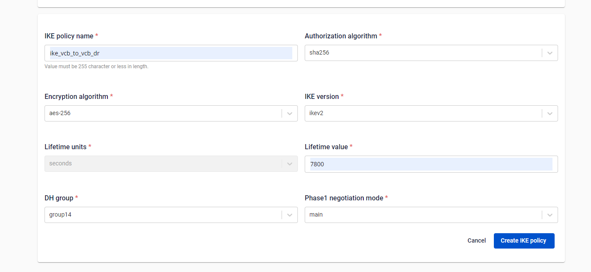
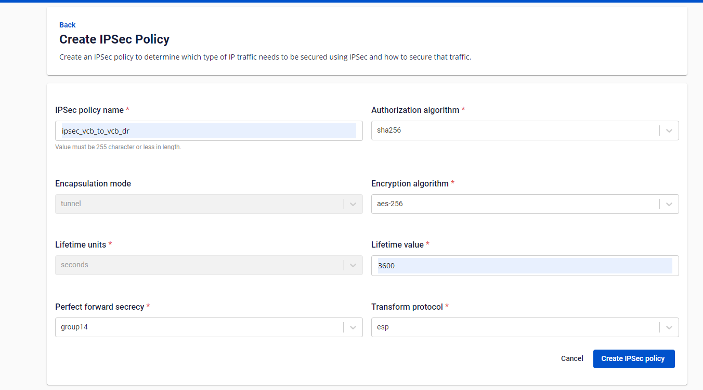
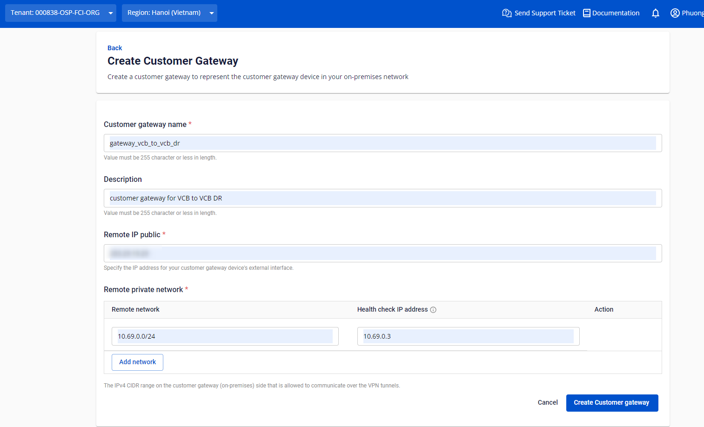
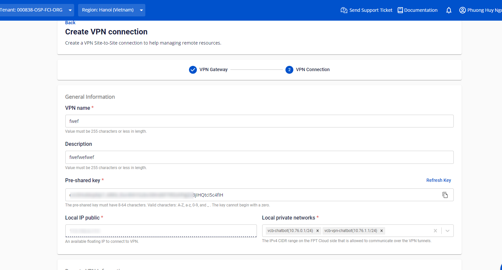

<h1 style="color:orange">Cài VPN</h1>
Cấu trúc VPN kết nối với nhau qua internet, qua IP của các router, bản chất kết nối giữa mạng VPN đều qua internet, tuy nhiên được mã hóa.

Gỉa sử kết nối mạng LAN giữa VPN1 và VPN2
 
<h2 style="color:orange">1. Các định nghĩa</h2>
IKE policy và ipsec kết nối mật thiết với nhau giống như TLS/SSL. IKE policy giống như SSL/TLS initiate handshake để thiết lập kết nối TLS/SSL. IPsec giống như giao thức mã hóa nội dung truyền trong như TLS/SSL.

- IKE policy là phase 1.
- ipsec là phase 2
<h3 style="color:orange">1.1. IKE policies</h3>

 
Cấu hình VPN khuyên dùng: lifetime mặc định để 7800, ko chia hết cho lifetime policy của ipsec (ví dụ ipsec có lifetime=3600 thì ike lifetime ko nên để 7200,10800,...)
- DH group (diffe-hellman group), khuyên dùng nên để group 14 (càng cao thì càng bảo mật, recommend group 14)
- phase1 có 2 lựa chọn là main và aggresive: khuyên dùng main, aggresive sẽ bỏ qua việc bảo mật để tối ưu hiệu năng.
<h3 style="color:orange">1.2. ipsec policies</h3>

 
Để giống hệt IKE, transform protocol khuyên dùng esp
<h3 style="color:orange">1.3. customer gateway</h3>

 
- remote ip public là ip router của mạng VPN remote (ip public vpn2)
- remote network là ip LAN của mạng VPN remote (ip lan vpn2)
<h3 style="color:orange">1.4. tạo VPN</h3>
Khi tạo VPN, pre-shared key phải giống nhau giữa 2 mạng VPN local và remote (giữa vpn1 và vpn2).

 
local private network là mạng LAN local (ip lan vpn1)