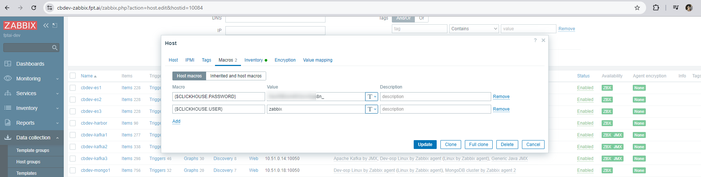

<h1 style="color:orange">Triển khai clickhouse</h1>
Triển khai clickhouse đơn node chạy trên docker. Clickhouse là relational database giống mysql nhưng thiên về column. Dùng để lưu trữ dữ liệu cho phân tích.

Chuẩn bị:
server cài clickhouse đơn node: 10.51.0.253.
Clickhouse version: 24.9.2
<h2 style="color:orange">1. Triển khai clickhouse</h2>
Tạo directory để làm việc với click house

    # mkdir /root/clickhouse/ && mkdir /root/clickhouse/config && mkdir /root/clickhouse/data && mkdir /root/clickhouse/logs && mkdir /root/clickhouse/config/users.d
    # vim docker-compose.yml
paste vào
```
version: '3'
services:
  clickhouse-server:
    restart: always
    image: clickhouse/clickhouse-server:24.9.2
    container_name: clickhouse-server
    ulimits:
      nofile:
        soft: 262144
        hard: 262144
    volumes:
      - ./data:/var/lib/clickhouse
      - ./logs:/var/log/clickhouse-server
      - ./config/users.xml:/etc/clickhouse-server/users.xml
      - ./config/config.xml:/etc/clickhouse-server/config.xml
      - ./config/users.d:/etc/clickhouse-server/users.d
    ports:
      - 8123:8123
      - 9000:9000
    cap_add:
      - SYS_NICE
      - NET_ADMIN
      - IPC_LOCK
      - SYS_PTRACE
```

Lưu ý, đầu tiên khởi chạy docker-compose mà ko có volume gì để lấy nội dung file users.xml và config.xml ra. Sau đó tùy chỉnh 2 file này xong mount lại.
<br>

Chỉnh sửa password cho user default trong file users.xml:
<br>
<h2 style="color:orange">2. Cài zabbix giám sát clickhouse</h2>

Tham khảo: https://www.zabbix.com/integrations/clickhouse#clickhouse_http
Mặc định zabbix đã có template giám sát clickhouse. 
<br>

Để cài đặt:
<h2 style="color:orange">2.1. Tạo user zabbix clickhouse</h2>
Tạo user zabbix trong clickhouse để zabbix truy cập

    # vim /root/users.d/zabbix.xml
    paste vào
```
<clickhouse>
  <users>
    <zabbix>
      <password>password</password>
      <networks>
          <ip>::/0</ip>
      </networks>
      <allow_databases>
        <database>system</database>
      </allow_databases>
    </zabbix>
  </users>
</clickhouse>
```

restart container chạy clickhouse

    # docker restart clickhouse-server
<h2 style="color:orange">2.2. Dùng user zabbix để giám sát</h2>
Add template: Templates/Databases ->  ClickHouse by HTTP vào host cài clickhouse

Add MACRO vào host để agent có user, pass đăng nhập vào clickhouse:<br>
<br>

Kiểm tra dữ liệu đã được lấy về:<br>
<br>