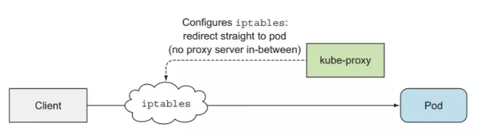

<h1 style="color:orange">Kiến trúc K8s</h1>
Một kubernetes cluster sẽ gồm 2 phần chính là:

Các Kubernetes master (control plane)
Kubernetes worker node
Kubernetes master sẽ bao gồm 4 component:

etcd
API server
Controller Manager
Scheduler
Kubernetes worker node sẽ bao gồm 3 thành phần:

kubelet
kube-proxy
container runtime
Bên cạnh những component chính, thì còn có một số add-on component phụ để enhance chức năng của kubernetes cluster như:

Kubernetes DNS server
Dashboard
Ingress controller
Container Network Interface network plugin
 

Tất cả những component đều độc lập và có chức năng riêng, một kubernetes cluster muốn chạy được thì cần tất cả component ở master và worker node đề phải hoạt động. Ta có thể kiểm tra trạng thái của các components ở Control Plane bằng cách dùng câu lệnh:

    $ kubectl get componentstatuses
    NAME                STATUS   MESSAGE             ERROR
    scheduler           Healthy  ok
    controller-manager  Healthy  ok
    etcd-0              Healthy  {"health": "true"}
<h2 style="color:orange">1. Những component này giao tiếp với nhau ntn?</h2>
Tất cả những system component trên đều giao tiếp với nhau thông qua API server, chúng không giao tiếp trực tiếp với nhau. API server là thành phần duy nhất tương tác với etcd, không có component nào ngoài API server tương tác trực tiếp với etcd.
<h2 style="color:orange">2. Những component này chạy thế nào trong cluster</h2>
Ví dụ khi cài nginx trên linux thì cần cài như sau:

    # sudo yum update -y && yum install nginx -y
    # sudo systemctl start nginx
Tất cả những component trong một kubernetes cluster sẽ không phải chạy như một ứng dụng cài trực tiếp trên server. Mà tất cả những component sẽ được chạy như một Pod, chúng sẽ được deploy tới master hoặc worker node và chạy như một Pod bình thường và nằm trong namespace tên là kube-system. Ta có thể list và xem những component đó:

    $ kubectl get po -n kube-system
    POD                             NODE
    kube-controller-manager-master  master
    kube-dns-2334855451-37d9k       master
    etcd-master                     master
    kube-apiserver-master           master
    kube-scheduler-master           master
    kube-flannel-ds-tgj9k           node1
    kube-proxy-ny3xm                node1
    kube-flannel-ds-0eek8           node2
    kube-proxy-sp362                node2
Ở master node có 4 component là `kube-controller-manager-master, etcd-master, kube-apiserver-master, kube-scheduler-master component` và 1 add-on `kube-dns`. Ở từng worker node, ta sẽ có kube-proxy component và 1 add-on kube-flannel-ds (Container Network Interface network plugin). Đây là những thành phần sẽ tạo nên một kubernetes cluster (tùy vào tool sử dụng install kubernetes thì tên Pod được tạo ra cho các component này có thể khác nhau).

Các bạn sẽ để ý là ta sẽ không thấy một component đó là kubelet, thì thằng component này là thằng duy nhất chạy như một ứng dụng cài trực tiếp trên server chứ không phải một Pod trong kubernetes.
<h3 style="color:orange">2.1. etcd</h3>
Etcd là một database mà được dùng để lưu trữ những thông tin về các resource bên trong kubernetes. Etcd là database dạng key-value store và. Tất cả các component khác sẽ đọc và ghi dữ liệu vào etcd thông qua API server.

Ngoài ra etcd còn là một distributed storage. Có nghĩa là ta có thể có nhiều hơn 1 etcd database trong một cluster và tất cả dữ liệu lưu trữ trong từng database đó điều giống nhau. Để khi một database die thì ta vẫn có 1 database khác chạy, giúp cho cluster ta vẫn chạy bình thường được.

Dữ liệu được lưu vào etcd dưới dạng key-value store. Từng key trong etcd là 1 path, key đó có thể chứa key khác hoặc là chứa value. K8s lưu tất cả đường dẫn bên dưới đường dẫn /registry.

    $ etcd /registry
    /registry/configmaps
    ...
    /registry/deployments
    ...
    /registry/pods
    ...
<h3 style="color:orange">2.2. API server</h3>
Đây là component trung tâm mà được sử dụng bởi các component khác hoặc client. API server cung cấp cho ta một REST API để ta thực hiện các hành động CRUD (Create, Read, Update, Delete) lên cluster state (thông tin về toàn bộ resource trong cluster), đọc, ghi, thay đổi cluster state. Và lưu cluster state vào etcd.

API server sẽ chịu trách nhiệm Authentication, Authorization client, validation config của resource, chuyển đổi resource thành dạng có thể lưu vào trong etcd. Một API server client mà chúng ta hay xài nhất là kubectl.

Khi ta dùng kubectl để tạo một resouce, thằng kubectl này sẽ tạo một POST request kèm theo body là config của resource tới API server. Sau đó API server sẽ kiểm tra xem client này có được phép gọi tới nó hay không qua Authentication plugin, sau đó API sẽ kiểm tra quyền của client này có được thực hiện hành động này hay không qua Authorization plugin. Tiếp theo API server sẽ thực hiện chuyển đổi config resource ban đầu thành dạng format nó có thể đọc thông quá các Admission control plugin. Bước tiếp theo API server sẽ validation config của resource này có đúng hay không, nếu mọi thứ đều ok hết thì resource này sẽ được lưu vào ectd.
<h3 style="color:orange">2.3. Controller Manager</h3>
Đây là component phụ trách việc tạo, deploy các resouce thông qua API server. Component này sẽ chứa nhiều controller khác nhau, mỗi controller sẽ thực hiện công việc riêng của nó. Một số controller như:

- Replication controllers
- Deployment controller
- StatefulSet controller
- ...
Từ tên của các controller thì ta cũng có thể đoán được là controller đó làm gì. Các controller này sẽ lắng nghe thông báo từ API server về các sự kiện mà thay đổi một resouce như là create, update hoặc delete và thực hiện hành động tương ứng với thay đổi đó. Là sẽ một ra một resouce object mới, hoặc update một cái có sẵn, hoặc xóa đi một thằng.
<h3 style="color:orange">2.4. Scheduler</h3>
Đây là component phụ trách việc sẽ chọn worker nào mà Pod sẽ được deploy tới. Công việc nó làm sẽ là lắng nghe thông báo từ API server về việc Pod nào đã được lưu vào ectd xong, mà chưa có thuộc tính node. Nó sẽ lựa chọn worker node phù hợp, sau đó đó update thuộc tính node của Pod resouce thông qua API server. Sau đó, API server sẽ thông báo tới kubelet ở worker node đó để tạo ra container runtime tương ứng với Pod đó.
<h3 style="color:orange">2.5. Kubelet</h3>
Đây là component sẽ chịu trách nhiệm tương tác với master node và quản lý container runtime. Khi ta join một worker node vào master, thì công việc đầu tiên của thằng kubelet này sẽ là tạo một post request với body là node config tới API server để tạo một node resouce.

Sau đó nó sẽ lắng nghe thông báo từ API server về Pod mà được scheduled tới nó để tạo container runtime tương ứng. Ngoài ra kubelet còn giám sát container và gửi thông tin đó lên API server. Khi Pod bị xóa khỏi API server, API server sẽ thông báo tới kubelet và nó sẽ thực hiện việc xóa container đó ra khỏi node, sau khi xong thì nó sẽ gửi thông báo lại cho API server là container tương ứng với Pod đó đã được xóa xong.
<h3 style="color:orange">2.6. Kube proxy</h3>
Đây là component quản lý traffic và network của worker node mà liên quan tới Pod. Khi tạo Service để client có thể tương tác được với Pod của chúng ta, thì ở bên dưới thằng kube-proxy này sẽ dựa vào config của service để cấu hình network tương ứng ở worker node để một request có thể gửi được tới Pod mà nằm phiá sau Service. Thằng kube-proxy này sẽ có 3 mode:

- userspace
- iptable
- ipvs
Thằng userspace mode là cách đầu tiên mà thằng kube-proxy được implement. Request từ client sẽ đi tới thằng iptable đầu tiên, sau đó sẽ gửi tới kube-proxy, và đi tới Pod.
 
Thì ở userspace mode này performance của nó khá kém nên kubernetes phát triển lên mode thứ 2 là iptable. Ở mode này thì request sẽ đi thẳng từ iptable tới Pod. Nhiệm vụ của kube-proxy lúc này là setting cấu hình đường đi của một request tới Pod bên trong iptable.
 
Ở mode cuối cùng là thay vì ta sử dụng iptable thì ta sẽ sửa dụng ipvs (IP vitrual service). Dùng ipvs thì sẽ có preformance tốt hơn so với iptable.
<h2 style="color:orange">3. Các component làm việc với nhau như thế nào?</h2>
Bây giờ ta sẽ xem khi một resouce được tạo thì các component sẽ làm việc ra sao. Ví dụ khi ta tạo một thằng Deployment dùng API server client (vd kubectl).

Đầu tiên, kubectl sẽ extract config file và gán nó vào body của post request, sau đó kubectl sẽ gửi post request này tới API server, API server sau khi thực hiện hết các việc của nó và lưu được deployment resouce vào bên trong etcd, lúc này API server sẽ gửi thông báo tới Deployment controller. Deployment controller nhận được thông báo rằng deployment mới đã được tạo, thì nó sẽ tìm config về template ReplicaSet bên trong config của nó để gửi request tạo ra ReplicaSet tới API server. Sau khi API server lưu ReplicaSet resouce vào trong etcd thì nó sẽ gửi thông báo cho ReplicaSet controller, ReplicaSet controller sẽ nhận thông báo và gửi request tạo Pod tới API server. API server lưu Pod resouce và thông báo cho Schedulcer, Scheduler chọn node và báo lại cho API server. API server sẽ thông báo tới kubelet ở worker node tương ứng để tạo container runtime cho Pod. 
 