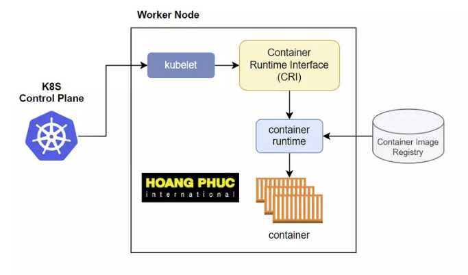
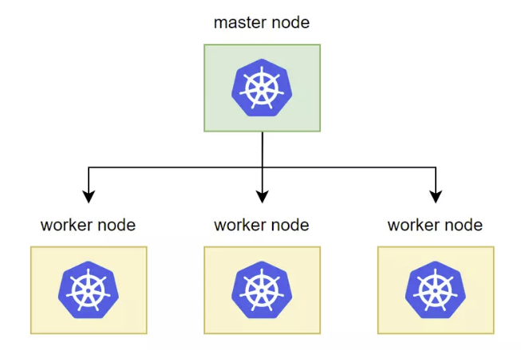
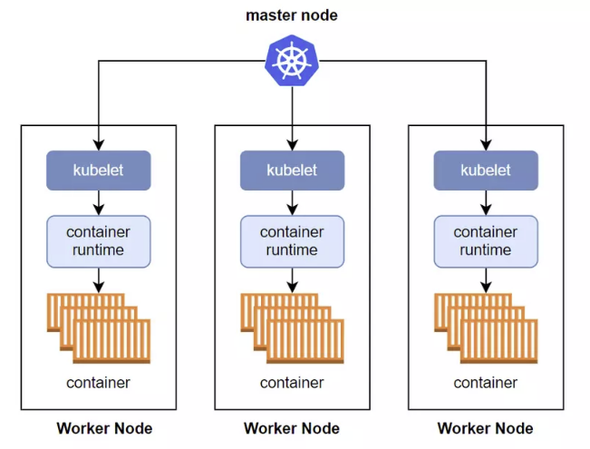
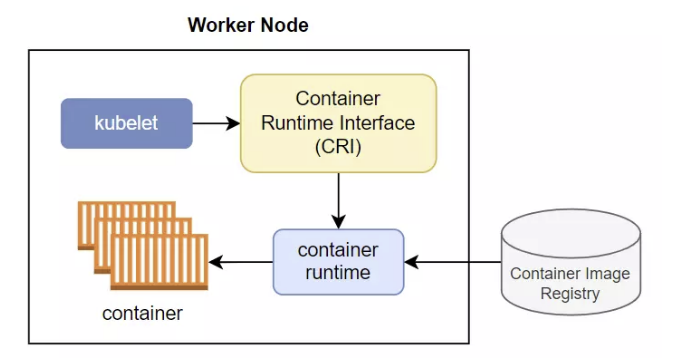
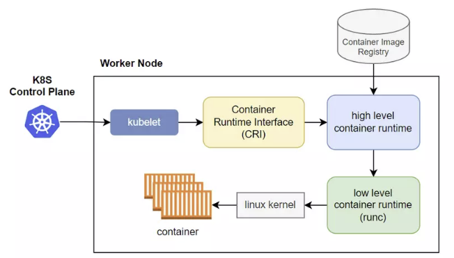
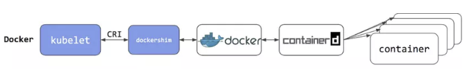
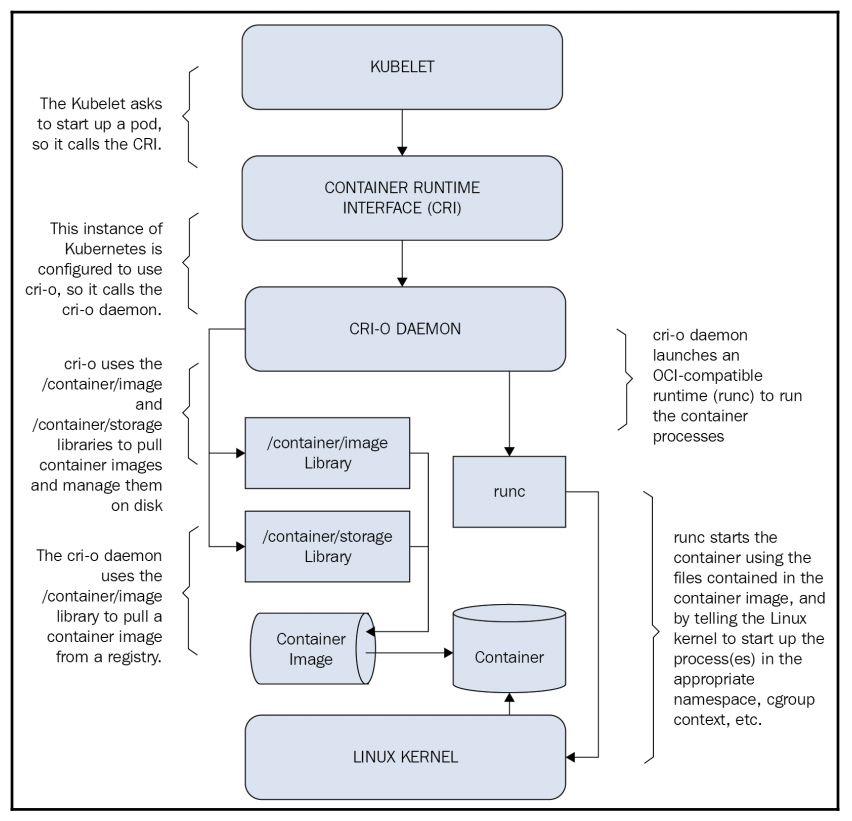

<h1 style="color:orange">Container runtime</h1>
Kubernetes được sử dụng các container runtime để chạy các container 

 
<h2 style="color:orange">1. Cấu trúc K8s</h2>

 
Sơ qua về kiến trúc k8s: master node có nhiệm vụ chính là quản lý cluster, phân phối và quản lý container tới từng worker node. Worker node có nhiệm vụ chính là nơi chứa các container để chạy ứng dụng. Trong từng master node và worker node nó sẽ có các thành phần sau đây: 
 

Kubernetes master sẽ bao gồm 4 component:
- etcd: dùng để lưu trữ trạng thái của cluster.
- API server: thành phần chính mà client hoặc các thành khác sử dụng để giao tiếp với kubernetes cluster.
- Controller Manager: quản lý và tạo các resource tương ứng trong cluster.
- Scheduler: phân phối chọn worker node để chạy container.

Kubernetes worker node sẽ bao gồm 3 thành phần:
- kubelet: quản lý container trên từng worker node.
- kube-proxy
- container runtime
<h2 style="color:orange">2. K8s quản lý cluster ntn?</h2>
Trong 1 cluster sẽ có nhiều worker node, worker node là nơi các container chạy. Để làm việc với từng container trên worker node, k8s sử dụng kubelet. 

 
Kubelet là thành phần tương tác với master node và quản lý container bên trong k8s cluster. Bên cạnh đó, kubelet giám sát container trên worker node và gửi thông tin về master node. Kubelet lắng nghe thông báo từ master node về cấu hình container được phân phối tới worker node, sau đó tạo container tương ứng cấu hình đó trên worker node.
<h2 style="color:orange">3. Container runtime và container runtime interface</h2>
K8s làm việc với container quá kubelet, kubelet làm việc với container qua container runtime. 
Container runtime đóng vai trò quản lý, giúp tạo và xóa container dễ dàng, thay vì tạo container bằng hàng loạt câu lệnh CLI phức tạp.

kubelet sẽ tương tác với container runtime ở trên worker node thông qua một layer tên là Container Runtime Interface (CRI).
 

Vậy tại sao ta lại phải cần CRI, sao kubelet không tương tác trực tiếp với container luôn đi, tách ra chi cho rảnh vậy?

Thì lý do cho việc này là vì nhà phát triển kubernetes muốn giữ cho kubelet đơn giản nhất có thể. Vì container runtime thì có rất nhiều loại (docker, cri-o, containerd, ...), thì thay vì ta phải implement việc tương tác với rất nhiều loại container runtime khác nhau bên trong kubelet, thì ta nhà phát triển kubernetes muốn để việc đó cho một thằng trung gian là CRI.

Cho dù ở worker node có xài container runtime nào đi chăng nữa thì kubelet cũng chỉ giao tiếp với CRI thông qua một tập lệnh duy nhất, còn lại việc giao tiếp với các container runtime khác nhau như thế nào thì tự thằng CRI nó implement.

Vậy thì kubelet sẽ thông qua CRI tương tác với container runtime, và container runtime sẽ thực hiện việc tạo container, hình minh họa nguyên một luồng kubernetes tạo container.
 
1. Đầu tiên kubernetes master node sẽ báo cho kubelet tạo container.
2. Tiếp theo kubelet sẽ giao tiếp với high level container runtime (cri-o, containerd, ...) thông qua CRI và kêu nó tạo container đi.
3. Lúc này high level container runtime sẽ pull image từ container image registry xuống, extract nó ra và lưu xuống disk.
4. Sau đó low level container runtime sẽ được thông báo và nó sẽ nhảy vào disk để lấy container image để tạo container.
5. Sau khi lấy được container image thì low level container runtime sẽ thực hiện một loạt lệnh xuống dưới linux kernel để tạo container.
<h2 style="color:orange">4. Các loại container runtime</h2>
<h3 style="color:orange">4.1. Docker</h3>
Docker là container runtime k8s sử dụng, nhưng ở bản 1.24 thì đã bị k8s remove.

 
K8s sử dụng docker thông qua CRI là dockershim, vì quá rườm ra nên đã bị remove từ bản 1.24.
<h3 style="color:orange">4.2. Containerd</h3>
Là 1 container runtime đơn giản và bớt rườm ra hơn so với docker.

 
Từ bản 1.1 thì containerd có nhúng sẵn một CRI plugin vào bên trong nó, kubelet chỉ cần tương tác trực tiếp với plugin này là được. Như ta thấy thì thay vì ở trên ta dùng docker cho container runtime ta phải đi qua rất nhiều lớp, còn với containerd thì ta đi thẳng tới nó luôn.
<h3 style="color:orange">4.3. CRI-O</h3>
Đây là một thằng container runtime cũng phổ biến mà có thể dùng cho kubernetes như thằng containerd.

 
CRI-O được phát triển bởi Redhat.