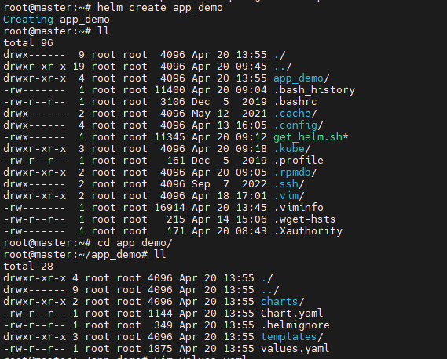
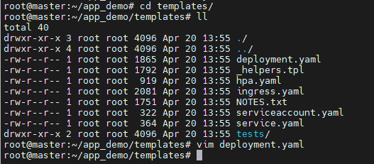

<h1 style="color:orange">Helm-chart</h1>
Khi mới tiếp cận với Kubernetes thì khái niệm helm-chart là một cái gì đó khá trừu tượng. Helm là một trình quản lý gói và công cụ quản lý ứng dụng cho Kubernetes, nó đóng gói nhiều tài nguyên Kubernetes vào một đơn vị triển khai logic duy nhất được gọi là Chart. Bên trong của Chart sẽ có phần chính là các "template, là định nghĩa các tài nguyên sẽ triển khai lên k8s.

Cụ thể, deploy một app lên k8s mình cần tạo 3 file yaml gồm deployment.yaml, service.yaml và ingress.yaml. Các file này định nghĩa rõ ràng các tham số cấu hình cho việc triển khai ứng dụng. Tuy nhiên khi cần thay đổi tham số thì việc sử dụng các file đó sẽ trở nên cồng kềnh và khó kiểm soát, không có quản lý version trên k8s.

Còn khi dùng helm, thì ta sẽ có các file tương tự như vậy nhưng ở dạng "template", tức là nó ở mức độ linh động hơn. Khung của các file mô tả deployment hay service cơ bản vẫn vậy, nhưng thay vì các giá trị cụ thể như ban đầu chúng ta thực hiện, thì nó sẽ kết hợp với các "giá trị" được khai báo từ một file value khác (file values.yaml trong helm chart) để sinh ra file yaml cuối cùng để appy vào hệ thống.
<h2 style="color:orange">Cách tạo Helm-chart</h2>
Để tạo helmchart, trước tiên ta phải cài helm và kubectl và cấu hình kết nối tới k8s của bạn. Sau đó tạo helmchart bằng lệnh "helm create [chart-name]":

    # helm create app-demo
Kết quả sinh ra một thư mục chứa helm-chart mới. File values.yaml chứa các tham số mặc định ban đầu, ta sẽ tạo copy file này ra thêm một file mới để điều chính một giá trị theo thực tế.

 
Trong đó, trước tiên ta quan tâm tới thư mục templates: 
 

Mặc định khi tạo một helmchart ta sẽ có các template cho: deployment, service, service account, ingress, hpa và các tests. So sánh với phần trước khi cài đặt ứng dụng bằng các manifest file thì ta đã viết 3 file gồm: deployment.yaml, service.yaml và ingress.yaml.

Thay vì ta phải tự viết từng tham số trong file deployment.yaml, thì khi dùng helmchart ta sẽ có một file template gần như đầy đủ các thành phần của một deployment, còn dùng những thành phần cụ thể nào thì ta định nghĩa qua file values (values.yaml).

`Lưu ý:`

- Nếu gán thêm các biến môi trường vào deployment, cái này trong template mặc định của deployment không có ==> Ta phải customize template của deployment để đạt mục đích tương tự (bổ sung cấu hình env trong deployment).
- Trong cấu hình mặc định của deployment template này chỉ có 01 container và sử dụng port mặc định là 80, port này sẽ dùng cho các phần kiểm tra liveness và readiness của port. Ứng dụng hiện tại mình viết đang listen port 8080 nên để không phải sửa code thì mình sẽ sửa giá trị này thành 8080.

Như vậy, ta có thể hiểu đơn giản cách dùng helmchart template như sau:
- templates/deployment.yaml + values.yaml ==> File deployment.yaml
- templates/service.yaml + values.yaml ==> File service.yaml
- templates/ingress.yaml + values.yaml ==> File ingress.yaml 

Tóm lại để customize một ứng dụng trước khi deploy nó lên k8s bằng helmchart thì bạn không phải sửa lại tất cả các file yaml như thông thường, mà bạn chỉ cần update một file values duy nhất.