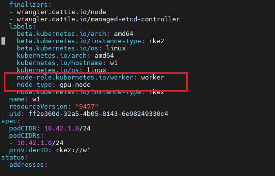
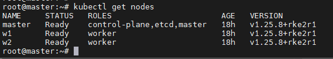

<h1 style="color:orange">Sử dụng RKE2 để triển khai K8s cluster</h1>
RKE2 là công cụ để triển khai k8s. Bản chất RKE2 chính là 1 distro của k8s, giống như các distro của Linux. Tuy vậy, RKE2 giúp cho việc triển khai cluster K8s được thuận tiện và dễ dàng hơn.
<h2 style="color:orange">1. Chuẩn bị</h2>
Thực hiện cài cluster K8s trên 3 server Ubuntu 20.04. 1 master, 2 worker.

Thực hiện trên tất cả các node: 
1. Disable firewall:

       $ systemctl stop ufw
       $ systemctl disable ufw
2. Enable IP forwarding
    
       $ vim /etc/sysctl.d/90-rke2.conf
       paste vào
       net.ipv4.conf.all.forwarding=1
       net.ipv6.conf.all.forwarding=1
       $ sysctl --system
3. Nếu server enable NetworkManager:
   
       $ vim /etc/NetworkManager/conf.d/rke2-canal.conf
       paste vào
       [keyfile]
       unmanaged-devices=interface-name:cali*;interface-name:flannel*
reload service NetworkManager:

    $ systemctl restart NetworkManager
4. Disable swap (k8s version 1.21 trở xuống không hỗ trợ dùng swap) 

       $ systemctl disable swap.target
       $ swapoff -a
để không sử dụng swap khi khởi động lại máy: mở file /etc/fstab và thêm dấu "#" vào dòng có swap.

5. Disable module nouveau driver trên các node gpu để cài đặt được nvidia driver:

       $ vim /etc/modprobe.d/blacklist-nouveau.conf
       paste vào
       blacklist nouveau
       options nouveau modeset=0
       $ update-initramfs -u
Sau đó thực hiện reboot server: init 6

6. Cài đặt Helm (chỉ cần trên server quản trị):

       $ curl -fsSL -o get_helm.sh https://raw.githubusercontent.com/helm/helm/main/scripts/get-helm-3
       $ chmod 700 get_helm.sh
       $ ./get_helm.sh
<h2 style="color:orange">2. Cài đặt RKE2</h2>

Cài đặt RKE2 server version 1.25.8 trên node master đầu tiên:

    $ curl -sfL https://get.rke2.io | INSTALL_RKE2_VERSION=v1.25.8+rke2r1 sh -
Tạo thư mục rke2:

    $ mkdir -p /etc/rancher/rke2
Tạo file config cho rke2:

    $ vim /etc/rancher/rke2/config.yaml
paste vào

    token: shared-secret
    tls-san:
      - cluster.local
    disable: 
      - rke2-ingress-nginx
Start service rk2-server:
    
    $ systemctl enable rke2-server
    $ systemctl start rke2-server
Copy tool kubectl và ctr vào /usr/local/bin. Các tool này khi cài script kéo rke2 về đã được cài

    $ cp /var/lib/rancher/rke2/bin/kubectl /usr/local/bin/kubectl
    $ cp /var/lib/rancher/rke2/bin/ctr /usr/local/bin/ctr
Lấy file kube config:

    $ mkdir .kube
    $ cp /etc/rancher/rke2/rke2.yaml .kube/config
Lấy token trên node master đầu tiên để join các node khác vào cluster:

    $ cat /var/lib/rancher/rke2/server/node-token
<h2 style="color:orange">2.1. Trên các node master còn lại</h2>

    $ curl -sfL https://get.rke2.io | INSTALL_RKE2_VERSION=v1.25.8+rke2r1 sh -
Tạo file config /etc/rancher/rke2/config.yaml trên các node master với nội dung:

    $ vim /etc/rancher/rke2/config.yaml
paste vào

    server: https://<IP node master đầu tiên>:9345
    token: <token lấy từ file /var/lib/rancher/rke2/server/node-token trên node master đầu tiên>
    tls-san:
      - cluster.local
    disable: 
      - rke2-ingress-nginx
Start service rke2-server:

    $ systemctl enable rke2-server.service
    $ systemctl start rke2-server.service
<h2 style="color:orange">2.2. Cài đặt RKE2 worker trên các node còn lại</h2>

    $ curl -sfL https://get.rke2.io | INSTALL_RKE2_TYPE="agent" INSTALL_RKE2_VERSION=v1.25.8+rke2r1 sh -
Tạo file config /etc/rancher/rke2/config.yaml trên các node worker với nội dung:

    # mkdir -p /etc/rancher/rke2
    # vim /etc/rancher/rke2/config.yaml
paste vào

    server: https://<IP node master đầu tiên>:9345
    token: <token lấy từ file /var/lib/rancher/rke2/server/node-token trên node master đầu tiên>
    tls-san:
      - cluster.local
    disable: 
      - rke2-ingress-nginx
Start service rke2-agent:

    $ systemctl enable rke2-agent.service
    $ systemctl start rke2-agent.service
Thêm Label "node-role.kubernetes.io/worker: worker" và “node-type: gpu-node” trên các node worker gpu.

    $ kubectl edit node/tên_node_worker
Thêm các dòng
    
    node-role.kubernetes.io/worker: worker
    node-type: gpu-node
 

tạo file /var/lib/rancher/rke2/agent/etc/containerd/config.toml.tmpl trên tất cả các node của cluster để cấu hình cho gpu-operator:

    $ /var/lib/rancher/rke2/agent/etc/containerd/config.toml.tmpl
paste vào

    version = 2
    [plugins]
      [plugins."io.containerd.grpc.v1.cri"]
        enable_selinux = false
        sandbox_image = "index.docker.io/rancher/pause:3.6"
        stream_server_address = "127.0.0.1"
        stream_server_port = "10010"
        [plugins."io.containerd.grpc.v1.cri".containerd]
          disable_snapshot_annotations = true
          snapshotter = "overlayfs"
          [plugins."io.containerd.grpc.v1.cri".containerd.runtimes]
            [plugins."io.containerd.grpc.v1.cri".containerd.runtimes.runc]
              runtime_type = "io.containerd.runc.v2"
      [plugins."io.containerd.internal.v1.opt"]
        path = "/data/rancher/rke2/agent/containerd"
Sau đó restart rke2 trên các node:

    $ master: systemctl restart rke2-server
    $ worker: systemctl restart rke2-agent
<h2 style="color:orange">3. Kiểm tra</h2>

    $ kubectl get nodes
 
<h2 style="color:orange">4. Uninstall RKE2</h2>
Để uninstall RKE2:

    $ /usr/local/bin/rke2-uninstall.sh
<h2 style="color:orange">5. Các câu lệnh kiểm tra rke2-k8s cluster</h2>

https://gist.github.com/superseb/3b78f47989e0dbc1295486c186e944bf

Lưu ý crictl là giao diện cho người dùng thay thế cho docker. VD: crictl ps thay thế cho docker ps.