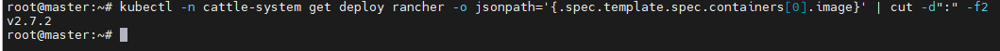

<h1 style="color:orange">Triển khai rancher</h1>
Hiểu đơn giản, RKE2 là công cụ hỗ trợ triển khai cluster k8s. Rancher là công cụ quản lý giám sát các cluster k8s, hỗ trợ triển khai các workload (application), quản lý tài nguyên dễ dàng.

Rancher có 2 option triển khai:
- Cài cluster service trên các server, mở kết nối đến các cluster k8s để giám sát. Chạy HA phải cấu hình proxy, keepalive, ...
- Cài trực tiếp trong 1 cluster k8s cần giám sát để k8s thực hiện chạy HA luôn cho rancher.

Hướng dẫn sử dụng helm để triển khai Rancher.
<h2 style="color:orange">1. Cài rancher</h2>

1. Sử dụng helm repo add để add Helm chart repo chứa chart để install Rancher:

       $ helm repo add rancher-stable https://releases.rancher.com/server-charts/stable
2. Tạo namespace cho rancher
Cần phải tạo K8s namespace. Vendor khuyến nghị nên đặt là `cattle-system`

       $ kubectl create namespace cattle-system
3. Cài cert-manager 
Sử dụng `Rancher-generated TLS certificate:` Rancher sử dụng `cert-manager` để issue và duy trì cert của chính nó. Rancher sẽ tạo ra CA cert của chính nó và kí cert sử dụng CA đó. Cert-manager có trách nhiệm quản lý certificate đó.

       $ kubectl apply -f https://github.com/cert-manager/cert-manager/releases/download/v1.11.0/cert-manager.crds.yaml

       Thêm Jetstack Helm repository
       $ helm repo add jetstack https://charts.jetstack.io

       Update local Helm chart repo
       $ helm repo update

       Cài cert-manager Helm chart
       $ helm install cert-manager jetstack/cert-manager --namespace cert-manager --create-namespace --version v1.11.0
1 khi đã instal cert, kiểm tra pod trong cert-manager namespace
 

4. Cài Rancher với Helm

       $ helm install rancher rancher-stable/rancher --namespace cattle-system --set hostname=cb-rancher-dev.fpt.ai --set replicas=1 --set global.cattle.psp.enabled=false --set bootstrapPassword=admin
Trong đó:
- `--set-hostname` chỉ ra hostname hoặc FQDN muốn dùng để truy cập Rancher server. Cần thiết khai báo DNS name link tới địa chỉ IP cài rancher với Load balancer hoặc ingress controller.
- `replicas` chỉ ra số pods được tạo cho Rancher để đảm bảo HA
- `bootstrapPassword` password mặc định khi truy cập lần đầu vào Rancher, sau khi truy cập có thể đổi
- `global.cattle.psp.enabled`: PSP là module để chặn pod bị cấu hình sai được tạo ra trong cluster. Đây là module đã lỗi thời và bị thay thế từ bản K8s 1.25. Dưới v1.25 thì dùng option này. Trên 1.25 thì có thể bỏ option này.
<h2 style="color:orange">2. Kiểm tra</h2>

    $  kubectl -n cattle-system rollout status deploy/rancher
 
-> Thành công

Để check rancher version:

    $ kubectl -n cattle-system get deploy rancher -o jsonpath='{.spec.template.spec.containers[0].image}' | cut -d":" -f2
 

<h2 style="color:orange">3. Để uninstall rancher</h2>

    $ git clone https://github.com/rancher/rancher-cleanup.git
    $ cd rancher-cleanup
Chạy job

    $ kubectl create -f deploy/rancher-cleanup.yaml
Xem log xóa

    $ kubectl  -n kube-system logs -l job-name=cleanup-job -f
Job chạy khoảng 1 tiếng

Job sẽ tạo pods trong namespace kube-system. Sau khi chạy xong có thể xóa pod trong namespace kube-system

     $ kubectl delete pod <tên_pod> -n kube-system
Lưu ý: rancher khi tạo sẽ tạo ra rất nhiều thành phần phụ trợ. Không xóa bằng lệnh dưới hay những lệnh tương tụ -> gây ra conflict: 

     $ kubectl delete all --all -n cattle-system
<h2 style="color:orange">4. Rotate certificate</h2>
Mặc định khi cài cluster k8s bằng rke2 thì cert cuar kubelet sẽ hết hạn sau 1 năm. Để kiểm tra:

    $ openssl x509 -in /var/lib/rancher/rke2/agent/serving-kubelet.crt -text
    $ openssl x509 -in /var/lib/rancher/rke2/agent/client-kubelet.crt -text
 

Để cập nhật cert mới cho kubelet, có thể update cluster rke2 hoặc sử dụng rotate cluster theo hướng dẫn: https://ranchermanager.docs.rancher.com/v2.6/how-to-guides/new-user-guides/manage-clusters/rotate-certificates