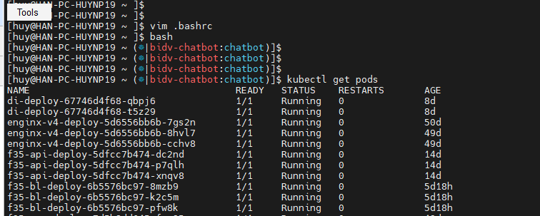

<h1 style="color:orange">Sử dụng Kubectl plugins</h1>
Kubectl là commmand line interface để tương tác với K8s cluster.
<h2 style="color:orange">1. Install krew</h2>
Chúng ta có thể cài krew như là kubectl plugin manager để cài kubectl plugin. Krew là tool đơn giản hóa việc sử dụng kubectl plugins. Krew giúp tìm kiếm plugins, cài và quản lý chúng trên máy. Nó tương tự như apt, dnf hoặc brew.

Cài krew:

    $ apt install git -y
    $ (
        set -x; cd "$(mktemp -d)" &&
        OS="$(uname | tr '[:upper:]' '[:lower:]')" &&
        ARCH="$(uname -m | sed -e 's/x86_64/amd64/' -e 's/\(arm\)\(64\)\?.*/\1\2/' -e 's/aarch64$/arm64/')" &&
        KREW="krew-${OS}_${ARCH}" &&
        curl -fsSLO "https://github.com/kubernetes-sigs/krew/releases/latest/download/${KREW}.tar.gz" &&
        tar zxvf "${KREW}.tar.gz" &&
        ./"${KREW}" install krew
      )
EXPORT krew bin path vào biến môi trường

    $ export PATH="${KREW_ROOT:-$HOME/.krew}/bin:$PATH"
<h2 style="color:orange">2. Cài krew plugin ctx và ns</h2>
Update krew local package

    $ kubectl krew update
Install krew plugin ctx và ns

    $ kubectl krew install ctx
    $ kubectl krew install ns
ctx dùng để setting và switching context

Để upgrade các plugin up-to-date
    
    $ kubectl krew upgrade
<h3 style="color:orange">2.1. Sử dụng ctx và ns</h3>
Check context hiện tại

    $ kubectl ctx -c
    $ kubectl ctx
Check namespace hiện tại

    $ kubectl ns -c
    đổi default namespace
    $ kubectl ns
<h2 style="color:orange">3. Cài kube-ps1</h2>
Kube-ps1 là tool display context và namespace hiện tại để tránh gây nhầm lẫn

 
Cài kube-ps1: 

    $ git clone https://github.com/jonmosco/kube-ps1.git
    $ mv ./kube-ps1/kube-ps1.sh /usr/local/bin
    $ vim .bashrc
    thêm các dòng
    source /usr/local/bin/kube-ps1.sh
    PS1='[\u@\h \W $(kube_ps1)]\$ '

    $ bash
<h2 style="color:orange">4. Cài fzf</h2>
Cài fzf hỗ trợ kubectl ns và kubectl ctx
    
    $ git clone --depth 1 https://github.com/junegunn/fzf.git ~/.fzf
    $ ~/.fzf/install
<h2 style="color:orange">5. Cấu hình để thao tác với remote k8s cluster rancher</h2>

Chuẩn bị:
- 1 node điều khiển (node điều khiển có kết nối tới rancher)
- k8s

Để cấu hình thao tác với remote cluster của rancher. Vào phần cluster management download cluster kubeconfig. Nội dung file sẽ như sau:
 
Với clusters.cluster.server là đường dẫn URL đến cấu hình cluster k8s 
Lưu ý, ta có thể thêm sửa xóa cluster qua trung gian rancher mà không cần kết nối trực tiếp đến control plane của k8s cluster.

Users.user.token là token cho user có quyền gọi vào API rancher để quản lý cluster k8s

 
Trên node thao tác với k8s cluster (node điều khiển) tạo file config cho kubectl:

    cd ~/ && mkdir -p .kube/clusters && cd ~/.kube
Mặc định cấu hình kubectl nằm trong folder .kube ở home directory. Cụ thể trong file: ~/.kube/config

Tham khảo: https://www.howtogeek.com/devops/getting-started-with-kubectl-to-manage-kubernetes-clusters/

Tuy nhiên nếu muốn thay đổi đường dẫn đến file config khác. Ta chỉnh sửa trong .bashrc hoặc /etc/profile.d/

Ở đây ta tạo file config cho cluster k8s rancher

    $ vim ~/.kube/clusters/bidv-chatbot.yaml
paste vào nội dung file tải về ở bước trước: 
 
Tiếp theo khai báo path kubectl trỏ đến file config:

    $ vim ~/.bashrc
    export KUBECONFIG=$(find ~/.kube/clusters -type f | sed ':a;N;s/\n/:/;ba')
có nghĩa là kubectl sẽ nhận toàn bộ file config trong folder ./kube/clusters/ 
 

Sau khi kết nối đến cluster thì hệ thống sẽ tự tạo các folder sau: 
 
Cache và kubens
<h3 style="color:orange">5.1 Cấu hình alias</h3>
Để thêm cluster quản lý, trong folder ~/.kube/clusters lại thêm 1 file yaml nữa với config của cluster khác lấy từ rancher

 
Sau đó đổi cluster muốn tương tác bằng cách thay đổi context:

    $ kubectl ctx
<h2 style="color:orange">6. Cấu hình alias</h2>
Cấu hình alias để thao tác nhanh
     
    $ vim ~/.bash_aliases
    paste vào
    # Kubernetes
    alias k=kubectl
    alias kcg='kubectl config get-contexts'
    alias kcu='kubectl config use-context'
    alias kd='kubectl describe'
    alias kps='kubectl get pods --show-labels'
    complete -o default -F __start_kubectl k
    alias kctx='kubectl ctx'
    alias kns='kubectl ns'

    # Ansible
    alias ap=ansible-playbook
    alias av=ansible-vault
    alias ag=ansible-galaxy
alias này hoàn toàn có thể paste vào file .bashrc

Để check alias. Ví dụ:
    
    # alias kps
 
<h2 style="color:orange">7. Cấu hình complete</h2>

    $ vim ~/.bashrc
    thêm vào dòng
    complete -W "bidv-chatbot" kcu
 
Dòng này thêm vào file bashrc để cấu hình mỗi khi chạy lệnh kcu, ấn tab là auto điền vào "bidv-chatbot". Option -W viết tắt của word