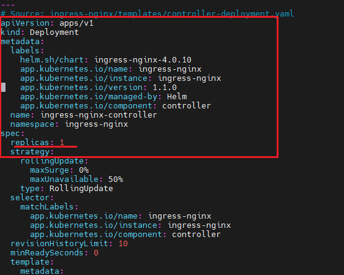
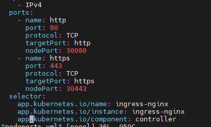
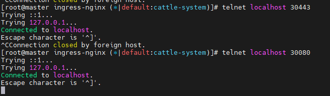
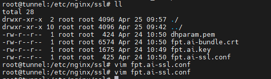
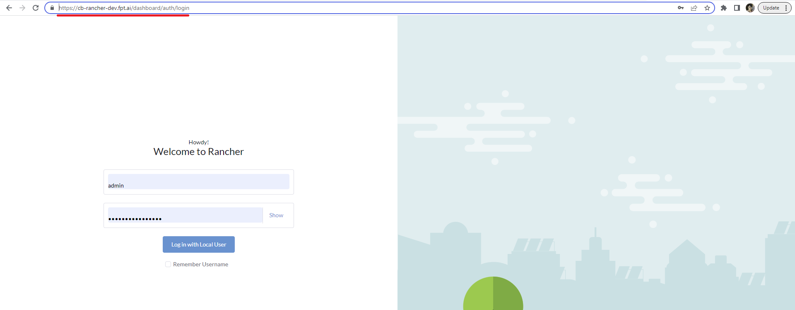

<h1 style="color:orange">Cài ingress-nginx (API gateway)</h1>
<h2 style="color:orange">1. Chuẩn bị</h2>
Cài ingress-nginx trên node master đ/c: 10.51.0.9

Tạo directory cho ingress-nginx

    $ mkdir ingress-nginx && cd ./ingress-nginx

Truyền 3 file vào directory ingress-nginx (3 file này đều nằm trong 08.ingress-nginx.zip):
- deployment-1.1.0.yaml
- nodeports.yaml
- run_after_create.sh

Lần lượt chạy 3 file:

    $ kubectl apply -f ./deployment-1.1.0.yaml
    $ kubectl apply -f ./nodeports.yaml
    $ kubectl apply -f ./run_after_create.sh
Trong file deployment-1.1.0.yaml, nếu có 1 master thì để replica là 1, 3 master thì replica=3 
 

Sau khi chạy xong thì dịch vụ chạy http trên port 30080 và https port 30443 của node master (30080 map với port 80 của ingress-nginx, 30443 map với 443)

Nội dung file nodeport: 
 
 
Lúc này, dịch vụ chạy trên port 80 và 443 của ingress-nginx đã được thông ra ngoài trên địa chỉ master, nếu có 3 master thì sẽ thông ra ngoài trên cả 3 con, port 30080 và 30443

Lưu ý: có thể cấu hình ingress-nginx chạy trên node worker, tuy vậy, nếu có nhiều worker thì cấu hình load balancer nginx bên ngoài có thể rắc rối, khó kiểm soát.
<h2 style="color:orange">2. Cài load balancer nginx bên ngoài</h2>
Cài nginx trên 1 host bất kì, có thông kết nối đến các con master. Ở đây địa chỉ của nginx là 103.176.146.157

    $ vim /etc/apt/sources.list.d/nginx.list
    paste vào
    deb https://nginx.org/packages/ubuntu/ focal nginx
    deb-src https://nginx.org/packages/ubuntu/ focal nginx
    $ sudo apt update
    $ sudo apt install -y nginx
<h3 style="color:orange">2.1 Cấu hình nginx</h3>

    $ cd /etc/nginx/
    $ vim nginx.conf
paste vào

    user  www-data;

    error_log  /var/log/nginx/error.log warn;
    pid        /run/nginx.pid;

    worker_processes  "2";

    worker_rlimit_nofile 30000;

    events {
        worker_connections  10000;
        multi_accept off;
    }

    http {
        include       /etc/nginx/mime.types;
        default_type  application/octet-stream;
        server_names_hash_bucket_size 64;
        client_max_body_size 200m;
        log_format  main  '$remote_addr - $remote_user [$time_local] "$request" '
                           '$status $body_bytes_sent "$http_referer" '
                           '"$http_user_agent" "$http_x_forwarded_for" '
                           '$host $request_length $request_time $upstream_response_time';
        access_log  /var/log/nginx/access.log main buffer=16k flush=2m;

        sendfile        on;
        tcp_nopush      on;
        tcp_nodelay     on;
        keepalive_timeout  75;
        keepalive_requests 600;
        server_tokens on;
        # gzip on;

        include /etc/nginx/conf.d/*.conf;
        include /etc/nginx/sites-enabled/*;
        }
<h3 style="color:orange">2.2. Cấu hình file config.d trong nginx</h3>

    $ cd conf.d/
    $ vim conf.d/default.conf
    paste vào
    server {
        listen      80;
        server_name "";
        return      444;
    }
File conf.d/fptai.conf

    $ vim conf.d/fptai.conf
    paste vào
    server {
        listen 80;
        server_name *.fpt.ai;
        return 301 https://$host$request_uri;
    }

    server {
        server_name *.fpt.ai;
        access_log /var/log/nginx/fpt.ai.access.log;
        error_log /var/log/nginx/fpt.ai.error.log error;

        client_max_body_size 200M;
        proxy_read_timeout 600s;
        proxy_send_timeout 600s;

        location / {
            include includes/k8s-proxy.conf;
            proxy_http_version 1.1;
            proxy_set_header Upgrade $http_upgrade;
            proxy_set_header Connection "upgrade";
        }

        include /etc/nginx/ssl/fpt.ai-ssl.conf;
    }
File conf.d/upstream.conf
    
    $ vim conf.d/upstream.conf
    paste vào
    upstream k8s-ingress {
        server 10.51.0.9:30080;        }
Ở đây có bao nhiêu master thì để bấy nhiêu node
<h3 style="color:orange">2.3. Cấu hình file includes trong nginx</h3>

    $ mkdir -p /etc/nginx/includes && cd /etc/nginx/includes
    $ vim k8s-proxy.conf
    paste vào
    proxy_pass http://k8s-ingress;

    proxy_pass_request_headers      on;
    proxy_set_header                Host $host;
    proxy_set_header  X-Real-IP $remote_addr;
    proxy_set_header  X-Forwarded-Proto https;
    proxy_set_header  X-Forwarded-For $remote_addr;
    proxy_set_header  X-Forwarded-Host $host;
<h3 style="color:orange">2.4. Cấu hình SSL cho nginx</h3>

    $ mkdir -p /etc/nginx/ssl && cd /etc/nginx/ssl
    $ vim fpt.ai-ssl.conf
    paste vào
    listen 443 ssl;

    ssl_certificate /etc/nginx/ssl/fpt.ai-bundle.crt;
    ssl_certificate_key /etc/nginx/ssl/fpt.ai.key;

    ssl_session_cache shared:SSL:20m;
    ssl_session_timeout 60m;
    ssl_protocols TLSv1.2 TLSv1.3;
    ssl_prefer_server_ciphers on;
    ssl_ciphers ECDH+AESGCM:ECDH+AES256:ECDH+AES128:DHE+AES128:!ADH:!AECDH:!MD5;

    ssl_dhparam /etc/nginx/ssl/dhparam.pem;  # generated using: openssl dhparam 2048 -out /etc/nginx/ssl/dhparam.pem
 
Trong đó: 
- fpt.ai.bundle.crt là server cert của nginx
- fpt.ai.key là server private key của nginx
- trong server cert đã được bundle server public key
- fpt.ai.bundle.crt (server cert) đã được issue bởi bên thứ 3, bên thứ 3 này được các máy trong fpt domain trust
- file dhparam.pem là file tự gen, dùng để hỗ trợ truyền Diffie-Hellman cho SSL. Diffie-Hellman là hàm băm hỗ trợ cho việc có thằng man-in-the-middle bắt được cái shared key khi truyền giữa client và server thì cũng không thể giải mã được nội dung truyền.

    $ systemctl restart nginx
<h2 style="color:orange">3. Kiểm tra</h2>
Lúc này, dịch vụ ingress-nginx của k8s trên đ/c 10.51.0.9:30080 của master đã được map tới 103.176.146.157:443 là phần truyền ssl trong config ssl: fpt.ai-ssl.conf

Ở đây ví dụ cài rancher (06.rancher-install.md), map tới ingress-nginx trong cụm k8s với domain: cb-rancher-dev.fpt.ai

Chỉnh sửa file host của window bằng quyền admin: C:\Windows\System32\drivers\etc\hosts 
Nếu là linux thì sửa file /etc/hosts

Thêm vào dòng 103.176.146.157 cb-rancher-dev.fpt.ai 
Vào browser để truy cập vào web 
 
----> Thành công