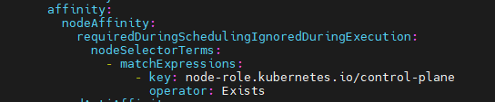
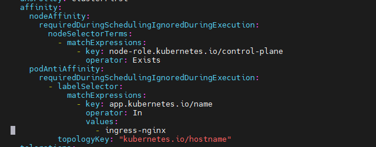

<h1 style="color:orange">Node affinity và pod affinity</h1>
<h2 style="color:orange">1. Node selector</h2>
Thuộc tính đầu tiên ta có thể sử dụng đó là nodeSelector, ta sẽ chỉ định thuộc tính này khi khai báo pod, giá trị của trường nodeSelector là label của node. Ví dụ như sau:

    apiVersion: v1
    kind: Pod
    metadata:
      name: pod-node-selector
    spec:
      nodeSelector:
        disktype: ssd
      containers:
        - name: main
          image: busybox
          command: ["dd", "if=/dev/zero", "of=/dev/null"]
Ở file trên ta chỉ định giá trị của nodeSelector là disktype: ssd, pod này sẽ được deploy tới những node mà được đánh label disktype: ssd, để đánh label của node, ta có thể xài câu lệnh như sau:

    $ kubectl label nodes <your-node-name> disktype=ssd
Đây là cách đầu tiên kubernetes chung cấp cho ta để deploy pod tới node mong muốn, nhưng nó sẽ có một nhược điểm là nếu ta không có bất cứ node nào được đánh label là disktype: ssd hoặc những node với label disktype: ssd đã đủ số lượng pod chạy trên nó, thì pod của ta không thể deploy được nữa. Bởi vì hạn chế này nên kubernetes có cung cấp cho ta một thuộc tính khác mà hiệu quả hơn khi so sánh nodeSelector là nodeAffinity.
<h2 style="color:orange">2. Node affinity</h2>
Thuộc tính này là phiên bản được nâng cấp hơn so với nodeSelector. Bên cạnh việc sẽ deploy pod tới node mà ta muốn, thì cái mà nó tốt hơn so với nodeSelector là nếu nó không kiếm được node ta chỉ định, thì nó sẽ deploy pod lên node khác nằm trong điều kiện lựa chọn của label, chứ không giống như nodeSelector nếu nó kiếm không được thì pod sẽ không thể được deploy.

Ngoài ra thì so với nodeSelector chỉ chọn chính xác theo label, nodeAffinity sẽ cho phép ta chọn label theo cách linh động hơn. Ví dụ như sau:

 
Để sử dụng trường nodeAffinity thì ta cần khai báo trường affinity trước, sau đó để chỉ định label của node thì ta dùng trường nodeSelectorTerms là một mảng chứa nhiều matchExpressions, giá trị key với value là giá trị của label node, operator thì có giá trị là `In, NotIn, Exists, DoesNotExist, Gt, Lt`. Ở trên thì là tồn tại node có role là control-plane (master) thì triển khai pod.
<h3 style="color:orange">2.1. Required During Scheduling and Ignored During Execution</h3>

- requiredDuringScheduling: có nghĩa là các thuộc tính ở dưới chỉ ảnh hưởng trong quá trình một pod được schedule tới một node mà thôi.
- IgnoredDuringExecution: có nghĩa là sẽ không có tác dụng tới những pod đã chạy ở trên node đó rồi.

Ví dụ pod của ta đã được deploy tới node có label là disktype: ssd, sau đó ta thì có xóa label của node này đi chăng nữa thì cũng không ảnh hưởng tới pod đang được chạy trên nó, mà chỉ ảnh hưởng tới các pod được deploy sau này mà thôi.
<h3 style="color:orange">2.2. Prioritizing nodes when scheduling a pod</h3>
Một điểm thú vị nữa của node affinity là ta có thể ưu tiên deploy pod tới node nào trước hơn so với các node còn lại trong những node ta đã chọn. Ta có thể thực hiện việc đó bằng cách sử dụng thuộc tính preferredDuringSchedulingIgnoredDuringExecution.
<h2 style="color:orange">3. Pod affinity</h2>
Thay vì deploy pod tới những node, thì ta sẽ có một nhu cầu khác nữa là deploy pod gần với một pod khác. Ví dụ dư là ta có pod backend và pod database, ta sẽ muốn hai pod đó được deploy gần với nhau để độ trễ của API là thấp nhất.

Ta có thể làm việc đó bằng cách bằng node affinity, nhưng ta sẽ cần đánh label cho node và chỉ định rõ những node có thể deploy cho pod, đây không phải là cách tốt cho vấn đề này. Ta sử dụng node affinity để deploy pod tới một cụm node cụ thể, sau đó ta sẽ để những pod liên quan được deploy gần với nhau.
<h3 style="color:orange">3.1. TopologyKey</h3>
Đây là thuộc tính giúp ta chỉ scope của pod khi nó đươc deploy gần với một pod khác, thường được quan tâm khi ta dùng cloud, nếu bạn không xài cloud thì có thể bỏ qua không cần tìm hiểu thuộc tính này. Nếu bạn có xài cloud, thì ta sẽ quen thuộc với các từ như là availability zone hoặc region, ta có thể dùng topologyKey để định nghĩa pod sẽ được deploy tới gần một pod khác trong cùng một node, cùng một AZ hoặc cũng một region.

Ta làm việc này bằng cách đánh label cho node với key là kubernetes.io/zone hoặc kubernetes.io/region, sau đó ta chỉ định trường topologyKey như sau:

    ...
    - topologyKey: kubernetes.io/zone
    ...
Ví dụ ở đây, những node có cùng giá trị zone thì pod sẽ triển khai trên node đấy, có thể triển khai 2 pod trên 1 node
Ta đã thấy cách hoạt động của pod affinity, sẽ giúp ta deploy những pod gần với nhau như ta muốn. Kubernetes cũng có cung cấp cho ta cách để deploy một pod mà cách xa so với pod còn lại nếu bạn muốn, dùng pod anti-affinity.
<h2 style="color:orange">4. Pod anti-affinity</h2>

 
Pod anti affinity cũng nằm trong trường affinity. 
- Ở hình trên thì là không triển khai vào những node nào đã có pod ingress-nginx chạy trên rồi.
- topologyKey thể hiện không triển khai vào Pod có cùng hostname.