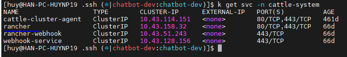

<h1 style="color:orange">DNS trong K8s</h1>

- Trong K8s, service tự động register. K8s chạy DNS service: `coredns` dưới dạng pod nằm trong namespace: kube-system 
 
- Những pod này được expose bởi kubedns service để các pod khác trong K8s có thể access coredns service này 
 
- Mỗi khi tạo 1 service mới, nó sẽ được register đến kubedns service
- Pod được tự động cấu hình với IP address của kubedns là IP của DNS resolver (mỗi khi ta truy cập domain name nào từ pod thì nó sẽ hỏi thằng DNS này đầu tiên).
- Do đó, tất cả pod có thể truy cập tất cả service bằng name.
<h2 style="color:orange">1. Truy cập các service từ pod</h2>

- Nếu service nằm cùng namespace với pod, pod có thể truy cập tới service bằng hostname viết tắt. VD:
- Nếu service nằm khác namespace với pod, yêu cầu FQDN bao gồm: 
`servicename.namespace.svc.clustername`
- Clustername được định nghĩa trong coredns Corefile và được set thành cluster.local mặc định, kiểm tra:

      # kubectl get cm -n kube-system coredns -o yaml
 

    # kubectl exec --stdin --tty tên_pod -- /bin/bash
Ví dụ 1 pod trong namespace `chatbot-dev` 
 

 
Từ 1 pod trong namespace `chatbot-dev`, thực hiện kết nối tới 1 service trong namespace `cattle-system`. Ví dụ:

    # kubectl exec --stdin --tty enginx-v4-deploy-6d5f4d959d-hvtqg -- /bin/bash
    root@enginx-v4-deploy-6d5f4d959d-hvtqg:~# curl rancher.cattle-system.svc.cluster.local
 
Kết nối thành công.

Nếu kết nối đến cùng namespace thì chỉ cần
    
    # curl tên_service
    ví dụ
    root@enginx-v4-deploy-6d5f4d959d-hvtqg:~# curl zns-ui-svc
 