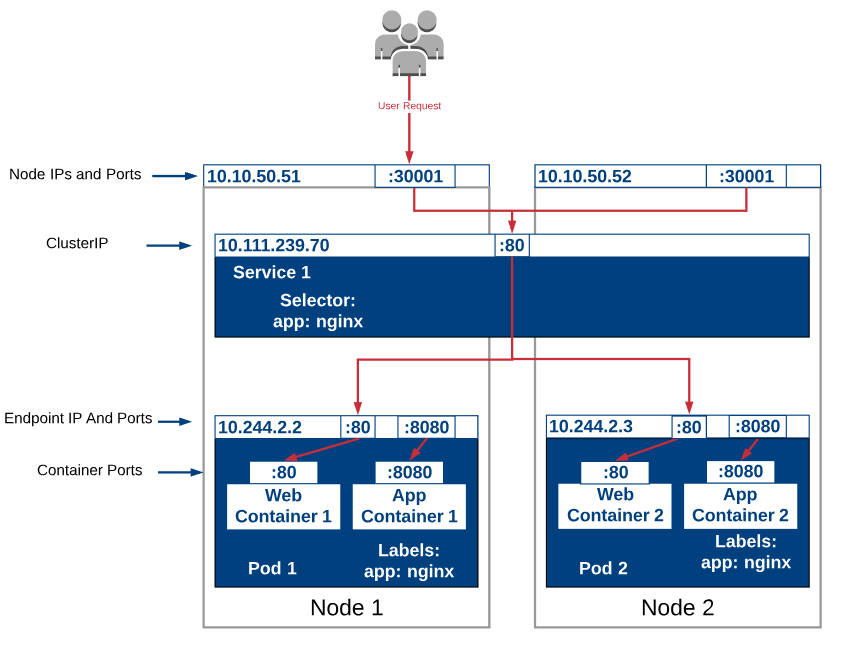
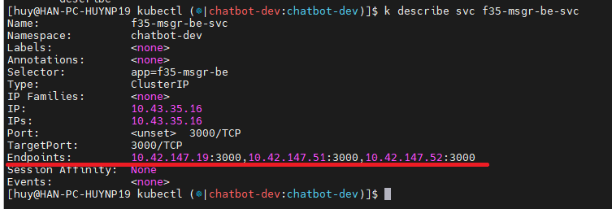

<h1 style="color:orange">Endpoint trong K8s</h1>
Endpoints là 1 object K8s, đại diện cho 1 danh sách Endpoints. Có 2 loại endpoint:

1. Internal pod chạy trong cluster: đây là kiểu thường gặp. Được k8s tạo tự động nếu khi ta tạo service và deployment (hoặc pod) có `service label selector` trùng với `pods label`
2. External IP mà không phải là pod: ít thông dụng hơn

External IP này có thể nằm ngoài cluster k8s - ví dụ là 1 external web hoặc database. 
Nó cũng có thể là external IP nằm ở namespace khác - nếu muốn trỏ service tới 1 service khác nằm khác namespace trong cluster.
<h2 style="color:orange">2. Endpoint nằm ở đâu</h2>

 
Endpoint nằm giữa service và các internal pods hoặc external resource (web server, database).
<h2 style="color:orange">3. Check endpoint</h2>
Nếu là 1 internal endpoint (pod label trùng với service label selector), có thể check endpoint:

    # kubectl describe svc/tên_service
 

Hoặc trực tiếp:

    # kubectl get endpoints tên_service

Với external Endpoints, nếu khi tạo service không định nghĩa label selector - K8s sẽ không tự động tạo list endpoints vì k8s không biết pods nào để proxy cho service.

Ví dụ tạo 1 service mà không có label selector:

    apiVersion: v1
    kind: Service
    metadata:
      name: my-service #<------ Should match the name of Endpoints object
    spec:
    #  selector:       # phần này comment
    #    app.kubernetes.io/name: tên_deploy    # phần này để ví dụ selector sẽ nằm đâu
      ports:
        - protocol: TCP
          port: 8080
          targetPort: 9376
Tạo external Endpoints

    apiVersion: v1
    kind: Endpoints
    metadata:
      name: my-service #<------ Should match the name of Service
    subsets:
      - addresses:
          - ip: 192.0.2.45
        ports:
          - port: 9376

`Lưu ý:` 
- Sử dụng từ `internal` để chỉ `auto-generated` Endpoints cho pods mà có label selector trùng với service.
- Sử dụng `external` để chỉ Endpoints được tạo thủ công (manual).
- Do đó dùng từ `auto-generated` và `manual` sẽ chính xác hơn. Tuy vậy dùng 2 từ kia cho dễ hình dung.
<h2 style="color:orange">4. Thay thế endpoints bằng endpointslice</h2>
Pods không cố định. Chúng không được thiết kế để bất biến, khi Pod bị tắt, không thể bật lại, chỉ có thể tạo pod mới với chức năng tương đương.

- Mỗi khi thêm hoặc xóa 1 pod kết nối với service, toàn bộ Endpoints object được update, và được gửi qua network đến tất cả node trong cluster
- Số lượng ip pods trong 1 endpoint object càng nhiều, thì endpoint object được vận chuyển giữa các node trong cluster càng lớn. Nếu service cần phải cập nhật nhiều lần, update pod thì thông tin vận chuyển của endpoints nàn phải update nhiều lần -> chiếm dụng tài nguyên network.
- Mỗi khi 1 node nhận thông tin update, node đó sẽ phải chạy tiến trình config network rules. Object càng lớn thì tài nguyên chạy tiến trình càng nhiều. Điều tương tự xảy ra với api server.

Nói ngắn gọn, càng nhiều Pods thay đổi (thêm, sửa, xóa):
- Tăng network traffic
- Tài nguyên tính toán cần thiết tăng cho việc process endpoints objects
- Ảnh hưởng tới control plane
- Giảm khả năng scale
<h3 style="color:orange">4.1. Endpointslice</h3>
Endpoint Slices chia Endpoint object thành các lát cắt nhỏ hơn (slices). Mỗi slice chứa max 100 endpoints. Có nghĩa là update nào với Pods trong Engpoint Slice sẽ đồng nghĩa với 1 slice nhỏ hơn gửi qua network cho các node.

- Giảm tải network traffic
- Giảm tài nguyên cần thiết process endpoint updates
- Giảm ảnh hưởng tới control plane
- Tăng khả năng scale
<h3 style="color:orange">4.2. Tạo Endpointslice</h3>
Ví dụ

    kind: Service
    apiVersion: v1
    metadata:
      namespace: default
      name: redis-svc
    spec:
      type: ClusterIP
    #  clusterIP: None
      ports:
        - port: 6379
          targetPort: 6379
    ---
    kind: EndpointSlice
    apiVersion: discovery.k8s.io/v1
    metadata:
      namespace: default
      name: redis-ep
      labels:
        kubernetes.io/service-name: redis-svc
    addressType: IPv4
    ports:
      - port: 6379
    endpoints:
      - addresses:
          - 10.51.0.12