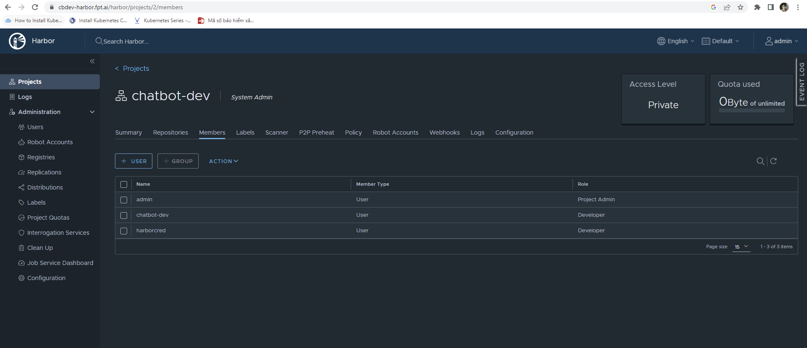
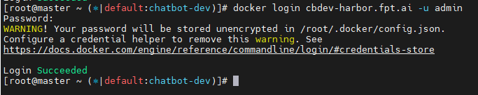
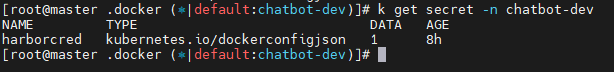
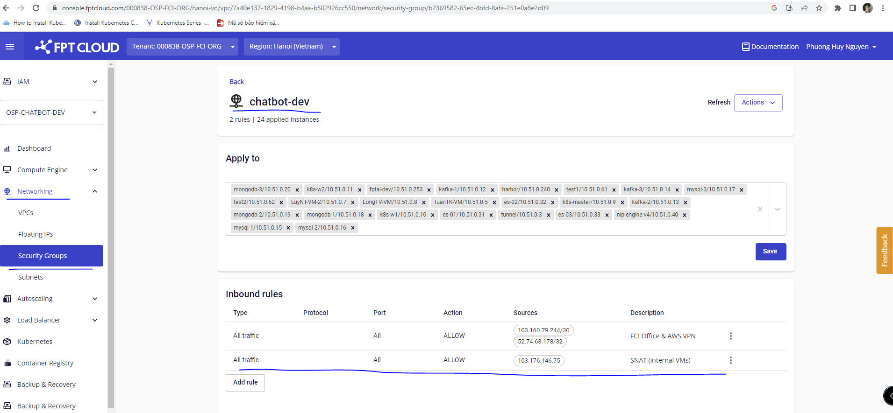
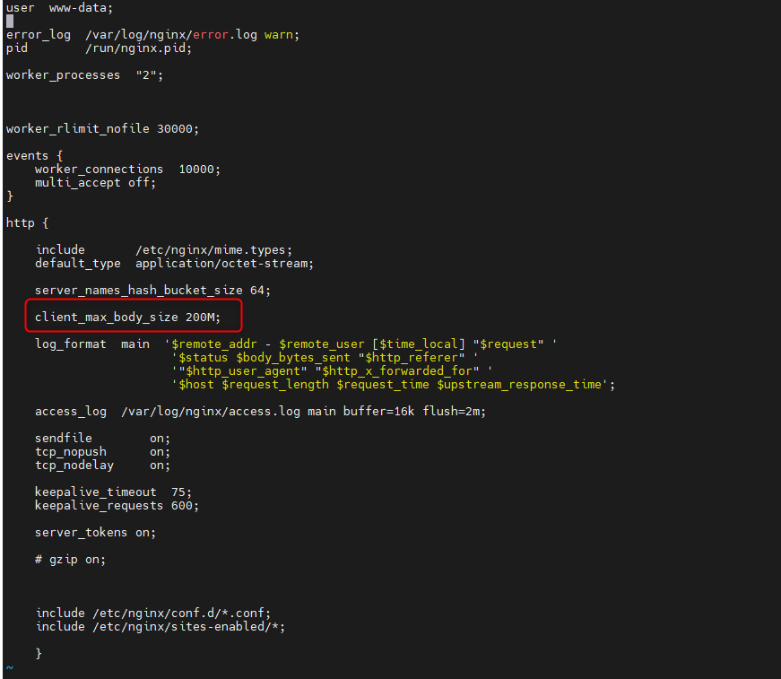
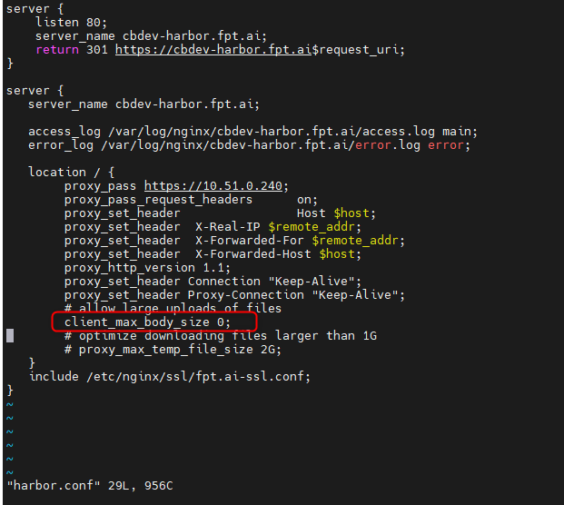
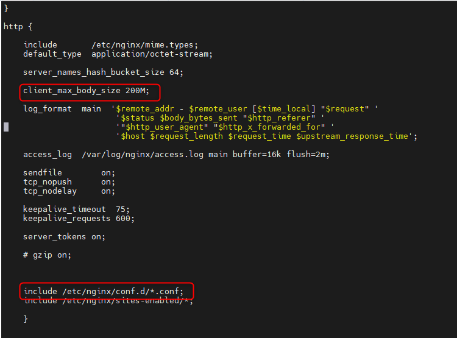

<h1 style="color:orange">Cấu hình k8s pull image từ harbor</h1>
Lưu ý, để cụm k8s có thể kéo image từ harbor về, đảm bảo tất cả server trong cụm k8s đều có kết nối đến harbor.

<h2 style="color:orange">1. Trên node master</h2>
Trên node master có kubectl, nếu kubectl cài trên 1 node khác thì node đấy cũng cần kết nối đến harbor.

Trên node master đã cài docker, thực hiện docker login với user có quyền push hoặc pull image trên harbor:

 
Ở đây với project chatbot-dev, user với role từ developer trở lên có quyền push và pull image

Đăng nhập vào private registry harbor:

    # docker login cbdev-harbor.fpt.ai -u admin
    Password:
 
Sau khi đăng nhập thì docker sẽ tạo 1 file config.json ở đường dẫn ~/.docker/

Sử dụng file này để cấu hình secret cho k8s bằng kubectl: (thực hiện trên kubectl-client)

    # kubectl create secret generic tên_secret --from-file=.dockerconfigjson=~/.docker/config.json --type=kubernetes.io/dockerconfigjson -n namespace
    ví dụ
    # kubectl create secret generic harborcred --from-file=.dockerconfigjson=~/.docker/config.json --type=kubernetes.io/dockerconfigjson -n chatbot-dev
 
<h2 style="color:orange">2. Thực hiện push/pull image lên harbor</h2>

    # docker login cpdev-harbor.fpt.ai -u admin -p password
    # docker tag myapp:latest cbdev-harbor.fpt.ai/<myproject>/myapp:latest
    # docker push cbdev-harbor.fpt.ai/myproject/myapp:latest
Trên node kubectl, thực hiện thử pull image từ harbor về và chạy trong 1 pod

    # vim test-harbor.yaml
    ---
    apiVersion: v1
    kind: Pod
    metadata:
      name: test
    spec:
      imagePullSecrets:
      - name: harbor-registry-secret
      containers:
        - name: test
          image: cbdev-harbor.fpt.ai/myproject/kuard-amd64:blue
          ports:
            - containerPort: 8080
              name: http
              protocol: TCP
<h2 style="color:orange">3. Trouble shooting</h2>
Lưu ý, nếu push, pull image bằng docker về bình thường. Tuy nhiên, k8s ko pull được image, có thể là do chưa thêm rule SNAT trên console openstack:

Trên node harbor:

    # curl ip.me
    103.176.146.75
Vào console openstack: thêm rule để mở cho ip 103.176.146.75

Networking -> Security Groups -> thêm rule 
 

<h2 style="color:orange">4. Lỗi không đẩy được image</h2>
Fix lỗi không đẩy được image lên harbor qua nginx. Lỗi 413: Request entity too Large

Nguyên nhân: Cấu hình client_max_body_size=200M, image có dung lượng  > 200M nên bị nginx block 

 
Sửa bằng cách, chỉnh config client_max_body_size 0 (loại bỏ ngưỡng chặn của nginx)

Vào file config nginx của harbor, thêm trường:

    # vim /etc/nginx/conf.d/harbor.conf
    thêm dòng client_max_body_size 0
 

Lưu ý: config này trong file config của riêng harbor sẽ đè lên config chung của nginx.conf (các service khác vẫn có trường client_max_body_size 200M) do trường `include /etc/nginx/conf.d/*.conf` nằm vị trí dưới trong file config.

 