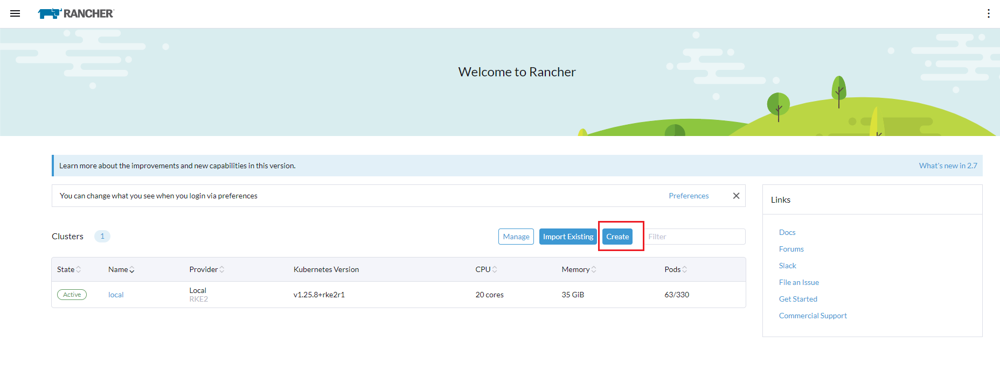
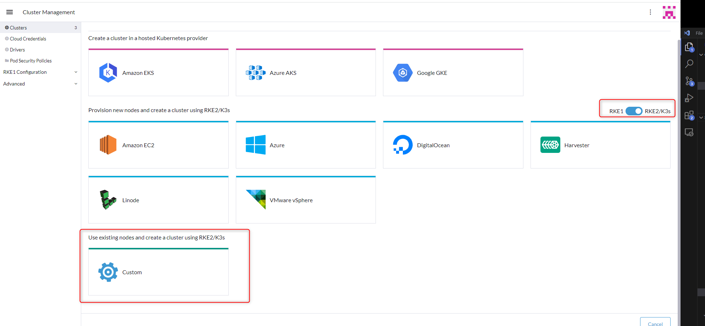
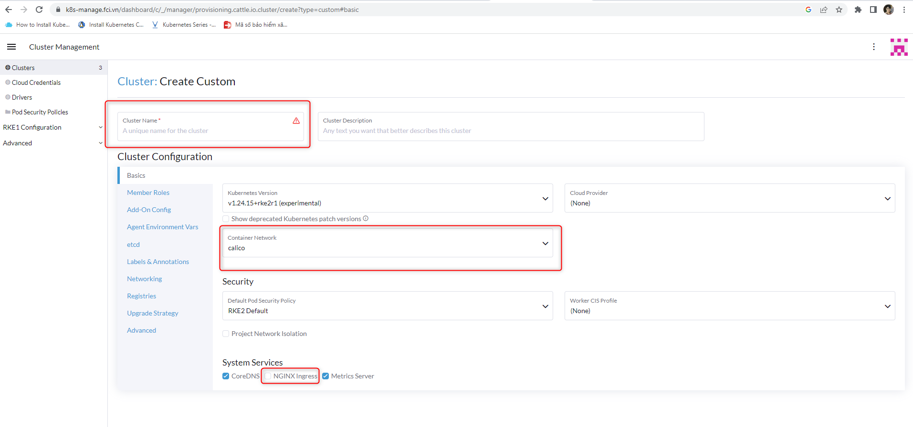
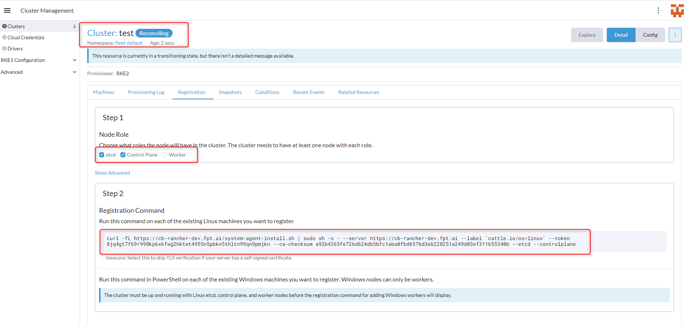

<h1 style="color:orange">Cấu hình k8s pull image từ harbor</h1>
Tạo cluster k8s cluster từ rancher
<h2 style="color:orange">1. Chuẩn bị</h2>
Các node chuẩn bị cài k8s cluster phải có kết nối đến rancher 
Rancher sử dụng version 2.7.2
<h2 style="color:orange">2. Cài đặt</h2>

Trên trang chủ của rancher -> create:
 

Enable tạo cluster bằng rke2 sử dụng container runtime là containerd thay vì docker như rke1 -> custom
 

Đặt tên cluster, network calico, disable ingess nginx (ingress nginx tự cài)
 

Cluster tên là test, trong phần node role:
- Nếu là control plane node thì tích vào etcd, control plane
- Nếu là node worker thì tích vào worker

Ở dưới sẽ tự động gen ra câu lệnh tương ứng để paste vào từng node 
 

Quay lại cluster menu và đợi cluster up, sau đó có thể lấy file Kubeconfig từ rancher để kết nối đến cluster