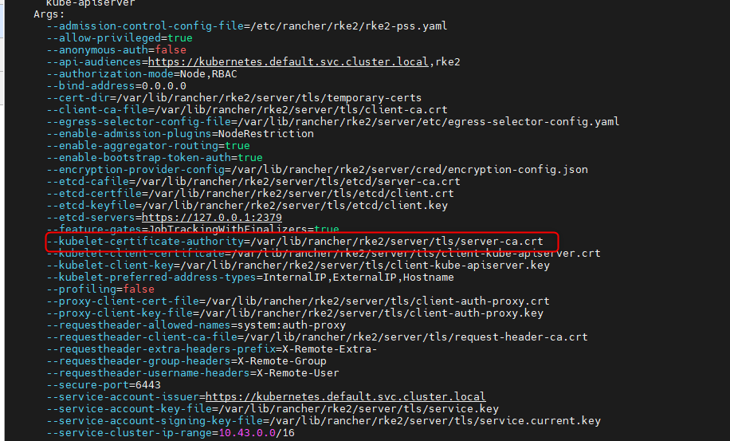
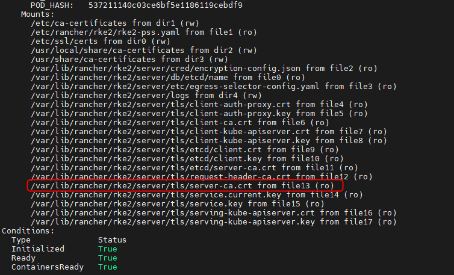
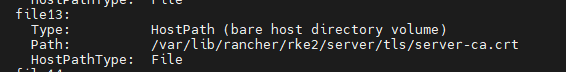
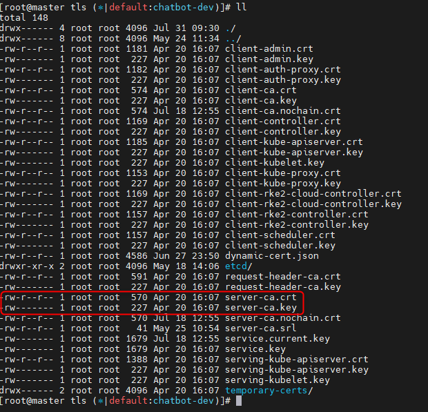
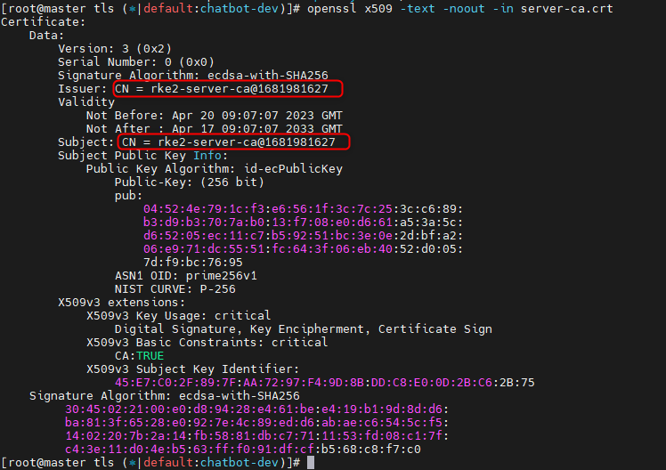
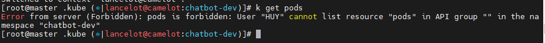
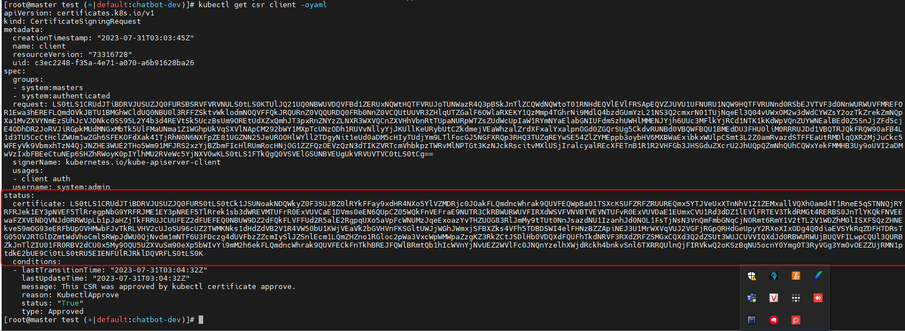
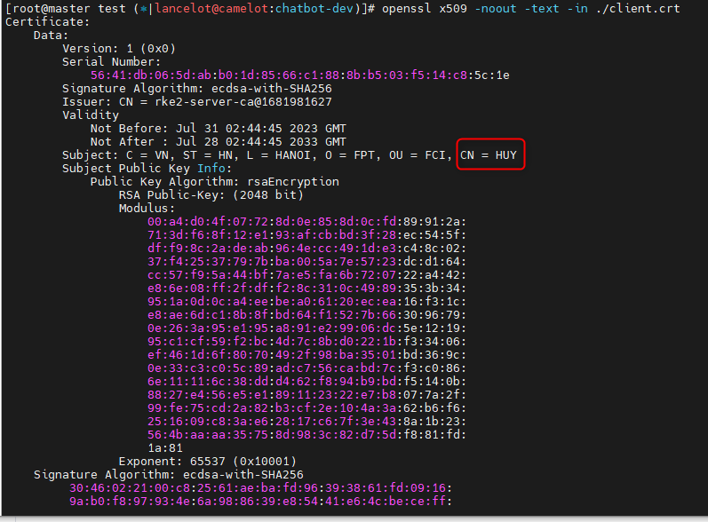
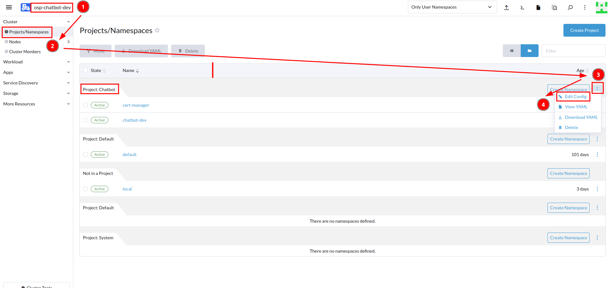

<h1 style="color:orange">Add user cluster k8s</h1>

Tham khảo: https://faun.pub/how-to-add-an-user-to-a-kubernetes-cluster-an-overview-of-authn-in-k8s-d198adc08119 
https://faun.pub/assign-permissions-to-an-user-in-kubernetes-an-overview-of-rbac-based-authz-in-k8s-7d9e5e1099f1 
Trong k8s cluster không có khái niệm user hay group cho user. Chỉ có khái niệm cert và thông tin mà cert chứa (CN-common name và O-organization). Cert sẽ dùng để authenticate mỗi request đến K8s cluster qua API server trong control plane. Nếu cert valid, thì client dùng cert đó có thể thực hiện những hành động với k8s cluster mà cert đó được authorize.
<h2 style="color:orange">1. Tạo csr </h2>
Tạo cert signing request. Tạo 1 cert, yêu cầu CA của k8s cluster kí.

    # openssl genrsa -out client.key 2048
    # openssl req -new -key client.key -out client.csr
Câu lệnh sẽ yêu cầu nhập common name(CN) và organization(O) như 1 phương thức để xác định danh tính client. 
<h2 style="color:orange">2. Dùng k8s CA kí client.csr </h2>

1. Để xác định cert CA của K8s cluster, sử dụng câu lệnh:

       # kubectl describe pod -n kube-system kube-apiserver-<master-node>
 
Dòng `kubelet-certificate-authority` chính là CA cert của K8s. Bất cứ cert nào được kí bởi CA này đều có quyền kết nối đến API server.

Để hiểu chi tiết hơn thì đây là đường dẫn đến file trong pod. Tuy nhiên đường dẫn này được mount từ file trên node control plane vào trong pod.
 
 

2. Dùng CA cert của k8s kí csr của client. SSH vào node master K8s (bất kì master nào trong control plane). Lưu ý hướng dẫn trong bài thực hiện với k8s cluster được install bằng rke2, với kubeadm hoặc minikube, file path có thể khác

       # cd /var/lib/rancher/rke2/server/tls
 

Inspet CA crt của k8s cluster:

    # openssl x509 -text -noout -in server-ca.crt
 
Issuer tương đương subject (đây là self-signed cert)

3. Kí

       #  sudo openssl x509 -req -in ./client.csr -CA /var/lib/rancher/rke2/server/tls/server-ca.crt -CAkey /var/lib/rancher/rke2/server/tls/server-ca.key -CAcreateserial -out ./client.crt -days 3650
check lại client.crt xem issuer có phải k8s cluster CA

    # openssl x509 -noout -text -in ./client.crt
<h2 style="color:orange">3. Dùng client.cert để kết nối đến K8S cluster</h2>
Truyền client.cert vào kubeconfig để kết nối đến K8s cluster qua API server.

    # kubectl config set-cluster tên_cluster --certificate-authority=server-ca.crt --server=https://10.51.0.9:6443 --embed-certs
    # kubectl config set-credentials tên_user --client-certificate=client.crt --client-key=client.key --embed-certs
    Tạo context để use config vừa tạo
    kubectl config set-context tên_context --user=tên_user --cluster=tên_cluster --namespace=tên_namespace
Tuy nhiên khi sử dụng lệnh: `kubectl get pods` để list pod thì lỗi unauthorized. Đó là vì cert này chỉ mới authen kết nối được với API server chứ chưa được authorized làm cái gì với k8s cluster.

Để unset config vừa tạo:

    # kubectl config unset users.<user_name>
    # kubectl config unset contexts.<context_name>
    # kubectl config unset clusters.<cluster_name>
Để lấy file kubeconfig của current context-view(mục đích tạo file portable kubeconfig):

    # kubectl config view --minify
 
<h2 style="color:orange">4. Cách đơn giản hơn để kí csr</h2>
Trong môi trường production, nhiều khi không thể kết nối vào các node control plane dễ dàng được. Phải sử dụng đường kubectl có quyền root đã có kết nối đến k8s cluster sẵn.

1. encode csr
    
       # cat client.csr | base64 -w 0
2. Tạo file client-csr.yaml

       # vim client-csr.yaml
       paste vào

       apiVersion: certificates.k8s.io/v1
       kind: CertificateSigningRequest
       metadata:      
         name: client       
       spec:          
         request: <output câu lệnh trên>
         signerName: kubernetes.io/kube-apiserver-client                      
         usages:   
         - client auth
3. check csr, csr đang trong trạng thái pending

       # k get csr
4. Kí csr
       
       # kubectl certificate approve client
5. extract base64 encoded cert từ csr

       # kubectl get csr client -o yaml
 
Decode base64 phần khoanh đỏ này và paste vào file client.crt hoặc có thể paste trực tiếp vào file kubeconfig

    apiVersion: v1
    clusters:
    - cluster:
        certificate-authority-data: <encode base64 của server-ca.crt>
        server: https://10.51.0.9:6443
      name: camelot
    contexts:
    - context:
        cluster: default
        namespace: chatbot-dev
        user: default
      name: default
    - context:
        cluster: camelot
        namespace: chatbot-dev
        user: lancelot
      name: lancelot@camelot
    current-context: lancelot@camelot
    kind: Config
    preferences: {}
    users:
    - name: lancelot
      user:
        client-certificate-data: <encode base64 của client.crt>   #kết quả câu lệnh trên
        client-key-data: <encode base64 của client.key>
<h2 style="color:orange">5. Phân quyền cho cert vừa tạo</h2>
Cert vừa tạo mới chỉ authen đến API server, chứ chưa được authorize bất cứ quyền gì. 
Tạo file yaml để tạo role và role binding cho cert vừa tạo

    apiVersion: rbac.authorization.k8s.io/v1
    kind: Role
    metadata:
      namespace: chatbot-dev
      name: dev
    rules:
    - apiGroups: [""]
      resources: ["pods", "pods/log"]
      verbs: ["get", "list"]
    - apiGroups: [""]
      resources: ["pods/exec", "pods/portforward"]
      verbs: ["create"]
    ---
    apiVersion: rbac.authorization.k8s.io/v1
    kind: RoleBinding
    metadata:
      name: rolebinding-dev
    subjects:
    - kind: User
      name: HUY
      apiGroup: rbac.authorization.k8s.io
    roleRef:
      kind: Role
      name: dev
      apiGroup: rbac.authorization.k8s.io
Lưu ý `name` trong `subjects` của RoleBinding phải trùng với CN trong cert. Ở đây ví dụ là HUY thì CN trong cert cũng phải là HUY
 

<h2 style="color:orange">6. Phân quyền user trong Rancher</h2>

 
Custom-role để Manage Workloads