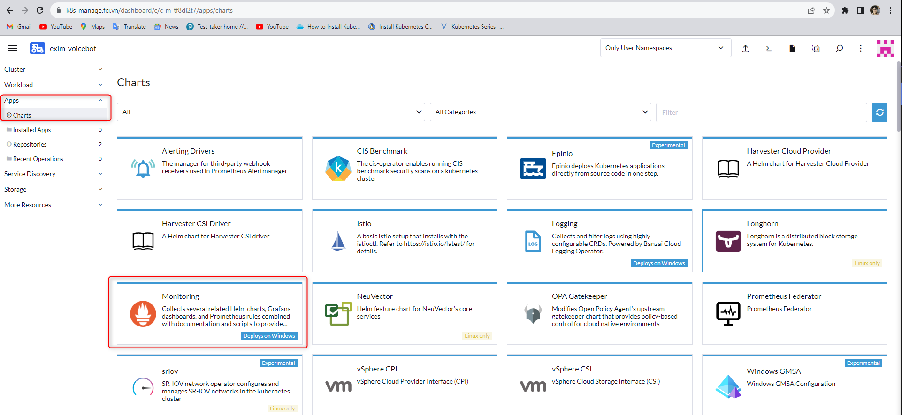
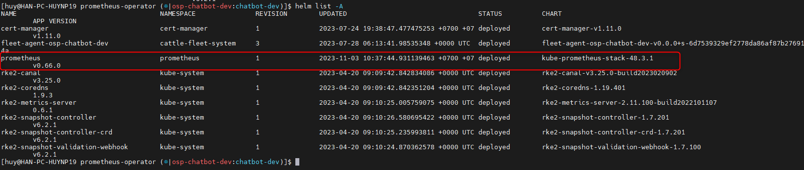
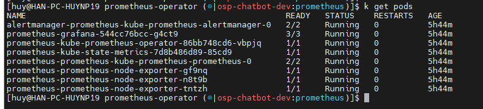
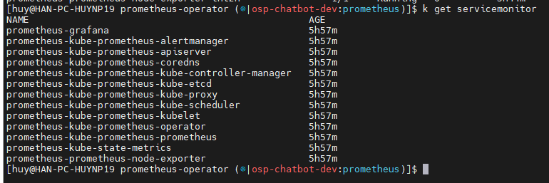
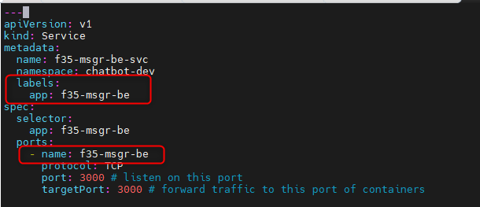
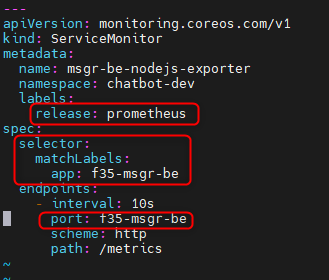
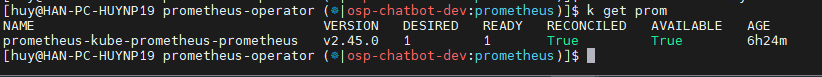
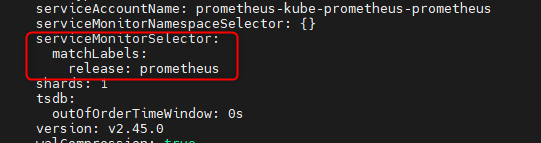
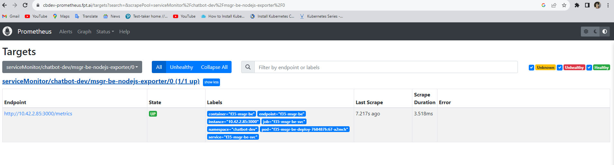
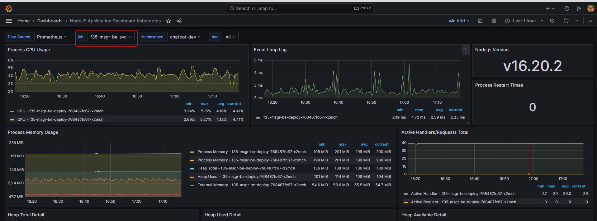

<h1 style="color:orange">Install prometheus k8s</h1>
<h2 style="color:orange">1. Sử dụng rancher</h2>
Apps -> Charts -> Monitoring -> Install

<br>
<h2 style="color:orange">2. Install bằng helm</h2>

Sử dụng helm kéo kube-prometheus về, link git kube-prometheus: https://github.com/prometheus-operator/kube-prometheus<br>
Hướng dẫn install kube-prometheus bằng helm, tham khảo: https://github.com/prometheus-community/helm-charts/tree/main/charts/kube-prometheus-stack<br>

Yêu cầu: Trên kubectl client đã cài đặt helm: 
- Kubernetes 1.19+
- Helm 3+

Lựa chọn context và namespace cần cài đặt sau đó chạy lệnh:<br>
Add repo:
   
    # helm repo add prometheus-community https://prometheus-community.github.io/helm-charts
    # helm repo update
Cài đặt:

    # helm install [RELEASE_NAME] prometheus-community/kube-prometheus-stack
Ví dụ release_name là `prometheus`, được cài đặt trong namespace `prometheus`:
<br>
Đợi khoảng 5,10 phút để helm tự cài:
<br>

Để uninstall kube-prometheus bằng helm:

    # helm uninstall [RELEASE_NAME]
Upgrade:

    # helm upgrade [RELEASE_NAME] prometheus-community/kube-prometheus-stack
<h2 style="color:orange">2.1. Tạo resource ingress để thò domain grafana và prometheus ra ngoài</h2>

```
---
apiVersion: networking.k8s.io/v1
kind: Ingress
metadata:
  namespace: prometheus
  name: prometheus-ing
  annotations:
    nginx.ingress.kubernetes.io/proxy-connect-timeout: "300"
    nginx.ingress.kubernetes.io/proxy-send-timeout: "300"
    nginx.ingress.kubernetes.io/proxy-read-timeout: "300"
    nginx.ingress.kubernetes.io/proxy-body-size: "200m"

spec:
  rules:
    - host: cbdev-prometheus.fpt.ai
      http:
        paths:
          - path: /
            pathType: Prefix
            backend:
              service:
                name: prometheus-kube-prometheus-prometheus
                port:
                  number: 9090
```

<h2 style="color:orange">2.2. Cấu hình add target cho prometheus</h2>

Lưu ý kube-prometheus `không` nhận config trong svc. Ví dụ:

```
apiVersion: v1
kind: Service
metadata:
  annotations:
    prometheus.io/scrape: 'true'
    prometheus.io/scheme: http
    prometheus.io/path: /metrics
    prometheus.io/port: 3000
```
Thay vào đó kube-prometheus nhận resource `Servicemonitor` và `Podmonitor` để biết được giám sát Service hoặc dịch vụ nào.<br>
<br>
Mặc định cài kube-prometheus đã có những servicemonitor này (giám sát pod, service).

Hướng dẫn add target vào prom này. Tuy nhiên, vẫn có những metrics từ pod ta muốn giám sát mà mặc định kube-prometheus ko có. Chính vì vậy, ta phải tự thêm. Trong hướng dẫn add Servicemonitor.<br>
Với pod sử dụng image build từ nodejs, metric nodejs thò ra trên port 3000, vì là gọi nội bộ trong k8s cluster nên cài chạy http.

Tạo svc:
```
---
apiVersion: v1
kind: Service
metadata:
  name: f35-msgr-be-svc
  namespace: chatbot-dev
  labels:
    app: f35-msgr-be-metrics
spec:
  selector:
    app: f35-msgr-be
  ports:
    - name: msgr-be
      protocol: TCP
      port: 3000 # listen on this port
      targetPort: 3000 # forward traffic to this port of containers
```
<br>
Lưu ý: 
- service phải có `labels:` trùng với phần `selector` của servicemonitor
- Phần `ports.name` của service phải trùng với `endpoints.port` của servicemonitor<br>

<br>
```
---
apiVersion: monitoring.coreos.com/v1
kind: ServiceMonitor
metadata:
  name: msgr-be-nodejs-exporter
  namespace: chatbot-dev
  labels:
    release: prometheus
spec:
  selector:
    matchLabels:
      app: f35-msgr-be
  endpoints:
    - interval: 10s
      port: f35-msgr-be
      scheme: http
      path: /metrics
```
Servicemonitor này có thể tạo ở namespace của svc, ko cần tạo ở namespace `prometheus`. Prome resources sẽ tự động pick up config<br>
Lưu ý nữa là phần `labels` của servicemonitor phải trùng với labels của resource prom của kube-prometheus. Check config bằng lệnh"

    # kubectl get prom -o yaml
<br>
<br>
<h2 style="color:orange">2.2. Kiểm tra target trên prom</h2>

Truy cập vào UI prometheus:<br>
<br>
Thấy target đã được add

Trên grafana add dashboard, ID: 18575<br>
<br>