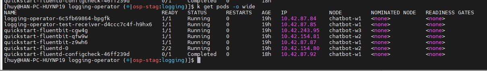
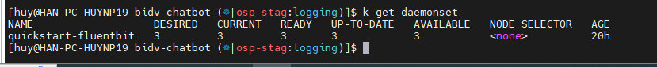
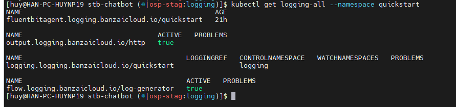
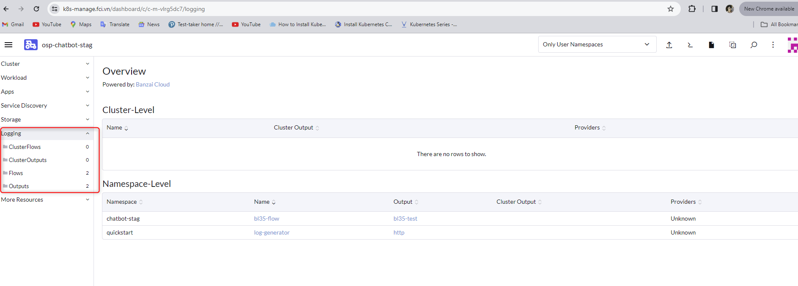

<h1 style="color:orange">Cài đặt logging operator</h1>
Logging operator là giải pháp hỗ trợ lấy log pod trong cụm k8s.

- Operator deploy và cấu hình log collector (hiện tại là Daemonset Fluent bit trong cụm k8s)
- Fluent bit query k8s API, làm giàu log với metadata của pod và đẩy log tới log forwarder
- Log forwarder sau đó đẩy tới es hoặc s3.

Tham khảo: https://kube-logging.dev/docs/
<h2 style="color:orange">1. Cài đặt logging operator</h2>

Tham khảo: https://kube-logging.dev/docs/quickstarts/single/

Deploy với helm: 

    # helm upgrade --install --wait \
     --create-namespace --namespace logging \
     --set testReceiver.enabled=true \
     logging-operator oci://ghcr.io/kube-logging/helm-charts/logging-operator
Expected output:

```
# kubectl get svc -n logging

NAME                             READY   UP-TO-DATE   AVAILABLE   AGE
logging-operator                 1/1     1            1           15m
logging-operator-test-receiver   1/1     1            1           15m
```
<h2 style="color:orange">2. Config logging operator</h2>

Tạo `logging` resource sử dụng fluentd
```
kubectl --namespace logging apply -f - <<"EOF"
apiVersion: logging.banzaicloud.io/v1beta1
kind: Logging
metadata:
  name: quickstart
spec:
  controlNamespace: logging
  fluentd:
    disablePvc: true
EOF
```

Tạo `FluentbitAgent` resource để collect logs từ tất cả container.
```
kubectl --namespace logging apply -f - <<"EOF"
apiVersion: logging.banzaicloud.io/v1beta1
kind: FluentbitAgent
metadata:
    name: quickstart
spec: {}
EOF
```
Kết quả output:
<br>
Fluentbit chạy daemonset nên với mỗi node trong cụm k8s sẽ đều có 1 pod chạy fluenbit, trừ khi chứa taint<br>
<br>
<h2 style="color:orange">3. Test hoạt động logging operator</h2>

Tạo 1 namespace `quickstart`, deploy service trong namespace này, deploy `output` (là resource gắn với việc sẽ đẩy log nào)

Apply tạo `flow` và `output`:
```
kubectl --namespace quickstart apply -f - <<"EOF"
apiVersion: logging.banzaicloud.io/v1beta1
kind: Flow
metadata:
  name: log-generator
spec:
  match:
    - select:
        labels:
          app.kubernetes.io/name: log-generator
  localOutputRefs:
    - http
---
apiVersion: logging.banzaicloud.io/v1beta1
kind: Output
metadata:
  name: http
spec:
  http:
    endpoint: http://logging-operator-test-receiver:8080
    content_type: application/json
    buffer:
      type: memory
      tags: time
      timekey: 1s
      timekey_wait: 0s
EOF
```
Check resource được tạo thành công:

    # kubectl get logging-all --namespace quickstart
<br>

Thường nên tạo mỗi namespace, 1 flow và 1 output riêng.
<h2 style="color:orange">4. Tạo flow và output trên rancher</h2>

<br>