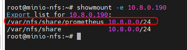
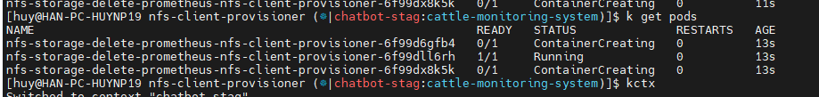
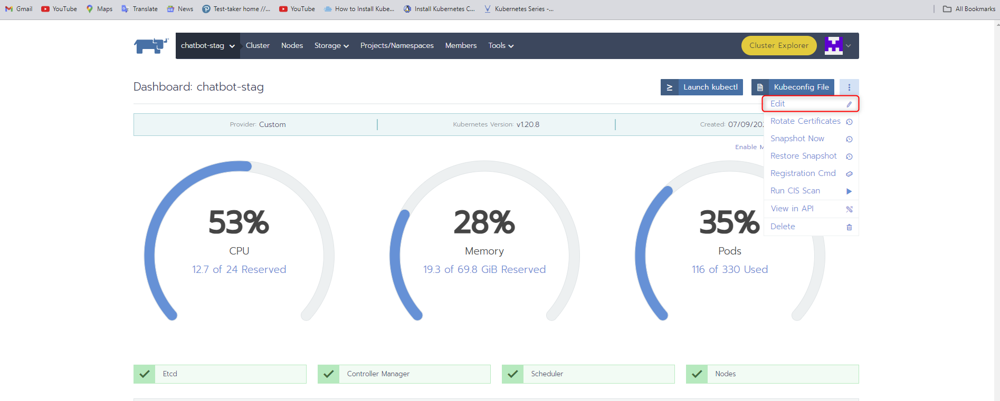
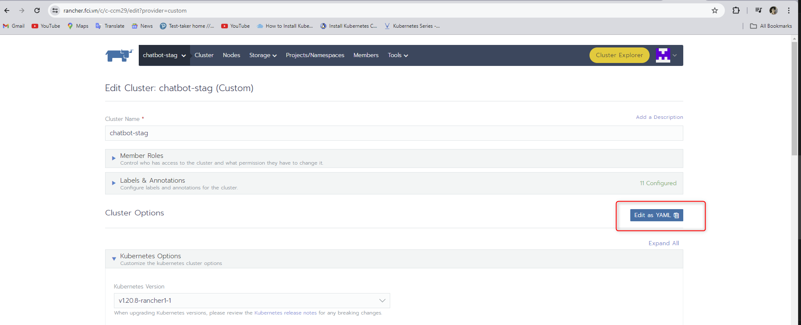
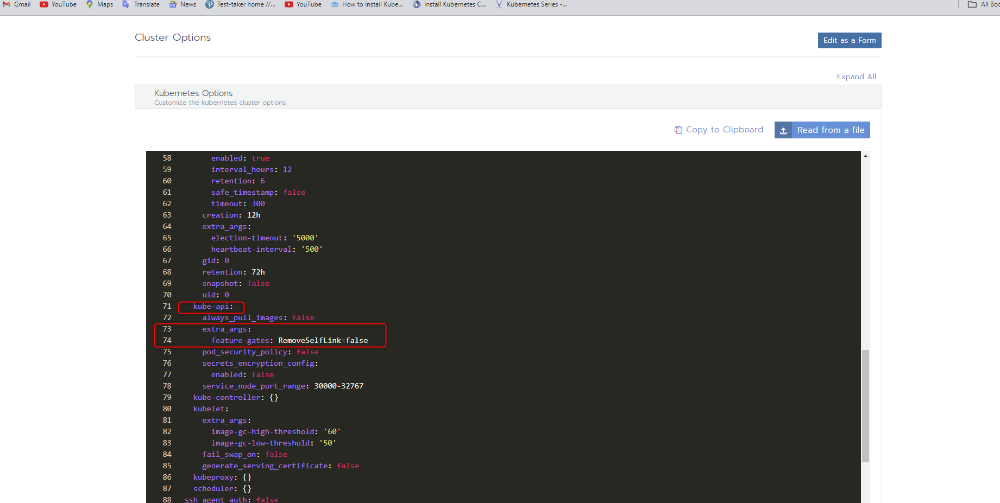
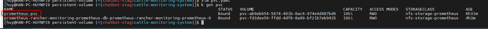
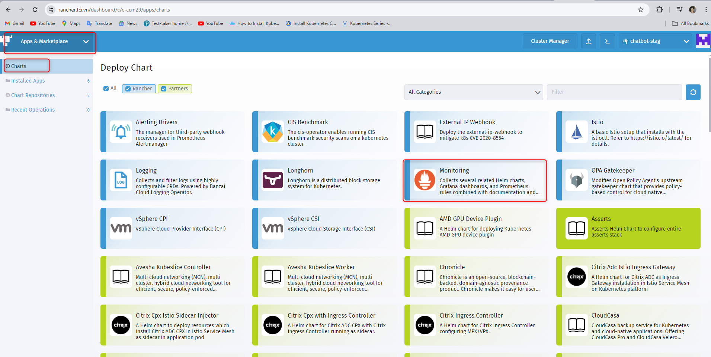
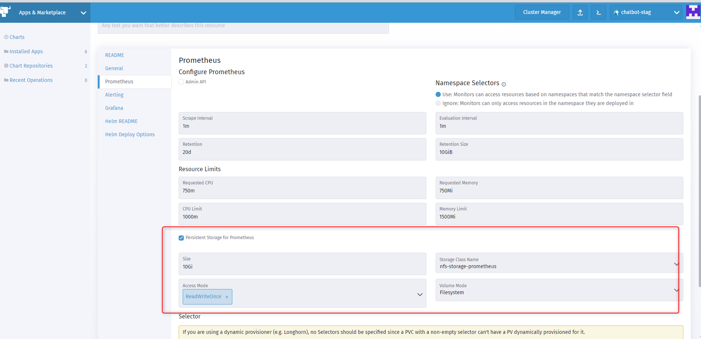
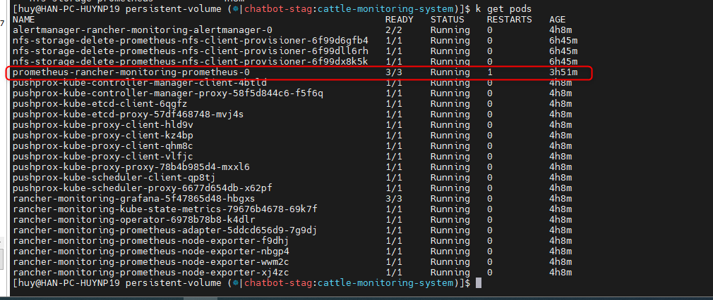

<h1 style="color:orange">Install monitoring trên Rancher</h1>
Cài đặt prometheus giám sát cụm k8s sử dụng persistent volume từ nfs. Mục đích để pod prometheus dùng 

Chuẩn bị: 
- rancher: v2.5.8
- Cụm k8s: v.1.20.8
- Helm: 
- Server nfs: 10.8.0.190, thư mục để mount nfs là `/var/share/nfs/prometheus`
- các node chạy k8s nằm trong dải 10.8.0.0/24

<h2 style="color:orange">1. Trên nfs server</h2>

Tham khảo: https://viblo.asia/p/k8s-phan-3-cai-dat-storage-cho-k8s-dung-nfs-RnB5pAw7KPG

Cấu hình file `/etc/exports` để share quyền cho các node theo format với mục đích là để cho phép các nnode trong dải 10.8.0.0/24 có quyền vào thư mục `/var/share/nfs/prometheus`

    # vim /etc/exports
    add dòng
    /var/nfs/share/prometheus    10.8.0.0/24(rw,sync,no_root_squash,no_all_squash)
    
    # systemctl restart nfs-server
<br>
<h2 style="color:orange">2. Cài Nfs storageclass trên k8s</h2>
Tạo thư mục để cài nfs 

    # mkdir ~/nfs-storage && cd ~/nfs-storage
Download helm chart nfs-client-provisioner để cài offline:

    # helm repo add stable https://charts.helm.sh/stable
    # helm search repo nfs-client-provisioner
    # helm pull stable/nfs-client-provisioner --version 1.2.11
    # tar -xzf nfs-client-provisioner-1.2.11.tgz
Thay đổi file values.yaml như sau:

    # cd nfs-client-provisioner
    # vim values.yaml
    thêm vào
    replicaCount: 3
    server: 10.8.0.190
    path: /var/share/nfs/prometheus
    provisionerName: nfs-storage-delete-prometheus    # tên storage-class
    name: nfs-storage-prometheus     # tên storage_class
    reclaimPolicy: Delete
    archiveOnDelete: false
Nếu reclaim policy là delete --> Phân vùng lưu trữ trên thiết bị storage cũng sẽ bị xóa luôn. Và ngược lại nếu reclaim policy là retain thì phân vùng sẽ vẫn còn lưu trên thiết bị lưu trữ.

Cài đặt storageclass vào 1 namespace:
    
    # cd nfs-client-provisioner
    # helm install nfs-storage-delete-prometheus --namespace cattle-monitoring-system -f values.yaml ./
Kết quả cài đặt
<br>
<h2 style="color:orange">3. Tạo pvc</h2>
Tạo thử pvc

```
apiVersion: v1
kind: PersistentVolumeClaim
metadata:
  name: prometheus-pvc
  namespace: cattle-monitoring-system
spec:
  storageClassName: nfs-storage-prometheus
  accessModes:
    - ReadWriteOnce
  resources:
    requests:
      storage: 10Gi
```

Tuy nhiên, bug của k8s versio 1.20 là pvc sẽ luôn ở trạng thái Pending chứ ko thể claim được, để sửa, thêm option sau vào cluster.yaml
<br>
<br>
<br>
Save -> đó đợi để cluster tạo lại pod api-server

<br>
Như hình thấy pvc đã được tạo -> có thể tạo được persistent volume cho prometheus, có thể xóa pvc này đi
<h2 style="color:orange">4. Install monitoring prometheus trên rancher</h2>

<br>
Tích như option trong hình <br>
<br>

-> Tạo pod này thành công là prometheus start thành công
<br>

Như vậy là prometheus đã sử dụng persistent volume thay vì EmptyDir (storage mà sẽ bị xóa khi pod bị xóa -> không lưu dữ liệu lịch sử metrics của prometheus)