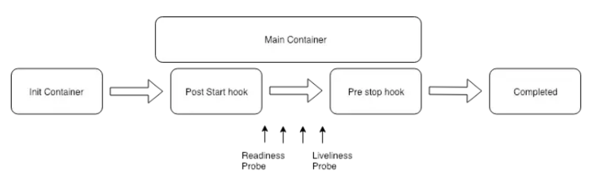
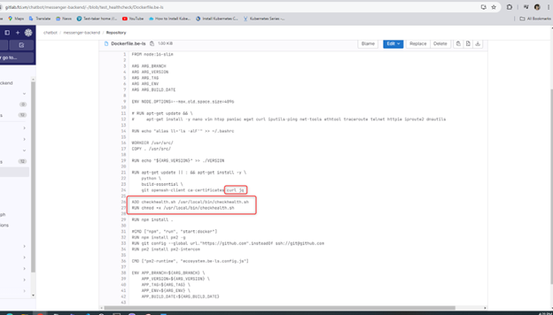
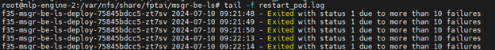

<h1 style="color:orange">LivenessProbe và ReadinessProbe trong k8s</h1>

Tham khảo: https://viblo.asia/p/kubernetes-best-practices-liveness-va-readiness-health-checks-4dbZN9R8KYM
Sử dụng Health checks là một trong những best practices trong Kubernetes.

Theo mặc định, Kubernetes sẽ bắt đầu gửi lưu lượng truy cập đến một Pod, khi tất cả các Container bên trong một Pod bắt đầu và khởi động lại container khi chúng bị hỏng. Tất cả các hành vi này trong cấu hình mặc định của Kubernetes hoạt động tốt, tuy nhiên bạn cũng có thể làm cho việc triển khai của mình đảm bảo và phù hợp hơn với yêu cầu riêng biệt của từng ứng dụng khác nhau bằng các cấu hình tùy chỉnh.

Kubernetes cung cấp cho chúng ta hai loại health checks là `Liveness check` và `Readiness check`, điều quan trọng là ta phải hiểu được công dụng, sự khác biệt giữa 2 loại health checks này để có thể sử dụng chúng một cách có hiệu quả. Hình dưới đây cho thấy vị trí hoạt động của các Healtcheck Probes trong pod lifcyle.<br>
<br>
<h2 style="color:orange">1. Định nghĩa</h2>
<h3 style="color:orange">1.1. Livenessprobe</h3>
liveness probe được sử dụng để kiểm tra xem khi nào thì nên khởi động lại một pods. Tức là nó sẽ kiểm tra xem ứng dụng của bạn còn sống hay đã chết hoặc không hoạt động đúng chức năng (Ví dụ, liveness probe có thể phát hiện deadlock, nơi một ứng dụng đang chạy, nhưng không có kết quả). Nếu ứng dụng của bạn còn đang hoạt động, thì Kubernetes sẽ không đụng gì đến nó cả. Nhưng nếu ứng dụng của bạn đã chết, Kubernetes sẽ loại bỏ pod đó và bắt đầu một pod mới để thay thế nó.
<h3 style="color:orange">1.2. Readinessprobe</h3>
readiness probe để xác định mức độ sẵn sàng cho ứng dụng của bạn. Nó sẽ kiểm tra và đảm bảo khi nào ứng dụng sẵn sàng đón nhận lưu lượng truy cập trước khi cho phép một dịch vụ gửi lưu lượng truy cập đến pods đó. Nếu một sự thăm dò và kiểm tra không thành công nó sẽ ngừng gửi lưu lượng truy cập cho đến khi ứng dụng vượt qua được sự kiểm tra.
<h3 style="color:orange">1.3. Các loại probe</h3>

`HTTP Probe`<br>
HTTP là loại probs tùy chỉnh phổ biến nhất. Ngay cả khi ứng dụng của bạn không phải là một máy chủ HTTP. Bạn hoàn toàn có thể tạo một ightweight HTTP server bên trong ứng dụng của bạn để phản hồi liveness probe. Kubernetes sẽ thực hiện ping tới một đường dẫn và nếu nó nhận lại được HTTP response trong phạm vi 200 hoặc 300 thì nó sẽ coi pod của bạn là đang healthy (khỏe mạnh và đang ngon ^^), còn nếu không pod đó sẽ được đánh dấu là unhealthy. Ví dụ:

```
apiVersion: v1
kind: Pod
metadata:
  labels:
    test: liveness
  name: liveness-http
spec:
  containers:
  - name: liveness
    image: k8s.gcr.io/liveness
    args:
    - /server
    livenessProbe:
      httpGet:
        path: /healthz
        port: 8080
        httpHeaders:
        - name: Custom-Header
          value: Awesome
      initialDelaySeconds: 3
      periodSeconds: 3
```

`Command Probe` <br>
Đối với Command probe, Kubernetes sẽ chạy một command bên trong một container của bạn. Nếu command được chạy trả về bằng 0, container của bạn sẽ được đánh dấu là healthy, ngược lại, nó sẽ được đánh dấu là healthy. Loại probe này thường được sử dụng khi bạn không thể hoặc không muốn chạy một HTTP server nhưng bạn muốn chạy một lệnh và để kiểm tra xem ứng dụng của mình có tốt hay không. Ví dụ:

```
apiVersion: v1
kind: Pod
metadata:
  labels:
    test: liveness
  name: liveness-exec
spec:
  containers:
  - name: liveness
    image: k8s.gcr.io/busybox
    args:
    - /bin/sh
    - -c
    - touch /tmp/healthy; sleep 30; rm -rf /tmp/healthy; sleep 600
    livenessProbe:
      exec:
        command:
        - cat
        - /tmp/healthy
      initialDelaySeconds: 5
      periodSeconds: 5
```

`TCP Probe`<br>
Khi cả HTTP probe hoặc Command probe không hoạt động, ta sẽ nghĩ đến việc sử dụng TCP probe. Với TCP probe, kubernetes sẽ cố gắng thiết lập một kết nối TCP trên port được chỉ định. Nếu nó có thể thiết lập kết nối, thì Pod được coi là healthy, ngược lại sẽ là một pod unhealthy. TCP probe được sử dụng rất hữu ích trong các dịch vụ gRPC và FTP. Ví dụ:

```
apiVersion: v1
kind: Pod
metadata:
 name: goproxy
 labels:
   app: goproxy
spec:
 containers:
 - name: goproxy
   image: k8s.gcr.io/goproxy:0.1
   ports:
   - containerPort: 8080
   readinessProbe:
     tcpSocket:
       port: 8080
     initialDelaySeconds: 5
     periodSeconds: 10
   livenessProbe:
     tcpSocket:
       port: 8080
     initialDelaySeconds: 15
     periodSeconds: 20
```
<h3 style="color:orange">1.4. Cấu hình probe</h3>

- `initalDelaySeconds`: Đây là độ trễ ban đầu tính bằng giây trước khi thực hiện các hành động healthcheck. Tức là sau khi container của start được bao nhiêu giây thì mới tiến hành liveness check hay probe check. Như chúng ta đã biết, nếu liveness check và unhealthy, nó sẽ restart lại pod của bạn. Vì vậy, bạn cần đặt thông số này một cách chính xác, đảm bảo một pod của bạn đã hoàn toàn khởi động xong mới thực hiện healthcheck. Nếu không, pod của bạn sẽ liên tục restart và không bao giờ sẵn sàng cả.
- `periodSeconds`: Là tần suất thực hiện probes và được tính bằng giây. Mặc định là 10 giây. Giá trị tối thiểu là 1.
- `timeoutSeconds`: Là thời gian times out (tính bằng giây) của các hành vi probe. Mặc định là 1 giây. Giá trị tối thiểu là 1.
- `successThreshold`: Số lần success liên tiếp của probes sau khi failed, nếu nó đạt con số này sẽ được coi là thành công, không thì sẽ thực hiện check tiếp. Mặc định là 1. Phải là 1 cho liveness. Giá trị tối thiểu là 1.
- `failureThreshold`: Khi một Pod start và probe thất bại, Kubernetes sẽ thử một số lần failureThreshold trước khi bỏ cuộc. Từ bỏ trong trường hợp liveness probe có nghĩa là khởi động lại container. Trong trường hợp readiness probe, Pod sẽ được đánh dấu Unready. Mặc định là 3. Giá trị tối thiểu là 1.
<h2 style="color:orange">2. Usecase thực tế</h2>
Trong ví dụ sẽ sử dụng livenessProbe để chạy 1 bash script trong container để healthcheck.

Bash script sẽ thực hiện curl vào http://localhost:3000/backend/api/v1/health-check với timeout là 2s. Nếu exit status câu lệnh curl trả về khác 0 thì sẽ tính là failures. 
- 10 Failures trong 1 phút -> restart pod
- 3 failures liên tiếp trong 1 phút -> restart pod
<h3 style="color:orange">2.1. Set up file healtcheck.sh</h3>

- Trong Dockerfile build image container, cài curl và jq, nhét script checkhealth.sh vào container khi build.<br>
<br>
- Nội dung script:
```
#!/bin/sh
# Log file to track failures
LOG_FILE="./health_check_failures.log"
FINAL_LOG_FILE="./restart_pod.log"
CONSECUTIVE_FAILS_FILE="./consecutive_failures.log"

# Perform the curl command
curl -m 2 --location --silent --header "api-key: 123123123" "https://cbstag-chatai.fpt.ai/backend/api/v1/health-check"
curl_exit_status=$?

echo $curl_exit_status

if [ $curl_exit_status -ne 0 ]; then
  # Log the failure with a timestamp
  echo "$(date +%s) - Curl command failed with exit status: $curl_exit_status" >> $LOG_FILE
  echo "$(date +%s)" >> $CONSECUTIVE_FAILS_FILE
else
  # If curl succeeds, reset the consecutive failures log
  > $CONSECUTIVE_FAILS_FILE
fi

# Remove logs older than 1 minute (60 seconds)
cutoff=$(date +%s --date='1 minute ago')
grep -v -e "^$" -e "^\s*$" $LOG_FILE | awk -v cutoff="$cutoff" '$1 >= cutoff' > $LOG_FILE.tmp && mv $LOG_FILE.tmp $LOG_FILE

# Count the number of failures in the last minute
failure_count=$(wc -l < $LOG_FILE)

# Check for 3 consecutive failures
consecutive_failures=$(tail -n 3 $CONSECUTIVE_FAILS_FILE | wc -l)

# Restart if there are 10 or more failures in the last minute
if [ "$failure_count" -ge 10 ]; then
  echo "$(hostname) $(date +'%Y-%m-%d %H:%M:%S') - Exited with status 1 due to more than 10 failures in the last minute" >> $FINAL_LOG_FILE
  exit 1
fi

# Restart if there are 3 consecutive failures
if [ "$consecutive_failures" -eq 3 ]; then
  echo "$(hostname) $(date +'%Y-%m-%d %H:%M:%S') - Exited with status 1 due to 3 consecutive failures" >> $FINAL_LOG_FILE
  exit 1
fi

exit 0
```

Thêm phần cấu hình livenessProbe trong deployment tạo pod:
```
      containers:
          livenessProbe:
            exec:
              command:
                - /bin/sh
                - -c
                - /usr/local/bin/checkhealth.sh
            initialDelaySeconds: 10
            periodSeconds: 1
            timeoutSeconds: 2
            failureThreshold: 3
```

Test thử log:<br>
<br>