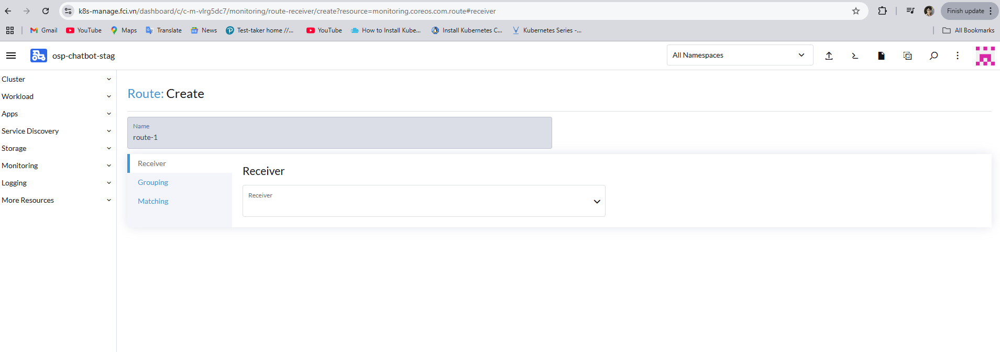

<h1 style="color:orange">Cấu hình alert pod cho rancher</h1>
Cấu hình alert pod crashloopback bắn vào msteams

Cài alerting driver: Apps -> Charts -> Alerting Drivers -> Install 
 
Cấu hình luôn vào namespace cattle-monitoring-system

Enable cấu hình teams 
 

Tạo receiver cho rancher để bắn vào webhook: 
Monitoring -> Alerting -> Route and Receivers -> Create receiver -> webhook -> Msteams: paste webhook của msteams vào phần Proxy URL:
 

Sau đó tạo route cho rancher: 
Monitoring -> Alerting -> Route and Receivers -> Route: 
 
Chọn receiver vừa tạo.

Phần Matching add: `severity: critical` 
 

Chỉnh rule severity của app từ warning -> critical để rancher bắn alert: 
 
<h2 style="color:orange">Kiểm tra</h2>
Thử tạo 1 pod bị crashloopbackoff:

 