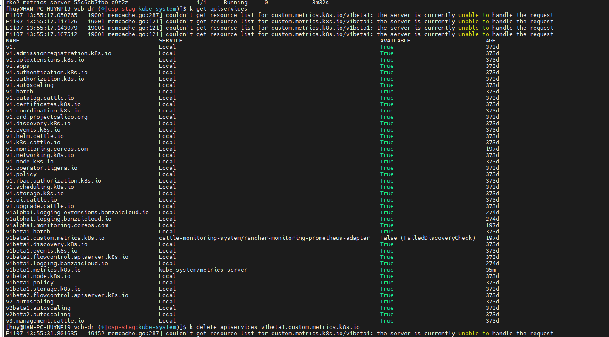
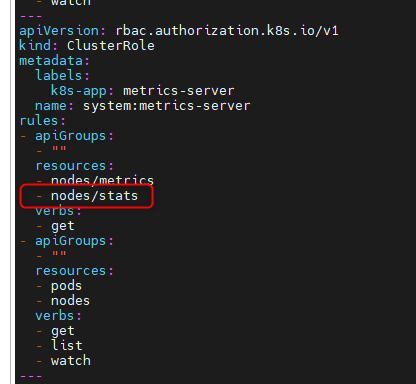
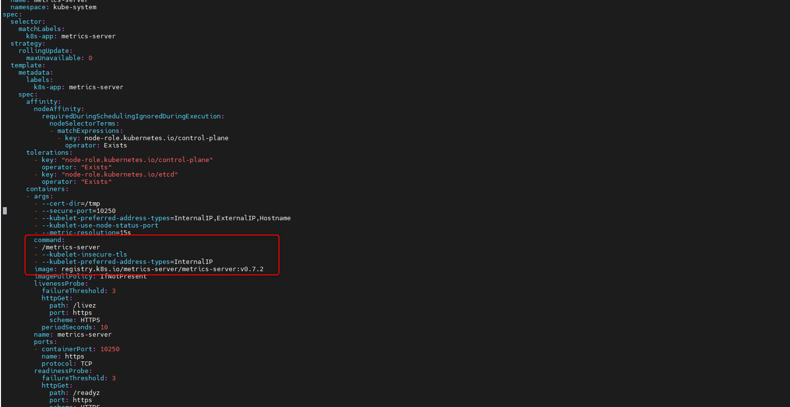
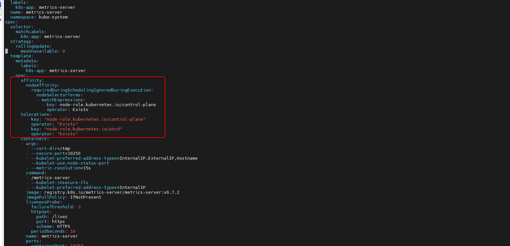
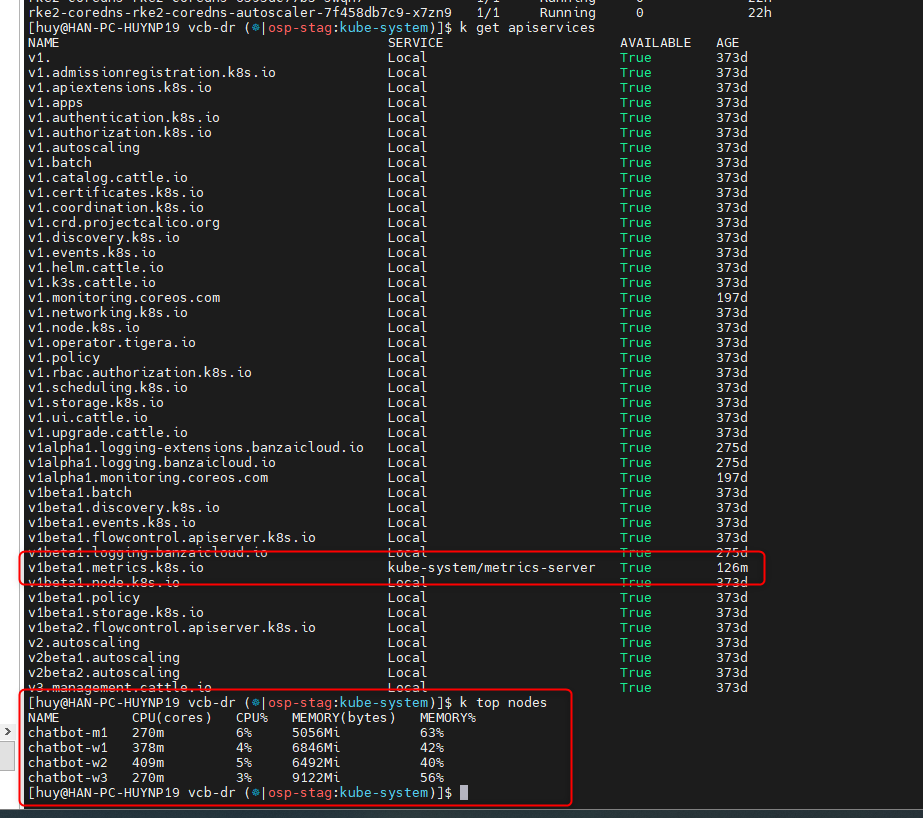

<h1 style="color:orange">Cài metric server</h1>
Metric server mặc định của rancher bị lỗi: rk2-metrics-server

<br>
Yêu cầu cài metric-server
<h2 style="color:orange">Cài đặt</h2>

Tham khảo: https://github.com/kubernetes-sigs/metrics-server

Tải file metric-server về để apply, lưu ý trong thời điểm cài metric-server version 0.7.2 đang là latest:

    # wget https://github.com/kubernetes-sigs/metrics-server/releases/latest/download/components.yaml
Sửa file components.yaml:<br>

Thêm quyền cho clusterrole của metrics server<br>

```
rules:
- apiGroups:
  - ""
  resources:
  - nodes/metrics
  - nodes/stats
```
<br>
Thêm phần command:
```
        command:
        - /metrics-server
        - --kubelet-insecure-tls
        - --kubelet-preferred-address-types=InternalIP
```
<br>
Đôi khi sau khi cluster rk2 rotate cert, phải deploy vào node control-plane, nếu ko sẽ bị dính lỗi, thêm phần affinity và node tolerant
```
      affinity:
        nodeAffinity:
          requiredDuringSchedulingIgnoredDuringExecution:
            nodeSelectorTerms:
            - matchExpressions:
              - key: node-role.kubernetes.io/control-plane
                operator: Exists
      tolerations:
        - key: "node-role.kubernetes.io/control-plane"
          operator: "Exists"
        - key: "node-role.kubernetes.io/etcd"
          operator: "Exists"
```
<br>

Sau đó apply file component:


    # k apply -f components.yaml
<br>
Kiểm tra thấy apiservices metric đã hoạt động bthg. Lấy thông số nodes cũng thành công.