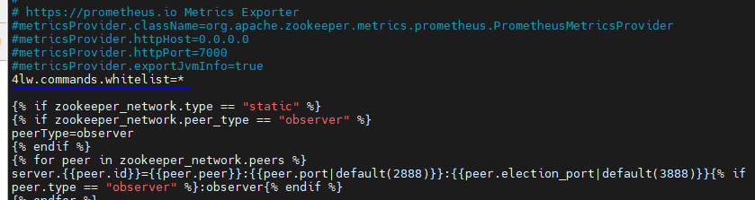

<h1 style="color:orange">Cài kafka, zookeeper cluster bằng ansible</h1>

Sử dụng https://gitlab.bcnfpt.com/chatbot/chatbot-dedicated-deploy/tree/main/chatbot-3.5-platform 
File playbook main.yaml nằm trong đường dẫn chatbot-dedicated-deploy/chatbot-3.5-platform/kafka-cluster/

 
<h2 style="color:orange">1. Cấu hình file host.yaml</h2>

    [zookeeper]
    host1 ansible_host=10.51.0.12 private_ip=10.51.0.12 zookeeper_myid=1
    host2 ansible_host=10.51.0.13 private_ip=10.51.0.13 zookeeper_myid=2
    host3 ansible_host=10.51.0.14 private_ip=10.51.0.14 zookeeper_myid=3

    [zookeeper_quorum]
    host[1:3]

    [kafka_broker]
    kb-host1 ansible_host=10.51.0.12 private_ip=10.51.0.12 kafka_broker_id=1
    kb-host2 ansible_host=10.51.0.13 private_ip=10.51.0.13 kafka_broker_id=2
    kb-host3 ansible_host=10.51.0.14 private_ip=10.51.0.14 kafka_broker_id=3

    [all:vars]
    ansible_user=root
    ansible_ssh_private_key_file=/root/.ssh/test-chatbot.pem
    ansible_ssh_common_args='-o ProxyCommand="ssh -W %h:%p tunnel@192.168.125.159 -i /root/.ssh/test-chatbot.pem"'
    ansible_python_interpreter="/usr/bin/python3"
Trong đó, cluster và zookeeper được cài cùng trên 3 server. Host ansible truy cập đến các server cài kafka, zookeeper qua 1 server đóng vai trò là bastion (192.168.125.159). 
- `ansible_ssh_private_key_file` là ssh key để truy cập server kafka.
- `ansible_ssh_common_args='-o ProxyCommand="ssh -W %h:%p tunnel@192.168.125.159 -i /root/.ssh/test-chatbot.pem"'` là ssh key để truy cập user "tunnel" của server bastion.
<h2 style="color:orange">2. Cấu hình file main.yaml</h2>
Sửa kafka heap, iface và kafka_iface thành giá trị tương ứng server:

    $ vim chatbot-dedicated-deploy/chatbot-3.5-platform/kafka-cluster/main.yaml
 

Vì file ansible sử dụng role được viết trên mạng, link: https://github.com/andrewrothstein. Khi chạy file playbook nó sẽ gọi các role tương ứng.

Đường dẫn các ansible-role này nằm ở `chatbot-dedicated-deploy/chatbot-3.5-platform/ansible-roles` 
 

Hoặc cũng có thể kéo trên ansible-galaxy với câu lệnh:
    
    $ ansible-galaxy install andrewrothstein.kafka-broker
    $ ansible-galaxy install andrewrothstein.zookeeper-cluster
1. Sửa iface trong file: /chatbot-dedicated-deploy/chatbot-3.5-platform/ansible-roles/andrewrothstein.zookeeper-cluster/defaults/main.yml

       $ vim /chatbot-dedicated-deploy/chatbot-3.5-platform/ansible-roles/andrewrothstein.zookeeper-cluster/defaults/main.yml
 
thành giá trị card mạng tương ứng server cài kafka, zookeeper.

2. Thêm dòng config vào file /chatbot-dedicated-deploy/chatbot-3.5-platform/ansible-roles/andrewrothstein.zookeeper-cluster/templates/zoo.cfg.j12

       $ vim /chatbot-dedicated-deploy/chatbot-3.5-platform/ansible-roles/andrewrothstein.zookeeper-cluster/templates/zoo.cfg.j12
       thêm dòng:
       4lw.commands.whitelist=*
 
<h2 style="color:orange">3. Chạy file playbook</h2>

    $ cd chatbot-dedicated-deploy/chatbot-3.5-platform/kafka-cluster/
    $ ansible-playbook main.yaml
Lưu ý: trong file `ansible.cfg` có define path dẫn tới hosts.yaml và path của role 
 
 

Kết quả chạy xong không báo lỗi
 
<h2 style="color:orange">4. Kiểm tra</h2>
ssh vào các host cài kafka, zoo để kiểm tra:

Gõ lệnh kiểm tra

    $ echo mntr | nc localhost 2181  #để kiểm tra cluster zookeeper
    $ kafka-broker-api-versions.sh --bootstrap-server localhost:9092   #kiểm tra cluster kafka