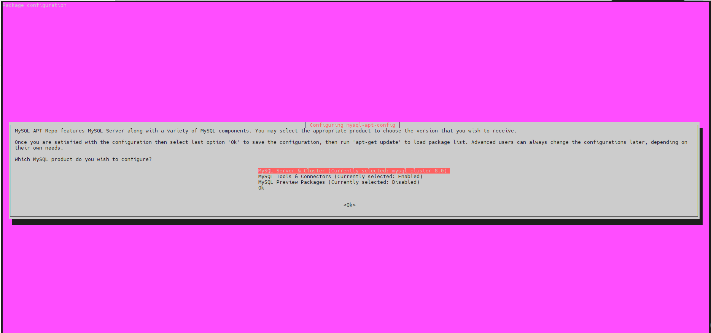
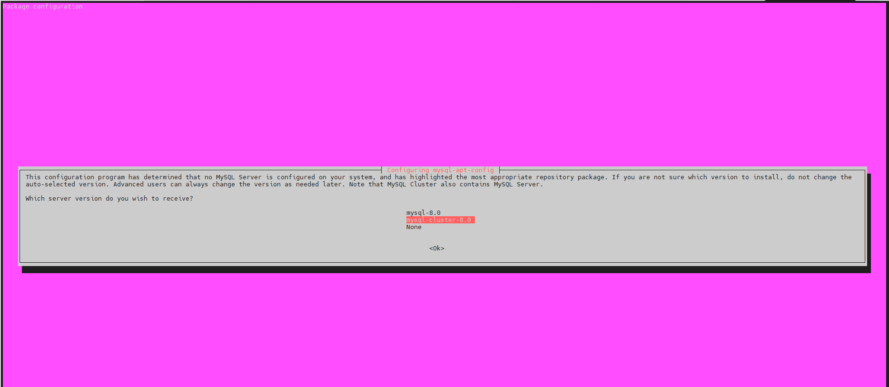
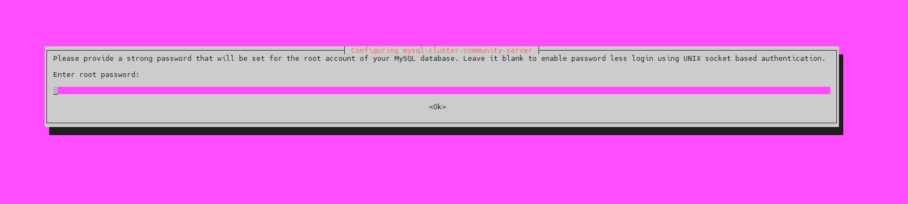
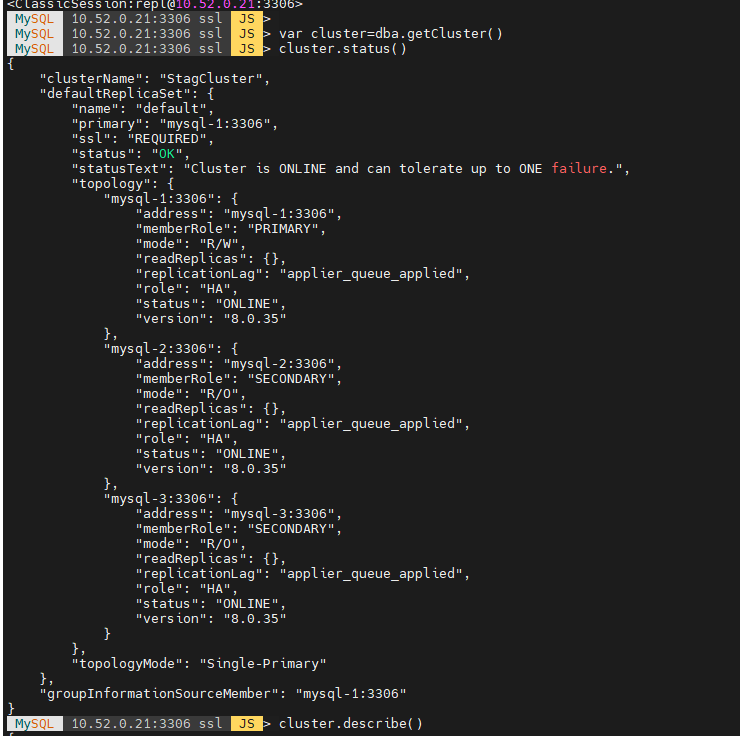
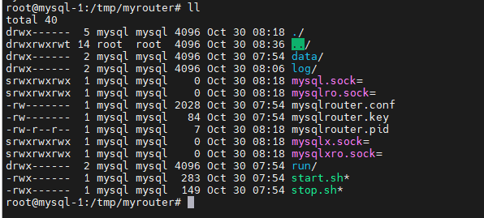

<h1 style="color:orange">Install mysql innodb cluster</h1>
Innodb cluster là 1 giải pháp toàn diện chạy cluster cho mysql, bao gồm group replication và mysqlrouter.

Chuẩn bị: 3 server cài mysql innodb cluster (required tối thiểu 3)<br>
IP: 10.52.0.21-23 port 3306<br>
Dự kiến cài đặt mysqlrouter chạy trên port 6446

Tạo file /etc/hosts trên cả 3 node:
```
10.52.0.21 mysql-1
10.52.0.22 mysql-2
10.52.0.23 mysql-3
```
<h2 style="color:orange">1.Cài đặt innodb cluster</h2>
Trên cả 3 node, cài đặt repo mysql

    # wget https://dev.mysql.com/get/mysql-apt-config_0.8.22-1_all.deb
    # sudo dpkg -i mysql-apt-config_0.8.22-1_all.deb
    # sudo apt-get update
Lựa chọn các option cho cluster<br>
<br>
<br>

Cài đặt mysql

    # sudo apt-get update
    # sudo apt-get install mysql-server mysql-shell
Trong quá trình cài đặt, mysql shell sẽ yêu cầu chọn các option cho mysql cluster. Nhập password cho user root<br>
<br>
<h2 style="color:orange">2.Tạo user replication</h2>
Trên cả 3 node tạo user replication:

```
# mysql –u root –p
mysql> CREATE USER 'repl'@'%' IDENTIFIED BY 'password';
mysql> GRANT ALL PRIVILEGES ON *.* TO 'repl'@'%' WITH GRANT OPTION;
mysql> FLUSH PRIVILEGES;
```

Cài đặt bind setup cho cả 3 node

    # vim /etc/mysql/mysql.conf.d/mysqld.conf
    paste vào
    bind-address = 0.0.0.0
    # sudo systemctl restart mysql
<h2 style="color:orange">3.Thực hiện setup cluster innodb</h2>
Trên node 1:

    # mysqlsh
    MySQL  JS > dba.configureInstance('repl@10.52.0.21:3306')
Node 2:

    # mysqlsh
    MySQL  JS > dba.configureInstance('repl@10.52.0.22:3306')
Node 3:

    # mysqlsh
    MySQL  JS > dba.configureInstance('repl@10.52.0.23:3306')
Tạo cluster, trên node 1 (node mong muốn setup làm master):
```
# mysqlsh
MySQL  JS > shell.connect('repl@10.52.0.21:3306')
MySQL  10.52.0.21:3306 ssl  JS > var cluster =dba.createCluster('StagCluster')
```
Sau đó add các node 2 và 3. Chạy command sau vẫn trong mysqlsh trên node 1
 
    MySQL  10.52.0.21:3306 ssl  JS > cluster.addInstance('repl@10.52.0.22:3306')
    MySQL  10.52.0.21:3306 ssl  JS > cluster.addInstance('repl@10.52.0.23:3306')
Check cluster status

    MySQL  10.52.0.21:3306 ssl  JS > cluster.status()
<br>

Check group replication trong mysql

    # mysql -u root -p
    mysql> SELECT * FROM performance_schema.replication_group_members;
<h2 style="color:orange">4. Cài đặt Mysqlrouter</h2>
Trên node mysql1

    # sudo apt-get install mysql-router
Bootstrap cluster

    # mysqlrouter --bootstrap root@10.52.0.21:3310 --directory /tmp/myrouter --conf-use-sockets --user=mysql
Trong đó, user mysql là user linux trên server 10.52.0.21.<br>
`/tmp/myrouter` là path hoạt động của mysqlrouter

<br>
Để start, stop mysqlrouter, chạy lệnh: ./start.sh, ./stop.sh
<h2 style="color:orange">5. Kiểm tra</h2>
Kết nối đến mysqlrouter 

    # mysql -P 6446 -h 10.52.0.21 -u root -p