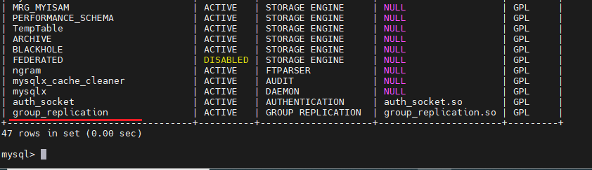
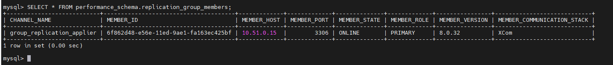
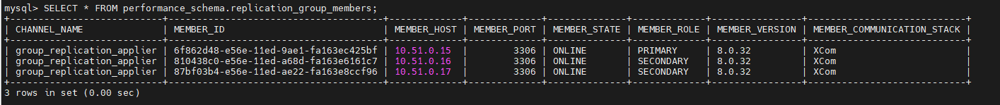
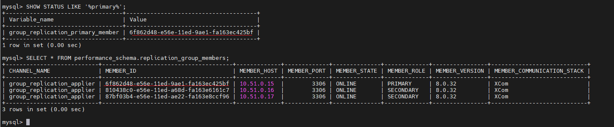
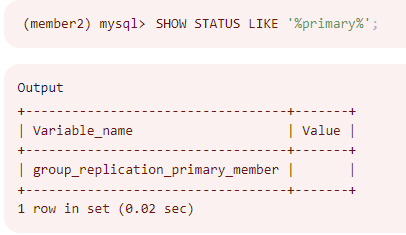
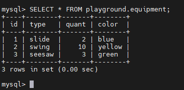

<h1 style="color:orange">Install replication mysql</h1>
<h2 style="color:orange">1. Chuẩn bị</h2>
3 node cài mysql trên ubuntu 20.04

- 10.51.0.15
- 10.51.0.16
- 10.51.0.17
<h2 style="color:orange">2. Tiến hành cài mysql trên 3 node</h2>

    $ apt update
    $ apt install mysql-server
    $ sudo systemctl start mysql
Cấu hình mysql trên 3 node: Lưu ý khi chạy script `mysql_secure_installation` sẽ gây lỗi error. Nguyên nhân là script này sẽ set password cho account root của mysql. Nhưng mà trong cấu hình cài đặt mặc định, account này không được cấu hình connect bằng pass.

Để fix lỗi này:

    $ sudo mysql
    mysql> ALTER USER 'root'@'localhost' IDENTIFIED WITH mysql_native_password BY 'password';
    mysql> exit
Sau đó chạy script `mysql_secure_installation`:

    $ sudo mysql_secure_installation
để chạy cấu hình bảo mật an toàn cho mysql.

Sau đó đăng nhập mysql:

    $ mysql -u root -p
    mysql> ALTER USER 'root'@'localhost' IDENTIFIED WITH auth_socket;
Lúc này, user root có thể đăng nhập vào mysql từ localhost mà ko cần pass.

Cấu hình add user cho mysql. Mặc định chạy root, để add thêm user khác ta sử dụng:

    $ mysql
    mysql> CREATE USER 'sammy'@'localhost' IDENTIFIED BY 'password';
<h2 style="color:orange">3. Cấu hình cài Mysql group replication</h2>
Trước đây với mô hình truyền thống master, slave với việc chỉ master được ghi và slave sẽ copy dữ liệu từ master. Slave có thể dùng cho tác vụ đọc, nhưng không được phép ghi.

Group replication là phương thức linh hoạt hơn, đảm bảo toàn bộ db mysql đều ghi được (tương tự cluster). Nếu primary mysql chết, các thành viên trong cluster sẽ bình bầu 1 master mới trong group. Cho phép các node còn lại hoạt động bình thường. Việc bình bầu và phát hiện lỗi, gửi message sử dụng thuật toán Paxos.
<h3 style="color:orange">3.1. Generating UUID để xác định Mysql group</h3>

Trước khi cấu hình, cần gen 1 UUID để xác định Mysql group mà ta định tạo. Trên `node 1:`

    $ uuidgen 
    4109c72d-942a-4403-b178-d293a931a841
<h3 style="color:orange">3.2. Cấu hình trên cả 3 node</h3>

    $ vim /etc/mysql/my.cnf
paste vào cấu hình:

    !includedir /etc/mysql/conf.d/
    !includedir /etc/mysql/mysql.conf.d/

    [mysqld]

    # General replication settings
    disabled_storage_engines="MyISAM,BLACKHOLE,FEDERATED,ARCHIVE,MEMORY"
    gtid_mode = ON
    enforce_gtid_consistency = ON
    master_info_repository = TABLE
    relay_log_info_repository = TABLE
    binlog_checksum = NONE
    log_slave_updates = ON
    log_bin = binlog
    binlog_format = ROW
    transaction_write_set_extraction = XXHASH64
    loose-group_replication_bootstrap_group = OFF
    loose-group_replication_start_on_boot = OFF
    loose-group_replication_ssl_mode = REQUIRED
    loose-group_replication_recovery_use_ssl = 1

    # Shared replication group configuration
    loose-group_replication_group_name = ""
    loose-group_replication_ip_whitelist = ""
    loose-group_replication_group_seeds = ""

    # Single or Multi-primary mode? Uncomment these two lines
    # for multi-primary mode, where any host can accept writes
    #loose-group_replication_single_primary_mode = OFF
    #loose-group_replication_enforce_update_everywhere_checks = ON

    # Host specific replication configuration
    server_id = 
    bind-address = ""
    report_host = ""
    loose-group_replication_local_address = ""
Những setting này là tối thiểu cho group replication. `loose-` prefix cho phép Mysql bỏ qua những options nó không hiểu và không báo lỗi.

    # General replication settings
    disabled_storage_engines="MyISAM,BLACKHOLE,FEDERATED,ARCHIVE,MEMORY"
    gtid_mode = ON
    enforce_gtid_consistency = ON
    master_info_repository = TABLE
    relay_log_info_repository = TABLE
    binlog_checksum = NONE
    log_slave_updates = ON
    log_bin = binlog
    binlog_format = ROW
    transaction_write_set_extraction = XXHASH64
    loose-group_replication_bootstrap_group = OFF
    loose-group_replication_start_on_boot = OFF
    loose-group_replication_ssl_mode = REQUIRED
    loose-group_replication_recovery_use_ssl = 1
`Section đầu tiên` chứa những config chuẩn cho mysql, ko cần thay đổi. Mysql yêu cầu dữ liệu lưu trong InnoDB storage engine. Mysql khuyến nghị disable các storage engine khác có thể gây ra error bằng dòng config đầu tiên. 
Những config còn lại bật global transaction ID, cấu hình binary logging yêu cầu cho group replicatio, và SSL cho group. Phần con fig này cũng setup 1 số config giúp cho phục hồi và bootstrapping.

    # Shared replication group configuration
    loose-group_replication_group_name = "4109c72d-942a-4403-b178-d293a931a841"
    loose-group_replication_ip_whitelist = "10.51.0.15,10.51.0.16,10.51.0.17"
    loose-group_replication_group_seeds = "10.51.0.15:33601,10.51.0.16:33601,10.51.0.17:33601"
`Section thứ hai` setup config chung cho group, phải giống nhau giữa các node. Sử dung port 33601 khuyến nghị cho replication port, là port để mysql group truyền dữ liệu cho nhau.

    # Single or Multi-primary mode? Uncomment these two lines
    # for multi-primary mode, where any host can accept writes
    #loose-group_replication_single_primary_mode = OFF
    #loose-group_replication_enforce_update_everywhere_checks = ON
`Section thứ ba` quyết định nên config single-primary hoặc multi-primary. Với single, mysql chỉ định 1 primary node (gần như luôn là group member đầu tiên) để xử lý việc đọc. Multi-primary group cho phép member nào cũng có thể ghi. Nếu config multi-primary group, bỏ comment dòng `loose-group_replication_single_primary_mode` và `loose-group_replication_enforce_update_everywhere_checks`. Nếu cài single thì để nguyên comment.

    # Host specific replication configuration
    server_id = 1
    bind-address = "10.51.0.15"
    report_host = "10.51.0.15"
    loose-group_replication_local_address = "10.51.0.15:33061"
`Section thứ tư` tương ứng với từng node mysql trong group.
Trên 3 node restart mysql

    $ systemctl restart mysql
<h3 style="color:orange">3.3. Cấu hình ufw  trên 3 node</h3>
Trên node 1:

    $ sudo ufw allow from member2_server_ip to any port 3306
    $ sudo ufw allow from member2_server_ip to any port 33061
    $ sudo ufw allow from member3_server_ip to any port 3306
    $ sudo ufw allow from member3_server_ip to any port 33061
<h3 style="color:orange">3.4. Cấu hình user replication và enable replication plugin trên cả 3 node</h3>
Để mở kết nối đến các server trong cùng 1 replication group, mỗi node mysql đều có 1 replication user. Bởi vì mỗi node sẽ có replication user riêng, phải tắt binary logging trong quá trình khởi tạo. Nếu không, 1 khi replication được khởi tạo, group sẽ quảng bá replication user từ node primary sang các node khác, tạo 1 user mà đã tồn tại:

    $ mysql
    mysql> SET SQL_LOG_BIN=0;
Tạo user replication:

    mysql> CREATE USER 'repl'@'%' IDENTIFIED BY 'password' REQUIRE SSL;
Grant quyền cho user replication:

    mysql> GRANT REPLICATION SLAVE ON *.* TO 'repl'@'%';
    mysql> FLUSH PRIVILIGES;
Enbale binary logging lại:

    mysql> SET SQL_LOG_BIN=1;
Set group_replication_recovery channel sử dụng user replication vừa tạo

    mysql> CHANGE REPLICATION SOURCE TO SOURCE_USER='repl', SOURCE_PASSWORD='password' FOR CHANNEL 'group_replication_recovery';
Nếu sử dụng bản cũ hơn 8.0.23 thì dùng lệnh:

    mysql> CHANGE MASTER TO MASTER_USER='repl', MASTER_PASSWORD='password' FOR CHANNEL 'group_replication_recovery';
Với replication user đã được cài sẵn, enable `group_replication` plugin để initiate group 

    mysql> INSTALL PLUGIN group_replication SONAME 'group_replication.so';
    mysql> SHOW PLUGINS;
 
<h3 style="color:orange">3.5. Start group replication</h3>

Trên `node 1 (master)` set config `group_replication_bootstrap_group` để khiến node này không kì vọng vào việc nhận thông tin từ các node peer trong group (vì là node đầu tiên nên ko có peer), start 1 group mới và tự bầu bản thân làm primary node.

    $ mysql
    mysql> SET GLOBAL group_replication_bootstrap_group=ON;
Rồi có thể start replication group

    mysql> START GROUP_REPLICATION;
    mysql> SET GLOBAL group_replication_bootstrap_group=OFF;
Group start với node 1 là thành viên đầu tiên, kiểm tra:

    mysql> SELECT * FROM performance_schema.replication_group_members;
 
ONLINE value cho member state biểu thị node hoạt động bình thường.

Tạo 1 database name `playground`, tiếp đó tạo table `equipment` trong database vừa tạo.

    mysql> CREATE DATABASE playground;
    mysql> CREATE TABLE playground.equipment ( 
    id INT NOT NULL AUTO_INCREMENT,
    type VARCHAR(50),
    quant INT,
    color VARCHAR(25),
    PRIMARY KEY(id)
    );
Insert 1 row vào table: 
  
    mysql> INSERT INTO playground.equipment (type, quant, color) VALUES ("slide", 2, "blue");
Start `node 2` và `node 3`:

    mysql> START GROUP_REPLICATION;
Kiểm tra lại các server trong cluster

Kiểm tra table `equipment` đã có trên node 2 và 3 chưa

    mysql> SELECT * FROM playground.equipment;
 
<h2 style="color:orange">4. Kiểm tra</h2>
Kiểm tra khả năng ghi trong node. Với cấu hình single primary, tất cả các tác vụ ghi vào node replication sẽ bị reject. Check primary node hiện tại:

    mysql> SHOW STATUS LIKE '%primary%';
Kết quả câu query sẽ trùng với member_ID trong câu lệnh:

    mysql> SELECT * FROM performance_schema.replication_group_members;
 

Với cấu hình multi-primary 
 
Trên `node 2` insert 1 row vào table `equipment`

    mysql> INSERT INTO playground.equipment (type, quant, color) VALUES ("swing", 10, "yellow");
Trên `node 3` insert 1 row vào table `equipment`

    mysql> INSERT INTO playground.equipment (type, quant, color) VALUES ("seesaw", 3, "green");
Trên `node 1` query dữ liệu table ` equipment` để kiểm tra

 
<h2 style="color:orange">5. Bootstrap khi toàn bộ group down</h2>

Trên `node 1`:

    mysql> SET GLOBAL GROUP_REPLICATION_BOOTSTRAP_GROUP=ON;
    mysql> START GROUP_REPLICATION;
    mysql> SET GLOBAL GROUP_REPLICATION_BOOTSTRAP_GROUP=OFF;
Trên `node 2` và `node 3`:

    mysql> START GROUP_REPLICATION;
<h2 style="color:orange">6. Tự động join vào group khi mysql start</h2>
Với setting hiện tại, nếu 1 node reboot, nó sẽ không tự động rejoin vào group. Để join vào group tự động sau khi reboot:

    $ vim /etc/mysql/my.cnf
    tìm dòng và set thành ON
    [mysqld]
    . . .
    loose-group_replication_start_on_boot = ON
    . . .
Config chỉ có tác dụng khi mysql boot up. Tuy nhiên, nếu 1 node mysql bị remove khỏi cluster vì vấn đề timeout mà mysql vẫn online, member sẽ không tự động join.

Config này để là ON lúc bootstrap sẽ mất rất lâu để online group.