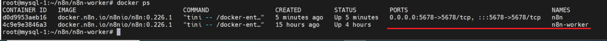

<h1 style="color:orange">Ghi chép cài đặt n8n</h1>
N8n là tool tự động cho các workflow

<h2 style="color:orange">1. Chuẩn bị</h2>
Mô hình n8n tối giản yêu cầu:

- n8n main(tương tự master)
- n8n worker đóng vai trò chạy các workflow
- Database (SQLite hoặc Postgresql) để lưu dữ liệu. Database lưu workflow data, lưu thông tin về các workflow, cấu hình và credential sử dụng bởi các node. Trong hướng dẫn cài đặt sử dụng Mysql.
- Redis là message queue trung gian giao tiếp giữa n8n main và worker, N8n-main nhận cấu hình workflow từ người dùng và đẩy vào redis dưới dạng key-value, giúp ích cho tác vụ đọc, ghi nhanh vì redis lưu dữ liệu trên RAM (có thể cấu hình lưu vào disk). Worker sẽ chọc vào redis lấy thông tin execution, task statuses và task data để thực thi.

Trong bài lab, n8n-main, worker, db và redis đều được cài trên 1 node: 10.51.0.15
<h2 style="color:orange">2. Cấu hình Mysql</h2>
Trên server đã có sẵn mysql. Lưu ý, nếu cài mysql group replication thì n8n chỉ chạy trên 1 master mysql. Nếu cấu hình 3 master mysql thì n8n sẽ lỗi.

    $ mysql
    mysql> CREATE DATABASE workflow;  #database lưu dữ liệu cho n8n
    mysql> CREATE USER 'n8n'@'%' IDENTIFIED BY 'password';
    mysql> GRANT ALL PRIVILEGES ON workflow.* TO 'n8n'@'%';
    mysql> FLUSH PRIVILEGES;
<h2 style="color:orange">3. Cấu hình Redis</h2>
Cài redis trên ubuntu 20.04

    $ sudo apt install lsb-release -y
    $ curl -fsSL https://packages.redis.io/gpg | sudo gpg --dearmor -o /usr/share/keyrings/redis-archive-keyring.gpg
    $ echo "deb [signed-by=/usr/share/keyrings/redis-archive-keyring.gpg] https://packages.redis.io/deb $(lsb_release -cs) main" | sudo tee /etc/apt/sources.list.d/redis.list
    $ sudo apt-get update
    $ sudo apt-get install redis -y
Cấu hình redis:

    $ systemctl start redis
    $ systemctl enable /lib/systemd/system/redis-server.service
    $ vim /etc/redis/redis.conf
sửa các dòng thành

    supervised systemd
    bind 127.0.0.1 ::1 thành 
    bind 0.0.0.0 ::1
    requirepass foobared thành
    requirepass password   #sửa pass mong muốn

    $ systemctl restart redis
Kiểm tra

    $ redis-cli
    127.0.0.1:6379> auth password
    127.0.0.1:6379> ping
    Output
    PONG
 
Redis listen trên port 6379, khi đăng nhập vào bằng password, mặc định ta đăng nhập user "default".
<h2 style="color:orange">4. Tạo n8n-main và n8n-worker bằng docker-compose</h2>
Config n8n-main

    version: '3'
    services:
      n8n:
        image: docker.n8n.io/n8nio/n8n:0.226.1
        container_name: n8n
        restart: unless-stopped
        environment:
          - DB_TYPE=mysqldb
          - DB_MYSQLDB_DATABASE=workflow
          - DB_MYSQLDB_HOST=10.51.0.15
          - DB_MYSQLDB_PORT=3306
          - DB_MYSQLDB_USER=n8n
          - DB_MYSQLDB_PASSWORD=123123
          - GENERIC_TIMEZONE=Asia/Ho_Chi_Minh
          - N8N_ENCRYPTION_KEY=123456
          - EXECUTIONS_MODE=queue
          - QUEUE_BULL_REDIS_HOST=10.51.0.15
          - QUEUE_BULL_REDIS_PORT=6379
          - QUEUE_BULL_REDIS_USERNAME=default
          - QUEUE_BULL_REDIS_PASSWORD=123123
          - QUEUE_BULL_REDIS_DB=1
          - WEBHOOK_URL=https://cb-n8n-dev.fpt.ai/
          - N8N_DISABLE_PRODUCTION_MAIN_PROCESS=false
          - N8N_BASIC_AUTH_ACTIVE=false
          - NODE_ENV=production
          - N8N_PORT=5678
          - N8N_DIAGNOSTICS_ENABLED=false
        volumes:
          - /root/n8n/.n8n:/home/node/.n8n
          - "/etc/localtime:/etc/localtime:ro"
          - "/etc/timezone:/etc/timezone:ro"
        ports:
          - 5678:5678
N8n main listen trên port 5678, n8n chạy mode queue, không scale main được: https://docs.n8n.io/hosting/scaling/queue-mode/#avoiding-downtime

Tham khảo cấu hình n8n tại: https://docs.n8n.io/hosting/environment-variables/environment-variables/#sqlite

Config n8n-worker

    version: '3'
    services:
      n8n-worker:
        image: docker.n8n.io/n8nio/n8n:0.226.1
        container_name: n8n-worker
        restart: unless-stopped
        command: ["n8n", "worker"]
        environment:
          - DB_TYPE=mysqldb
          - DB_MYSQLDB_DATABASE=workflow
          - DB_MYSQLDB_HOST=10.51.0.15
          - DB_MYSQLDB_PORT=3306
          - DB_MYSQLDB_USER=n8n
          - DB_MYSQLDB_PASSWORD=123123
          - GENERIC_TIMEZONE=Asia/Ho_Chi_Minh
          - N8N_ENCRYPTION_KEY=123456
          - EXECUTIONS_MODE=queue
          - QUEUE_BULL_REDIS_HOST=10.51.0.15
          - QUEUE_BULL_REDIS_PORT=6379
          - QUEUE_BULL_REDIS_USERNAME=default
          - QUEUE_BULL_REDIS_PASSWORD=123123
          - QUEUE_BULL_REDIS_DB=1
          - N8N_BASIC_AUTH_ACTIVE=false
          - NODE_ENV=production
          - N8N_PORT=5678
          - N8N_DIAGNOSTICS_ENABLED=false
        volumes:
          - /root/n8n/.n8n:/home/node/.n8n
          - "/etc/localtime:/etc/localtime:ro"
          - "/etc/timezone:/etc/timezone:ro"
        network_mode: "host"
Khi sử dụng network "host" thì worker sẽ không listen trên port nào cả, mà nó chỉ kết nối đến database và redis, worker sẽ hoạt động tùy biến trên port bất kì.
 
 
 
<h2 style="color:orange">5. Cấu hình nginx trên node front-proxy (tunnel)</h2>

Cấu hình nginx trên node front-proxy để nginx chuyển đổi domain `https://cb-n8n-dev.fpt.ai/` thành địa chỉ IP của node n8n-main.

Cấu hình chuẩn đã có trong hướng dẫn ../02.K8s/08.ingress-nginx-k8s.md 
Nginx này đã được cấu hình làm reverse proxy cho ingress-nginx. Ở đây, sẽ cấu hình nginx làm reverse proxy cho 1 ip khác (multi-reverse-proxy).

Trên con front-proxy:

    $ cd /etc/nginx/conf.d/
    $ vim n8n.conf
paste vào

    server {
        listen 80;
        server_name cb-n8n-dev.fpt.ai;
        return 301 https://cb-n8n-dev.fpt.ai$request_uri;
    }

    server {
       server_name cb-n8n-dev.fpt.ai;

       access_log /var/log/nginx/cb-n8n-dev.fpt.ai/access.log main;
       error_log /var/log/nginx/cb-n8n-dev.fpt.ai/error.log error;

       location / {
            proxy_pass http://10.51.0.15:5678;
            proxy_pass_request_headers      on;
            proxy_set_header                Host $host;
            proxy_set_header  X-Real-IP $remote_addr;
            proxy_set_header  X-Forwarded-For $remote_addr;
            proxy_set_header  X-Forwarded-Host $host;
            proxy_http_version 1.1;
            proxy_set_header Connection "";
            chunked_transfer_encoding off;
            proxy_buffering off;
            proxy_cache off;
       }
       include /etc/nginx/ssl/fpt.ai-ssl.conf;
    }

    $ systemctl restart nginx
Kiểm tra, vào browser truy cập domain:
cb-n8n-dev.fpt.ai (phải khai báo ip node front-proxy vào /etc/hosts)

 