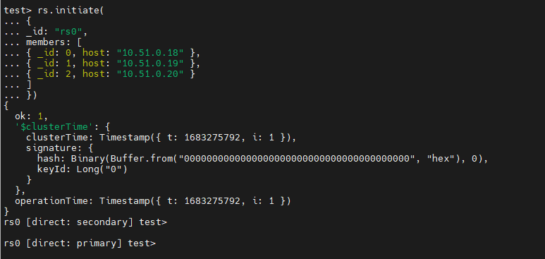
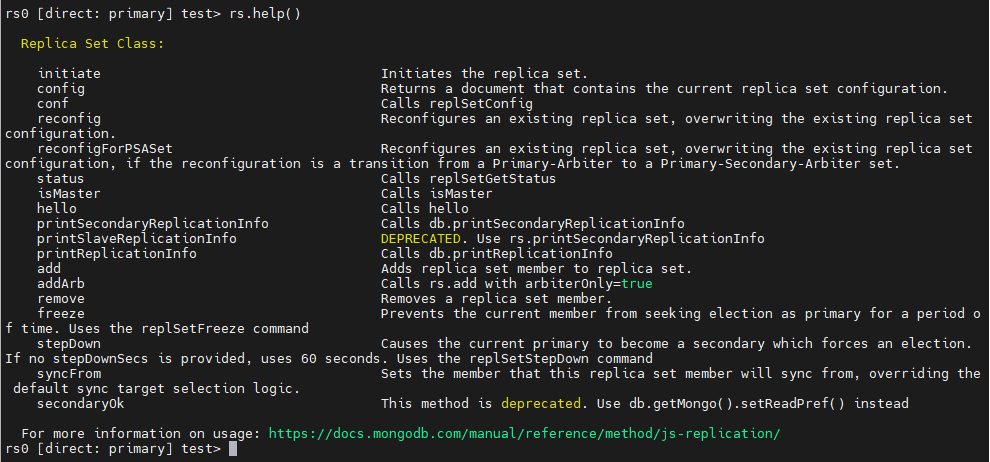
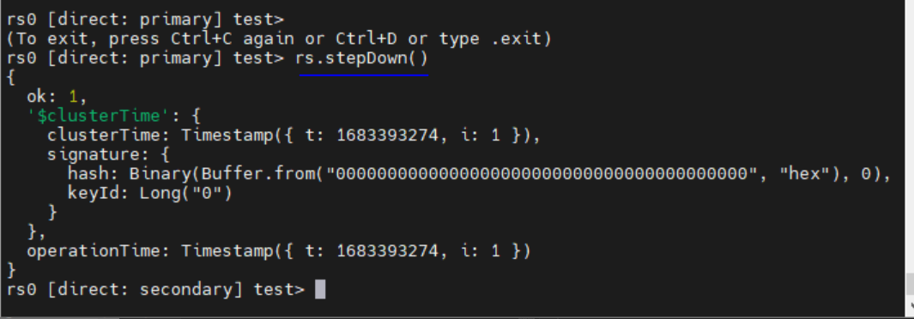

<h1 style="color:orange">Cài đặt Mongodb replica set</h1>
Chuẩn bị 3 server ubuntu 20.04:

- 10.51.0.18
- 10.51.0.19
- 10.51.0.20
<h2 style="color:orange">1. Vô hiệu hóa Transparent Huge Pages (THP)</h2>
Transparent Huge Pages (THP) là chương trình quản lý RAM trên Linux. Tuy nhiên, làm giảm khả năng của mongodb, vì THP có mẫu truy cập bộ nhớ thưa thớt, thay vì liền kề. Vì vậy khi dùng mongodb, THP nên được disable trên server. 

Tham khảo: https://www.mongodb.com/docs/manual/tutorial/transparent-huge-pages/

    $ vim /etc/systemd/system/disable-transparent-huge-pages.service
paste vào

    [Unit]
    Description=Disable Transparent Huge Pages (THP)
    DefaultDependencies=no
    After=sysinit.target local-fs.target
    Before=mongod.service

    [Service]
    Type=oneshot
    ExecStart=/bin/sh -c 'echo never | tee /sys/kernel/mm/transparent_hugepage/enabled > /dev/null'

    [Install]
    WantedBy=basic.target
Reload daemon

    $ sudo systemctl daemon-reload
    $ sudo systemctl start disable-transparent-huge-pages
    $ sudo systemctl enable disable-transparent-huge-pages
Kiểm tra bằng cách thấy output [never] trong câu lệnh sau:

    $ cat /sys/kernel/mm/transparent_hugepage/enabled
<h2 style="color:orange">2. Install mongoDB</h2>
Import key cho repo mongodb

    $ sudo apt-get install gnupg
    $ curl -fsSL https://pgp.mongodb.com/server-6.0.asc | sudo gpg -o /usr/share/keyrings/mongodb-server-6.0.gpg --dearmor
Tạo file repo cho mongodb

    $ echo "deb [ arch=amd64,arm64 signed-by=/usr/share/keyrings/mongodb-server-6.0.gpg ] https://repo.mongodb.org/apt/ubuntu focal/mongodb-org/6.0 multiverse" | sudo tee /etc/apt/sources.list.d/mongodb-org-6.0.list
    $ sudo apt-get update
    $ sudo apt-get install -y mongodb-org
Optional: mặc định apt upgrades sẽ nâng cấp version của mongodb, để lock version này, dùng lệnh:

    $ echo "mongodb-org hold" | sudo dpkg --set-selections
    $ echo "mongodb-org-database hold" | sudo dpkg --set-selections
    $ echo "mongodb-org-server hold" | sudo dpkg --set-selections
    $ echo "mongodb-mongosh hold" | sudo dpkg --set-selections
    $ echo "mongodb-org-mongos hold" | sudo dpkg --set-selections
    $ echo "mongodb-org-tools hold" | sudo dpkg --set-selections
MongoDB nếu cài = package thì data nằm ở `/var/lib/mongodb`, log nằm ở `/var/log/mongodb`

Cấu hình mongodb bind vào port 0.0.0.0 trong file mongod.conf

    $ vim /etc/mongod.conf
    sửa
    bind 127.0.0.1 thành 0.0.0.0
    $ systemctl start mongod
    $ systemctl enable mongod
<h3 style="color:orange">2.1. Remove mongoDB</h3>

    $ sudo apt-get purge mongodb-org* -y
    $ sudo apt remove mongodb
    $ sudo apt purge mongodb
    $ sudo apt autoremove -y
    $ sudo rm -r /var/log/mongodb
    $ sudo rm -r /var/lib/mongodb
<h2 style="color:orange">3. Cài mongoDB Replica set</h2>
MongoDB chạy replica set. Mỗi replica set sẽ có 1 primary member và ít nhất 1 secondary member. 
Primary member là node duy nhất cho phép write. Mỗi replica set chỉ có 1 primary trong 1 thời điểm. Secondary node copy primary's operations log và thực hiện y hệt theo op log đó. Nhiều primary sẽ dẫn tới data conflict. 
Default, các app sẽ chỉ đọc từ primary, có thể đọc từ thêm cả secondary, tuy nhiên, dữ liệu được truyền async, đọc từ secondary có thể ko update kịp dữ liệu. 
Mỗi khi primary sập, các node secondary sẽ bầu 1 primary mới. Có thể tối đa 50 members, nhưng mà vote thì max 7 member. 
<h2 style="color:orange">3.1. Cấu hình DNS + firewall</h2>
Thực hiện thêm DNS trên cả 3 node:

    $ vim /etc/hosts
    10.51.0.18 mongo0.replset.member
    10.51.0.19 mongo1.replset.member
    10.51.0.20 mongo2.replset.member
Cấu hình firewall 

    $ sudo ufw allow from mongo0_server_ip to any port 27017
    $ sudo ufw allow from mongo2_server_ip to any port 27017
<h2 style="color:orange">3.2. Cấu hình MongoDB</h2>
Cấu hình trên cả 3 node

    $ vim /etc/mongod.conf
chỉnh sửa các dòng

    . . .
    # network interfaces
    net:
      port: 27017
      bindIp: 127.0.0.1 thành IP note tương ứng
    . . .
    replication:
      replSetName: "rs0"
    . . . 
replSetName là tên riêng và phải giống nhau giữa các node trong replica set.

    $ systemctl restart mongod

Trên node 1 (dự kiến làm node primary)

    $ mongosh
để access mongodb-cli (đối với bản 6.0 trên thì dùng mongosh, dưới 6.0 thì dùng mongo).

Để initiate replica set chạy lệnh trên node 1

    test> rs.initiate(
    {
    _id: "rs0",
    members: [
    { _id: 0, host: "10.51.0.18" },
    { _id: 1, host: "10.51.0.19" },
    { _id: 2, host: "10.51.0.20" }
    ]
    })
Sau khi chạy lệnh xong nếu output trả về "ok" : 1 là thành công
 
Nếu replica set được khởi động như mong đợi, client's promt sẽ đổi từ `test >` sang
`rs0 [direct:secondary] test >`

List các command quản lý replica set.

    test> rs.help()
 

Sau khi chạy lệnh sẽ thấy node có promt `rs0 [direct: primary] test>` 
Có nghĩa là Mongodb hiện tại đã được bầu làm primary node.

Để check status các node:

    $ mongosh --eval 'rs.status()'
<h2 style="color:orange">3.3. Để thêm node vào replica set MongoDB</h2>
Trên node primary:

    rs0 [direct:primary] test> rs.add( "ip_node_mongodb_new" )
<h2 style="color:orange">4. Cài user, pass cho Replica set</h2>
Hoạt động tương tự như user, pass trong các db khác như MySQL, Postgresql. Ngoài ra, còn có thể cấu hình TLS,SSL cho replica set với x509

Trên cả 3 node tạo ssh-keygen

    $ ssh-keygen
để tạo cặp private và public key của 3 node mongodb. Sau đó đẩy public key vào file /root/.ssh/authorized_keys của cả 3 node. VD: đẩy public key node 2 và 3 vào file authorized_keys của node 1. Tương tự public key node 1,3 vào file authorized_keys của node 2,...
<h3 style="color:orange">4.1. Tạo user admin cho mongodb</h3>
Trên node primary:

    $ mongosh
    rs0 [direct: primary] test> use admin
Output

    switched to db admin
Tạo user admin:

    db.createUser(
    {
    user: "root",
    pwd: passwordPrompt(),
    roles: [ { role: "userAdminAnyDatabase", db: "admin" } ]
    }
    )
Role là tập hợp quyền built-in của mongodb. Role "userAdminAnyDatabase" có toàn quyền với mongodb
 
Nhập pass và tạo thành công sẽ có output như hình.

Ngoài ra, để tạo user với role khác: 
`Đăng nhập vào mongo với account "root"`

    $ mongosh
    rs0 [direct: primary] test> use admin
    rs0 [direct: primary] admin> db.auth ("root","password")
    rs0 [direct: primary] admin> db.createUser(
    {
    user: "clusteradmin",
    pwd: passwordPrompt(),
    roles: [ { role: "clusterAdmin", db: "admin" } ]
    }
    )
<h3 style="color:orange">4.2. Tạo và phân phối Authentication Keyfile</h3>
Keyfile hành động như là 1 shared password giữa các member trong cluster.

Trên cả 3 node:

    $ mkdir ~/mongo-security
Trên node primary:

    $ cd ~/mongo-security/
    $ openssl rand -base64 768 > keyfile.txt
    $ chmod 400 keyfile.txt
    $ scp keyfile.txt root@10.51.0.19:/root/mongo-security
    $ scp keyfile.txt root@10.51.0.20:/root/mongo-security
Đổi user keyfile trên cả 3 node về mongodb vì mongodb chạy bằng user mongodb

    $ sudo chown -R mongodb:mongodb ~/mongo-security/
    $ chmod 755 /root/ #nếu directory ~/ là /root/
<h3 style="color:orange">4.3. Enable keyfile Authentication</h3>
Để tránh downtime, thực hiện trên các node secondary trước (ở đây là node 2 và 3)

    $ vim /etc/mongod.conf
đổi dòng `#security:` thành:

    ...
    security:
      keyFile: /root/mongo-security/keyfile.txt
      transitionToAuth: true
    ...

    $ systemctl restart mongod
Trên node primary

    $ mongosh
    rs0 [direct: primary] test> rs.stepDown()
 

    $ mongosh
    rs0 [direct: primary] test> exit
    $ vim /etc/mongod.conf

    $ sudo systemctl restart mongod
<h3 style="color:orange">4.4. Restart các member</h3>
Option `transitionToAuth` để là true có nghĩa là các member chấp nhận giao tiếp cả bằng keyfile và kết nối non-authenticated. Để đổi lại, trên 3 server đổi cấu hình.

    $ vim /etc/mongod.conf
comment dòng

    #transitionToAuth: true

    $ sudo systemctl restart mongod
Sau đó để kiểm tra chạy lệnh sau sẽ fail
  
    $ mongosh --eval 'rs.status()'
Phải gõ lệnh sử dụng authen

    $ mongosh -u "clusteradmin" -p --authenticationDatabase "admin" --eval 'rs.status()'