<h1 style="color:orange">Cài đặt Mongodb replica set bằng ansible</h1>

Cài đặt ansible sử dụng collection (là bản đóng gói mở rộng hơn của role, 1 collection có thể có nhiều role): https://galaxy.ansible.com/community/mongodb

Để cài đặt, yêu cầu máy đã cài ansible, để pull collection này từ ansible-galaxy:

    $ ansible-galaxy collection install community.mongodb -p /path/to/collection
<h2 style="color:orange">1.Chuẩn bị</h2>
3 server Ubuntu 20.04:

- 10.51.0.18: primary node
- 10.51.0.19: secondary
- 10.51.0.20: secondary
<h2 style="color:orange">2.Viết các file để cài ansible mongodb</h2>
Để chạy ansible cài đặt mongodb replica set cần tạo các file sau:

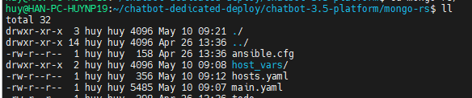 

<h3 style="color:orange">2.1. File ansible.cfg</h3>

    $ vim ./ansible.cfg

    [defaults]
    nocows = 1
    inventory = ./hosts.yaml
    roles_path = ../ansible-roles
    collections_paths = ../collections/ansible_collections
    host_key_checking = False
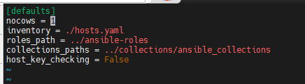 
Với `inventory` là path dẫn đến file inventory 
`roles_path` là path dẫn đến directory role mongodb 
`collections_paths` là path dẫn tới collection 
<h3 style="color:orange">2.2. File hosts.yaml</h3>

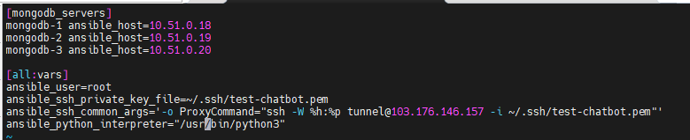 

    $ vim ./hosts.yaml
paste vào

    [mongodb_servers]
    mongodb-1 ansible_host=10.51.0.18
    mongodb-2 ansible_host=10.51.0.19
    mongodb-3 ansible_host=10.51.0.20

    [all:vars]
    ansible_user=root
    ansible_ssh_private_key_file=~/.ssh/test-chatbot.pem
    ansible_ssh_common_args='-o ProxyCommand="ssh -W %h:%p tunnel@103.176.146.157 -i ~/.ssh/test-chatbot.pem"'
    ansible_python_interpreter="/usr/bin/python3"
Để đăng nhập vào các mongodb-server sử dụng ssh key, define path ssh key bằng dòng config: `ansible_ssh_private_key_file=~/.ssh/test-chatbot.pem` 
Đăng nhập vào mongodb qua bastion trung gian, cũng sử dụng ssh key để đăng nhập, cũng phải define path ssh key để vào
<h3 style="color:orange">2.3. Directory host_vars</h3>

    $ mkdir ./host_vars && cd ./host_vars
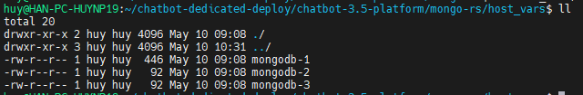 
Với mongodb-1 là primary node trong mongodb replica set nên 

    $ vim mongodb-1

    ---
    ufw_allowed_ip_01: 10.51.0.19 # mongo-02
    ufw_allowed_ip_02: 10.51.0.20 # mongo-03

    # user setup
    admin_pwd: "xxxxxxxxxxxxxxxxx"              # SAMPLE_p0xVaB64Bqm08gmNp0xV_SAMPLE
    longtv16_pwd: "xxxxxxxxxxxxxxxxx"           # SAMPLE_FkDbXeutif9vSKuTjC23_SAMPLE
    service_pwd: "xxxxxxxxxxxxxxx"            # SAMPLE_HQabYNKxY4sMTfIr7OgO_SAMPLE
Tương tự file mongodb-2 và mongodb-3

    $ vim mongodb-2
    ---
    ufw_allowed_ip_01: 10.51.0.18 # mongo-01 IP
    ufw_allowed_ip_02: 10.51.0.20 # mongo-03 IP

    $ vim mongodb-3
    ---
    ufw_allowed_ip_01: 10.51.0.18 # mongo-01 IP
    ufw_allowed_ip_02: 10.51.0.19 # mongo-02 IP
<h3 style="color:orange">2.4. File Main.yaml</h3>

Nội dung file main yaml: [06.main.yaml](./06.main.yaml) 

Trong đó,  
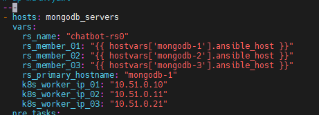 
k8s_worker_ip là ip của các node worker k8s. Các node này sẽ được mở firewall tới mongodb để tạo database và lưu dữ liệu.

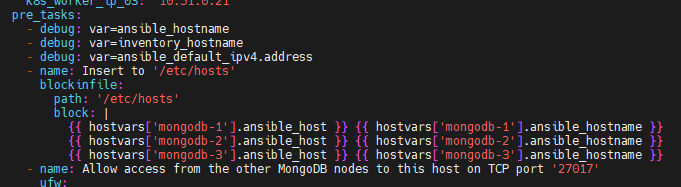 
Lưu ý: pre_tasks là các tác vụ chạy trước khi gọi role; Debug: var= là việc in các biến ra trong pre_tasks
- `var=ansible_hostname`: là in ra biến trong là kết quả câu lệnh `uname -n` chạy trên các host trong file inventory
- `var=ansible_default_ipv4.address`: là in ra biến là kết quả câu lệnh `ip -4 route get 8.8.8.8`, là ip default dùng để thông ra internet của host trong file inventory

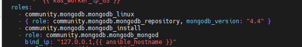 
Mongodb_version sử dụng bản 4.4, nếu không khai báo biến này sẽ mặc định cài bản 6.0

Tại sao mặc định 6.0? Sửa trong collection được đóng gói file path: `collections/ansible_collections/community/mongodb/roles/mongodb_repository/defaults` 
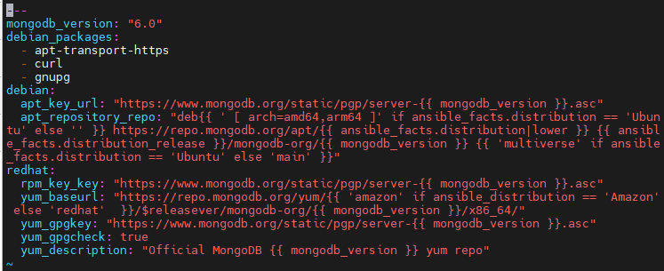 

Tạo 1 số user cần thiết và phân quyền trong mongodb 
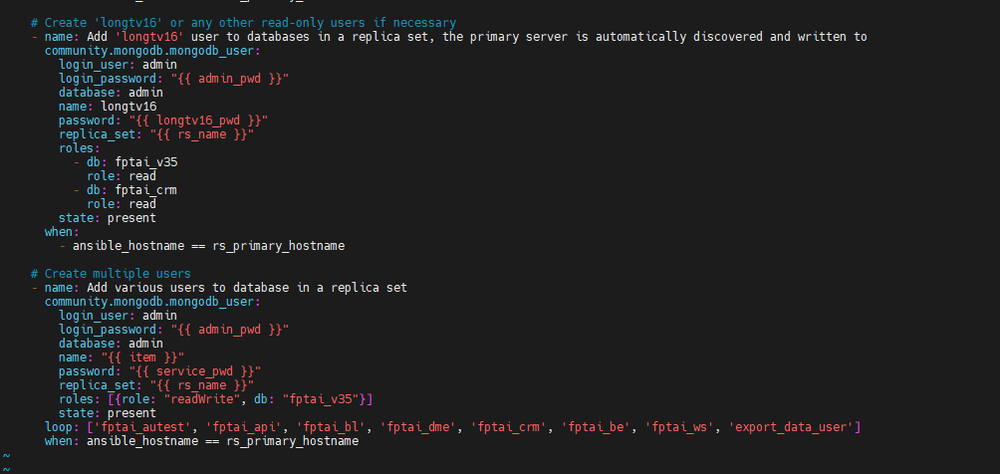 
<h2 style="color:orange">3. Chạy ansible và kiểm tra</h2>

    $ ansible-playbook main.yaml
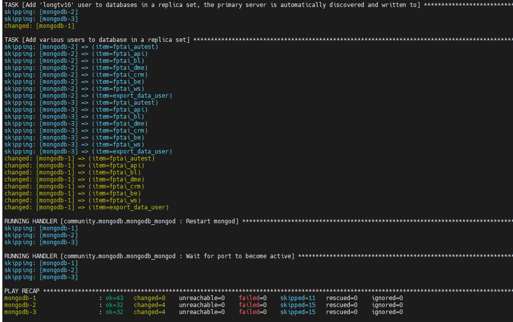 

Lưu ý, nếu đã cài thành công 1 lần, nếu gỡ toàn bộ mongodb trên cả 3 server đi để cài lại sẽ bị lỗi. Cách sửa: xóa các file sau:

    $ rm -rf /root/mongodb_admin.success
    $ rm -rf /root/.mongorc.js
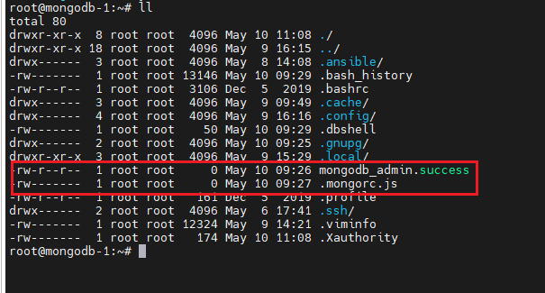 
Mục đích cho bước này thành công:  
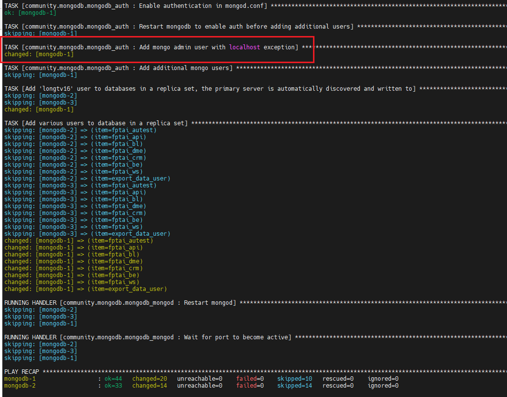 

Kiểm tra, ssh vào node primary (ở đây là 10.51.0.18), đăng nhập mongodb<rb>
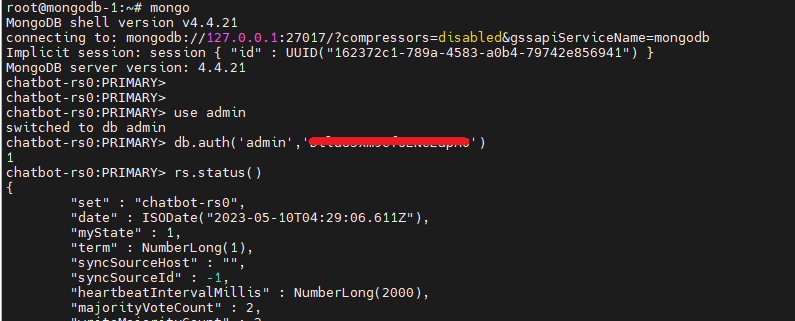 
