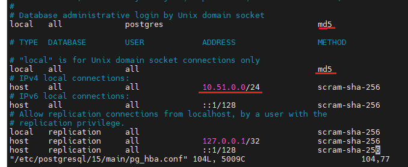

<h1 style="color:orange">Install postgresql 15 trên ubuntu 20.04</h1>
Chuẩn bị: 1 server ubuntu 20.04: 10.51.0.40
<h2 style="color:orange">1. Cài đặt postgresql trên ubuntu 20.04</h2>

    $ sudo apt update && sudo apt dist-upgrade -y
    $ sudo apt install gnupg2 wget vim -y
Enable repo postgresql 15 

    $ sudo apt-cache search postgresql | grep postgresql
    $ sudo sh -c 'echo "deb http://apt.postgresql.org/pub/repos/apt $(lsb_release -cs)-pgdg main" > /etc/apt/sources.list.d/pgdg.list'
    $ wget -qO- https://www.postgresql.org/media/keys/ACCC4CF8.asc | sudo tee /etc/apt/trusted.gpg.d/pgdg.asc &>/dev/null
    $ sudo apt update -y
Cài đặt postgresql

    $ sudo apt install postgresql postgresql-client -y
    $ sudo systemctl enable postgresql
    $ sudo systemctl start postgresql
Check version postgres đã install

    $ psql --version
    psql (PostgreSQL) 15.3 (Ubuntu 15.3-1.pgdg20.04+1)
Truy cập vào postgres bằng user postgresql, vì postgresql không cho đăng nhập bằng user root

    $ sudo -u postgres psql
    hoặc su sang user postgres
    $ sudo -i -u postgres
    $ psql
<h2 style="color:orange">2. Setup postgresql 15 với password</h2>

    $ psql
    postgres=# ALTER USER postgres PASSWORD 'Str0ngP@ssw0rd';
    ALTER ROLE
    postgres=#
<h2 style="color:orange">3. Cấu hình postgresql 15 cho phép remote access</h2>
Mặc định cấu hình postgres chỉ cho phép local đăng nhập. Để cấu hình cho phép remote

    $ vim /etc/postgresql/15/main/postgresql.conf
    chỉnh sửa dòng listen_addresses = '127.0.0.1'
    thành listen_addresses = '*'
Cấu hình firewall để đăng nhập postgres

    $ sudo vim /etc/postgresql/15/main/pg_hba.conf
 
Chỉnh peer thành md5 để yêu cầu đăng nhập bằng mật khẩu. Trong hình là mở cho dải 10.51.0.0/24 đăng nhập remote

    $ sudo systemctl restart postgresql
    $ sudo systemctl enable postgresql
Cấu hình firewall cho postgresql

    $ sudo ufw allow 5432/tcp
<h2 style="color:orange">4. Để add user cho postgres</h2>

    $ sudo -i -u postgres
    $ CREATE ROLE admin WITH LOGIN SUPERUSER CREATEDB CREATEROLE PASSWORD 'Passw0rd';
Từ host remote đăng nhập postgresql

    $ psql -h 192.168.201.12 -U postgres
yêu cầu phải cài postgresql-client