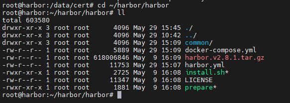
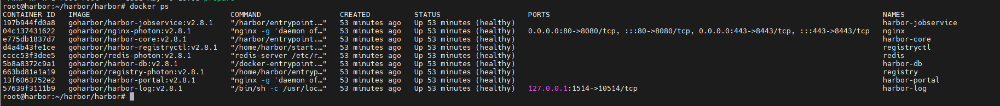
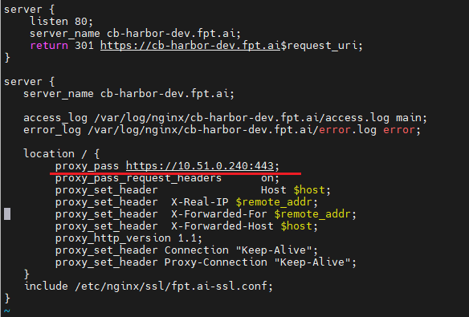
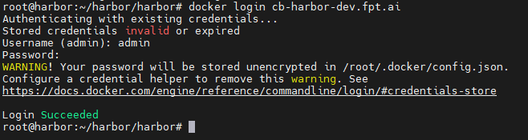
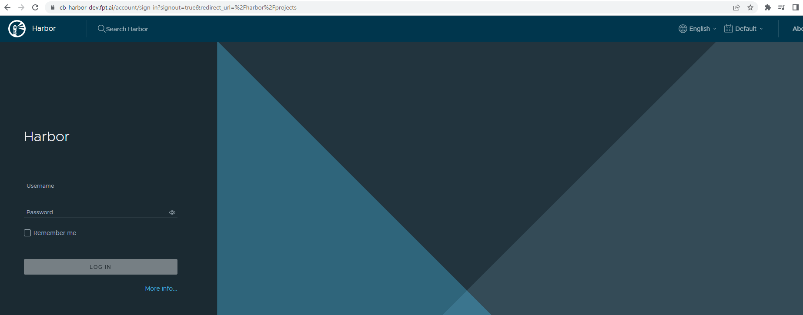

<h1 style="color:orange">Cài đặt harbor</h1>
Harbor là registry giống như docker hub nhưng sử dụng cho mạng nội bộ. 
Trong hướng dẫn cài đặt harbor sử dụng docker-compose 
Tham khảo: https://goharbor.io/docs/2.8.0/install-config/download-installer/
<h2 style="color:orange">1. Chuẩn bị</h2>

- 1 server cài harbor, ip: 10.51.0.240
- Server cài harbor đã được cài đặt docker và docker-compose
<h2 style="color:orange">2. Cài đặt</h2>
Truy cập trang: https://github.com/goharbor/harbor/releases 
Để tải bản latest của harbor (trong hướng dẫn sử dụng bản 2.8.1 offline)

    $ mkdir ~/harbor/
    $ mv harbor-offline-installer-v2.8.1.tgz ~/harbor/ && cd ~/harbor
    $ tar xzvf harbor-offline-installer-v2.8.1.tgz
Tạo các file cert cho harbor

    $ mkdir -p /data/cert
Chuyển vào file cert và key đã được tạo cho harbor. Nếu chưa có cert và private key client cho harbor có thể tham khảo cách tạo trên trang chủ: https://goharbor.io/docs/2.8.0/install-config/configure-https/

    $ mv fpt.ai-bundle.crt /data/cert
    $ mv fpt.ai.key /data/cert

Cấu hình config cho harbor

    $ cd ~/harbor/harbor/
    $ mv ./harbor.yml.tmp harbor.yml
    $ vim harbor.yml
Sửa config:

    hostname: cb-harbor-dev.fpt.ai    #là domain để client truy cập vào harbor
    ...
    https:
      port: 443
      certificate: /data/cert/fpt.ai-bundle.crt      # cert được issue
      private_key: /data/cert/fpt.ai.key             
    ...
    harbor_admin_password: Harbor_password
    database:
      password: Database_password
    data_volume: /data
Tạo file cert cho docker:

    $ mkdir -p /etc/docker/certs.d && /etc/docker/certs.d
    $ cp /data/cert/fpt.ai-bundle.crt ./
    $ cp /data/cert/fpt.ai.key ./
    $ cp fpt.ai-bundle.crt ca.crt
    $ systemctl restart docker
Tạo file docker-compose

    $ cd ~/harbor/harbor/ && ./prepare
sau khi lệnh chạy xong sẽ tạo file docker-compose.yml và folder common 
 

Khởi tạo harbor

    $ docker-compose up -d
Câu lệnh sẽ tạo ra các container: 
 
<h2 style="color:orange">3. Cấu hình bastion nginx</h2>
Trong lab có sử dụng truy cập vào harbor qua 1 server nginx đ/c: 103.146.176.157

Trên server bastion:

    $ vim /etc/nginx/conf.d/harbor.conf
paste vào 
 
Cài đặt proxy_pass truy cập vào server cài harbor qua port https.
<h2 style="color:orange">4. Kiểm tra</h2>
Trên 1 server cài docker bất kì trong cùng vùng LAN thử connect đến registry harbor:

    $ vim /etc/hosts
    thêm vào 
    10.51.0.240 cb-harbor-dev.fpt.ai

    $ docker login cb-harbor-dev.fpt.ai
    Nhập Harbor_password
 

Vào browser truy cập http://cb-harbor-dev.fpt.ai 
Lưu ý phải cấu hình DNS để host truy cập nhận diện được domain.
 