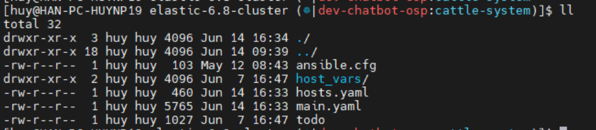
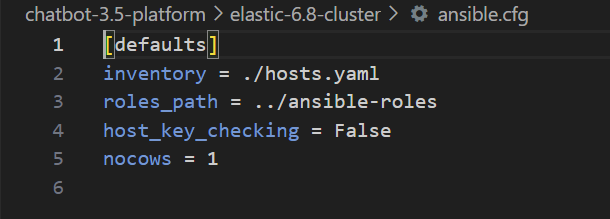
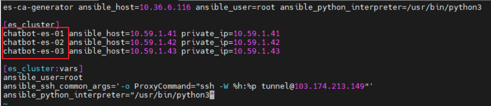
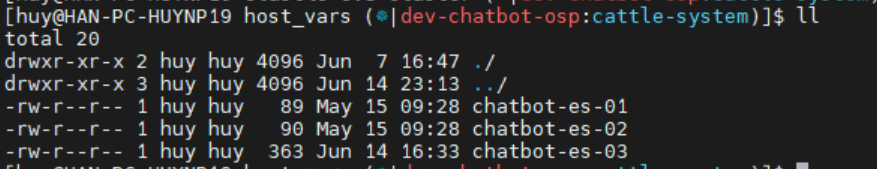
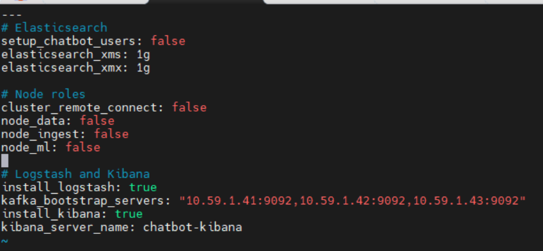
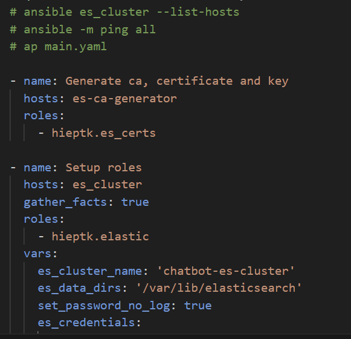

<h1 style="color:orange">Sử dụng ansible để cài elasticsearch, kibana, logstash</h1>
<h2 style="color:orange">Chuẩn bị</h2>
3 node chạy elasticsearch:

- 10.59.1.41: 
- 10.59.1.42:
- 10.59.1.43: kibana, logstash

Cấu trúc các file trong ansible như sau:
 
<h2 style="color:orange">1. Ansible.cfg</h2>
Nội dung file ansible:

 
Trong đó, directory ../ansible-roles là đường dẫn tới role của ansible. Nếu không define thì sẽ dùng đường dẫn mặc định.
<h2 style="color:orange">2. Hosts.yaml</h2>

 
- 10.36.6.116: là node gen ra cert cho elastic cluster
<h2 style="color:orange">3. host_vars directory</h2>
Trong directory host_vars chứa các biến cho mỗi member trong elastic cluster.

 
Lưu ý: tên file phải giống hệt trong hosts.yaml 
 

Nội dung file chatbot-es-03 khi cài kibana, logstash sẽ thêm 1 số biến:
 
<h2 style="color:orange">4. Main.yaml</h2>

 

- task generate ca ssh vào node 10.36.6.110 để gen ra cert cho elasticsearch. Task gọi role hieptk.es_certs
- task setup roles gọi role hieptk.elastic. Đẩy cert vừa tạo vào các node elastic và cài elastic. Cài logstash, kibana trên node es-03