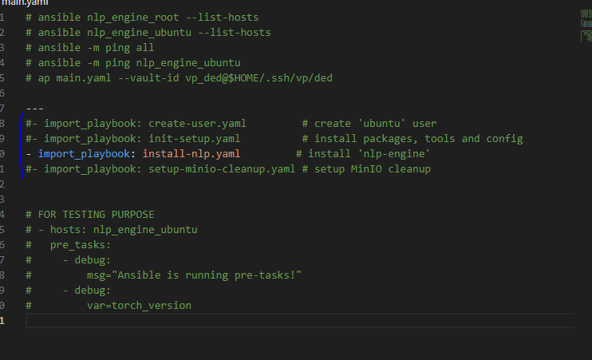

<h1 style="color:orange">Cài đặt NLP-engine-v4 bằng ansible</h1>
<h2 style="color:orange">1. Chuẩn bị</h2>

- 1 server cài ubuntu 20.04 sử dụng làm ansible host: 172.18.251.67 (ip này ko quan trọng), kết nối đến các server cài NLP qua 1 bastion, đ/c: 103.176.146.157
- Các server cài nlp. Lưu ý: server cài OS ubuntu 18.04 (các version mới hơn của ubuntu ko cài được do lệch phiên bản code nlp): 
10.59.1.41 
10.59.1.42 
- Cài dvc và dvc-s3 trên node ansible controller.
- Ý tưởng của code ansible này là pull code về máy local (ansible controller) từ gitlab, kéo hết các thư viện nặng từ MinIO bằng dvc. Code kéo từ 2 repo về, 1 là code wrapper do anh hiephm3 viết, 1 repo là code core engine của đội NLP làm. Cho vào 1 cục trên máy local rồi đẩy lên các remote chạy ansible, cài đầy đủ thư viện trên remote.
<h2 style="color:orange">2. Cài đặt</h2>

 
<h3 style="color:orange">2.1. group_vars</h3>
Trong file vars.yaml, lưu ý có biến: `dvc_minio_secret_key` được mã hóa, giải mã bằng vault pass: `ded` 

 
Câu lệnh giải mã:

    # yq e '.dvc_minio_secret_key' inventories/voicebot/group_vars/all/vars.yml | av decrypt --vault-id vp_ded@$HOME/.ssh/vp/ded
Hoặc khi chạy file main.yaml thì phải thêm vaultpass để ansible giải mã được biến:

    # ap -i main.yaml --vault-id vp_ded@$HOME/.ssh/vp/ded
<h3 style="color:orange">2.2. host_vars và hosts.yaml</h3>

 
- 10.59.1.51, 10.59.1.52 là ip của 2 server nlp.
- 103.174.213.149 là ip của bastion
<h3 style="color:orange">2.3. Main.yaml</h3>
Trong file main.yaml sẽ chứa nhiều file nhỏ 

 
Có thể uncomment cả 4 dòng để chạy liên tục hoặc uncomment từng dòng để chạy lần lượt từng file: create-user -> init-setup -> install-nlp -> setup-minio-cleanup

Lưu ý: trong file creat-user, có bước đẩy public key của owner vào user các host ansible tác động. Ta sửa đường dẫn đến public key mong muốn. Mục đích ssh được vào các server này bằng cặp private, public key.

 
{{local_home_dir}} là thư mục home của user chạy ansible trên ansible_host(user chạy câu lệnh ansible-playbook). Ví dụ ở đây user chạy câu lệnh là ansible-playbook main.yaml thì thư mục chứa public key sẽ là `home/huy/.ssh/test-chatbot.pub` 
Comment là #Huynp19

 
<h3 style="color:orange">2.4. Chạy lệnh cài nlp = ansible</h3>

    # cd path-to/engine-v4
    # ansible-playbook -i main.yaml --vault-id vp_ded@$HOME/.ssh/vp/ded