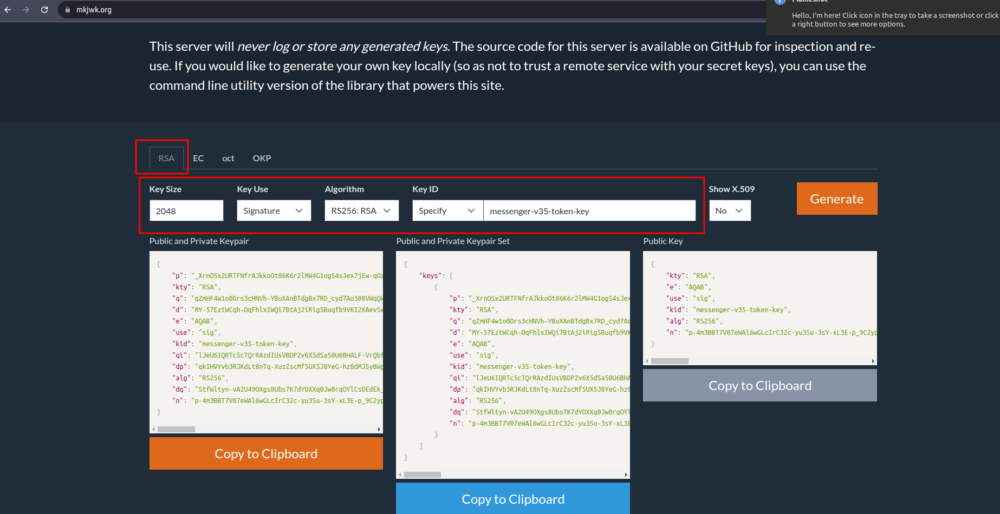

<h1 style="color:orange">Note patch</h1>

Ném thư mục init_db vào master/primary của mysql, mongodb

1. Giải mã các file

       # av decrypt --vault-id vp_ded@$HOME/.ssh/vp/ded fptai_v3_init_data_31May2020.sql

       init_db/patches_mysql_chatbot/fptai_v3_init_data_31May2020.sql
       init_db/patches_mysql_chatbot/fptai_v3_structure_31May2020.sql
       init_db/patches_mysql_rating/rating_v3_migration_data_31May2020.sql
       init_db/patches_mysql_rating/rating_v3_structure_31May2020.sql
       inti_db/patches_mysql_survey/initial.sql
2. chạy file 0.create_mysql_users.sql

       # mysql -u root -p < 0.create_mysql_users.sql
Lưu ý: bỏ fptid, bỏ user longvt16, anhvh

3. chạy patch mysql 1.run_mysql_patches.sql 
Lưu ý: bỏ fptid, bỏ user longvt16, anhvh 
4. chạy patch mongodb 4.run_mongodb_users.js

<h2 style="color:orange">2. Gen password cho các service deploy</h2>
Cài đặt makepasswd

    # makepasswd --chars=28 --count=20
Gen ra 20 password với độ dài 28 kí tự

Gen jwk (JSON web key):

Vào trang: https://mkjwk.org/

Để gen ra jwk: 

    kty: "RSA", algorith: "RS256", key use: "signature", key id: "messenger-v35-token-key"
 