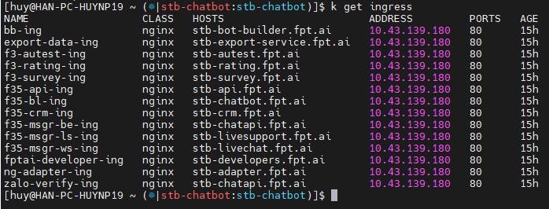
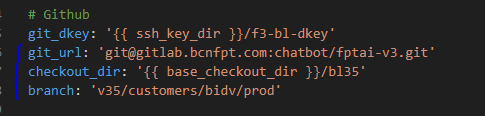
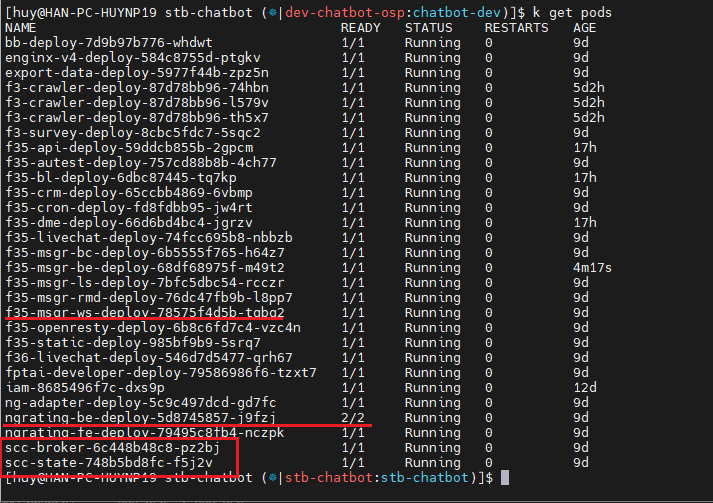
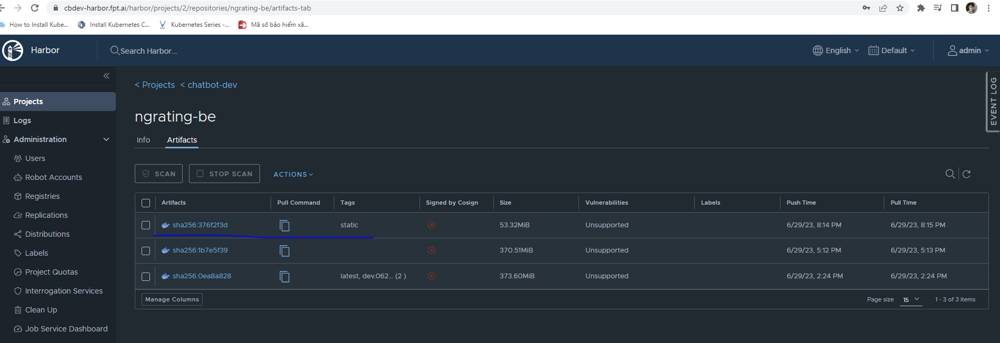
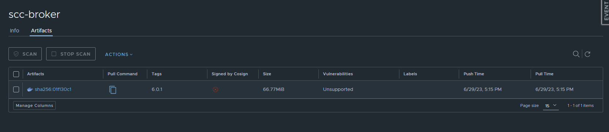
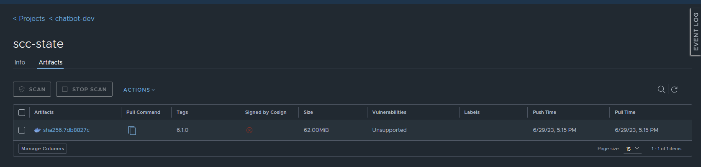
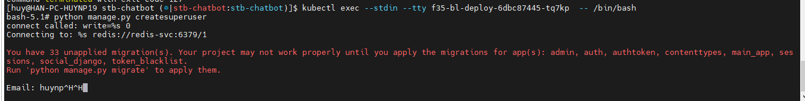
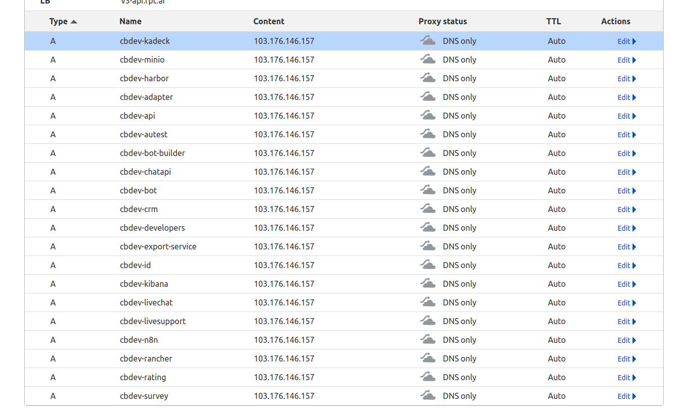

<h1 style="color:orange">Note deploy service</h1>
Deploy các service trên cụm k8s

<h2 style="color:orange">1. Chạy file sysconfig</h2>
File config này tạo 1 tables trong database fptai_v3 để làm ENV. 
Đổi toàn bộ ngày giờ chạy file trong file sysconfig.sql

    # sed -i 's/2023-06-21 08:00:00/2023-06-28 17:00:00/g' sysconfig.sql
Chạy file

    # mysql -u root -p
    mysql> use fptai_v3;
    mysql> source ~/sysconfig.sql
    mysql> select * from sys_config;     #để kiểm tra
Lưu ý nội dung password: "crm_password" trong line 60 giữ nguyên do đã được hard code

<h2 style="color:orange">2. Deploy endpointslice</h2>

    # ap -i inventories/stb-prod run.yaml -t=deploy-others -e "service=ep name_svc=redis"
    # ap -i inventories/stb-prod run.yaml -t=deploy-others -e "service=ep name_svc=mysql"
    # ap -i inventories/stb-prod run.yaml -t=deploy-others -e "service=ep name_svc=mongo"
    # ap -i inventories/stb-prod run.yaml -t=deploy-others -e "service=ep name_svc=engine00"
    # ap -i inventories/stb-prod run.yaml -t=deploy-others -e "service=ep name_svc=engine01"
    # ap -i inventories/stb-prod run.yaml -t=deploy-others -e "service=ep name_svc=engine02"
    # ap -i inventories/stb-prod run.yaml -t=deploy-others -e "service=ep name_svc=engine03"
    # ap -i inventories/stb-prod run.yaml -t=deploy-others -e "service=ep name_svc=e4default"
    # ap -i inventories/stb-prod run.yaml -t=deploy-others -e "service=ep name_svc=e4z00"
    # ap -i inventories/stb-prod run.yaml -t=deploy-others -e "service=ep name_svc=e4z10"
    # ap -i inventories/stb-prod run.yaml -t=deploy-others -e "service=ep name_svc=e4z11"
Để kiểm tra

    # k get endpointslice
<h2 style="color:orange">3. Deploy ingress</h2>

    # ap -i inventories/stb-prod run.yaml -t=deploy-others -e "service=ing name_svc=api35"
    # ap -i inventories/stb-prod run.yaml -t=deploy-others -e "service=ing name_svc=autest"
    # ap -i inventories/stb-prod run.yaml -t=deploy-others -e "service=ing name_svc=bb"
    # ap -i inventories/stb-prod run.yaml -t=deploy-others -e "service=ing name_svc=bl35"
    # ap -i inventories/stb-prod run.yaml -t=deploy-others -e "service=ing name_svc=crm"
    # ap -i inventories/stb-prod run.yaml -t=deploy-others -e "service=ing name_svc=export-data"
    # ap -i inventories/stb-prod run.yaml -t=deploy-others -e "service=ing name_svc=fptai-developer"
    # ap -i inventories/stb-prod run.yaml -t=deploy-others -e "service=ing name_svc=msgr-be"
    # ap -i inventories/stb-prod run.yaml -t=deploy-others -e "service=ing name_svc=msgr-ls"
    # ap -i inventories/stb-prod run.yaml -t=deploy-others -e "service=ing name_svc=msgr-ws"
    # ap -i inventories/stb-prod run.yaml -t=deploy-others -e "service=ing name_svc=ng-adapter"
    # ap -i inventories/stb-prod run.yaml -t=deploy-others -e "service=ing name_svc=rating"
    # ap -i inventories/stb-prod run.yaml -t=deploy-others -e "service=ing name_svc=survey"
    # ap -i inventories/stb-prod run.yaml -t=deploy-others -e "service=ing name_svc=zalo-verify"
Để kiểm tra

    # k get ing
 
<h2 style="color:orange">4. Deploy service</h2>

    # ap -i inventories/stb-prod run.yaml --vault-id vp_stb@$HOME/.ssh/vp/stb -t=checkout,deploy -e "service=enginx-v4 release=enginx-1.6-release"
    # ap -i inventories/stb-prod run.yaml --vault-id vp_stb@$HOME/.ssh/vp/stb -t=checkout,deploy -e "service=export-data release=3.5.1-bidv-chatbot-release"
    # ap -i inventories/stb-prod run.yaml --vault-id vp_stb@$HOME/.ssh/vp/stb -t=checkout,deploy -e "service=api35 release=3.5.1-bidv-chatbot-release"
    # ap -i inventories/stb-prod run.yaml --vault-id vp_stb@$HOME/.ssh/vp/stb -t=checkout,deploy -e "service=autest release=3.5.1-bidv-chatbot-release"
    # ap -i inventories/stb-prod run.yaml --vault-id vp_stb@$HOME/.ssh/vp/stb -t=checkout,deploy -e "service=crm release=3.5.0-bidv-chatbot-release"
    # ap -i inventories/stb-prod run.yaml --vault-id vp_stb@$HOME/.ssh/vp/stb -t=checkout,deploy -e "service=cron35 release=cron-1.1-release"
    # ap -i inventories/stb-prod run.yaml --vault-id vp_stb@$HOME/.ssh/vp/stb -t=checkout,deploy -e "service=bl35 release=3.5.4-bidv-chatbot-release"
    # ap -i inventories/stb-prod run.yaml --vault-id vp_stb@$HOME/.ssh/vp/stb -t=checkout,deploy -e "service=dme35 release=3.5.0-bidv-chatbot-release"
    # ap -i inventories/stb-prod run.yaml --vault-id vp_stb@$HOME/.ssh/vp/stb -t=checkout,deploy -e "service=msgr-bc release=3.5.0-bidv-chatbot-release"
    # ap -i inventories/stb-prod run.yaml --vault-id vp_stb@$HOME/.ssh/vp/stb -t=checkout,deploy -e "service=msgr-be release=3.5.7-bidv-chatbot-release"
    # ap -i inventories/stb-prod run.yaml --vault-id vp_stb@$HOME/.ssh/vp/stb -t=checkout,deploy -e "service=msgr-rmd release=3.5.0-bidv-chatbot-release"
    # ap -i inventories/stb-prod run.yaml --vault-id vp_stb@$HOME/.ssh/vp/stb -t=checkout,deploy -e "service=msgr-ws release=3.5.0-bidv-chatbot-release"
    # ap -i inventories/stb-prod run.yaml --vault-id vp_stb@$HOME/.ssh/vp/stb -t=checkout,deploy -e "service=static35 release=3.5.0-bidv-chatbot-release"
    # ap -i inventories/stb-prod run.yaml --vault-id vp_stb@$HOME/.ssh/vp/stb -t=checkout,deploy -e "service=ng-adapter release=3.5.0-bidv-chatbot-release"
    # ap -i inventories/stb-prod run.yaml --vault-id vp_stb@$HOME/.ssh/vp/stb -t=checkout,deploy -e "service=ngrating-be release=3.5.0-bidv-chatbot-release"
1. Những service này không cần build lại image, có thể dùng chung image với những domain khác (dự án khác, cụ thể là bidv, hc) 
Những service đã có sẵn image, nó sẽ load ENV vars từ file configmap (trong code ansible) để tạo container trong k8s

2. Deploy những service có frontend build bằng Vue.js, sẽ nhồi env vào trước khi build, sẽ không đọc ENV vars như các service trên. Các service này lần lượt là: bb, livechat35, livechat36, msgr-ls, survey, openresty, ngrating-fe, fptai-developer 
Các service này sẽ đọc env vars trong code ansible trước -> gen ra 1 file .env -> đẩy file .env cùng với source code lên 1 con VM của Gcloud để build ra image. 
- Hiểu đơn giản, service 1 là có sẵn image rồi -> deploy đẩy env vào
- service 2 là đẩy env vào rồi mới build image, cả 2 đều đọc env từ code ansible.

Đánh tag cho các service trên gitlab. VD: stb-3.5.0-release với link gitlab và branch 
 

Chạy lệnh deploy.VD:

    # ap -i inventories/stb-prod run.yaml --vault-id vp_stb@$HOME/.ssh/vp/stb -t=rc_all -e "service=bl35"
<h2 style="color:orange">5. Lưu ý khi deploy</h2>

 
Các pods scc-broker và scc-state này được dựng khi deploy cùng msgr-ws.
- scc-broker sử dụng image cố định: cbdev-harbor.fpt.ai/chatbot-dev/scc-broker:6.0.1
- scc-state sử dụng image cố định: cbdev-harbor.fpt.ai/chatbot-dev/scc-state:6.1.0
- ngrating-be có 2 container trong 1 pods, 1 container sử dụng image cố định: ngrating-be:static

Cần phải kéo thủ công image từ repo khác và đẩy lên repo harbor của hệ thống: 
 
 
 

1. Sau khi deploy xong, vào pod bl35. Ví dụ ở đây:

       # kubectl exec --stdin --tty f35-bl-deploy-6dbc87445-tq7kp  -- /bin/bash
       chạy lệnh tạo superuser
       # python manage.py createsuperuser
 
Nhập email, nhập password. Câu lệnh sẽ tạo user trên keycloak

2. Lưu ý sau khi deploy xong phải thêm domain name vào cloudfare DNS. Vi dụ với cụm dev:
 
Đồng thời nhập các domain vào phần Valid Redirect URIs 
 