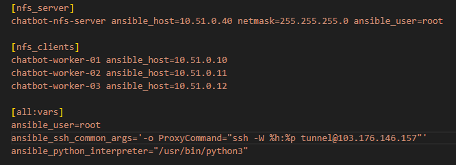

<h1 style="color:orange">Triển khai NFS bằng ansible</h1>

 
<h2 style="color:orange">1. ansible.cfg</h2>

 
File inventory là: ./hosts.yaml 
Đường dẫn đến roles_path là: ../ansible-roles 
<h2 style="color:orange">2. hosts.yaml</h2>

 
- chatbot-nfs-server là NFS server chứa directory để mount đến các k8s worker
- chatbot-worker-01, 02, 03 là các worker k8s. Vì cụm k8s có ít node nên sử dụng NFS mount storage đến các node k8s worker, sau đó các pod được mount tới directory NFS này bằng hostpath

- path dùng để mount trên NFS: /var/nfs/share/ 
- path được mount trên các node worker: /mnt/nfs/
- Config pod mount trong file config deployment k8s trong phần templates của ansible. VD: file chatbot-3.5-platform/chatbot-services/bidv-chatbot/templates/api35/deploy.yaml.j2

 
 
<h2 style="color:orange">3. Chạy file</h2>

    # ansible -m ping all
    # ap main.yaml
