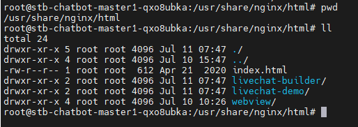

<h1 style="color:orange">Note webview</h1>
Trong file /etc/nginx/conf.d/fptai.conf, thêm block:

    # vim /etc/nginx/conf.d/fptai.conf
    thêm block vào cuối file

    server {
        server_name stb-chatbot-tools.fpt.ai;

        access_log /var/log/nginx/stb-chatbot-tools.fpt.ai_access.log;
        error_log /var/log/nginx/stb-chatbot-tools.fpt.ai_error.log;

        location ~ ^/(livechat-builder|webview|livechat-demo) {
            root /usr/share/nginx/html;
            index index.php index.html index.htm;
            try_files $uri $uri/ =404;
        }

        include /etc/nginx/ssl/fpt.ai-ssl.conf;
    }
Trong đó:
- `sever_name`: là domain mà block này sẽ xử lý
- `access_log`: path file log nginx cho những request đến domain này và mã trả về (vd:200,404,503,...)
- `error_log`: path file error nginx cho những request đến domain này (error xảy ra trong quá trình process, không phải kết quả trả về 400 hay 500)
- `root /usr/share/nginx/html;`: Set root directory trên con nginx để phục vụ hiển thị web tĩnh cho domain này.
- `location`: define URL path cho domain này. Ví dụ khi truy cập "https://stb-chatbot-tools.fpt.ai/livechat-builder" thì nginx sẽ trả về nội dung trong "/usr/share/nginx/html/livechat-builder", tương tự truy cập "https://stb-chatbot-tools.fpt.ai/webview" thì nginx trả về nội dung trong folder "/usr/share/nginx/html/webview", ...
 
- `index`: List ra những file được index để trả về cho request nếu những file này tồn tại trong directory được yêu cầu (vd: webview). Nginx sẽ index những file này theo thứ tự, nếu không define config này thì mặc định nginx sẽ tìm file tên "index.html" để import.
- `try_files`: Define hành động khi access 1 file. Nginx sẽ check nếu file có tồn tại, nếu không sẽ thử access URI như là 1 directory, nếu cả 2 fail thì trả về 404