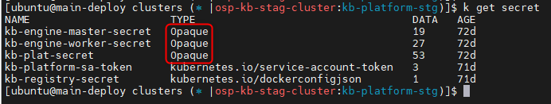
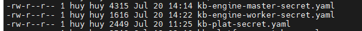
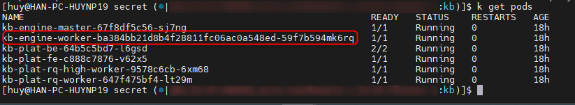
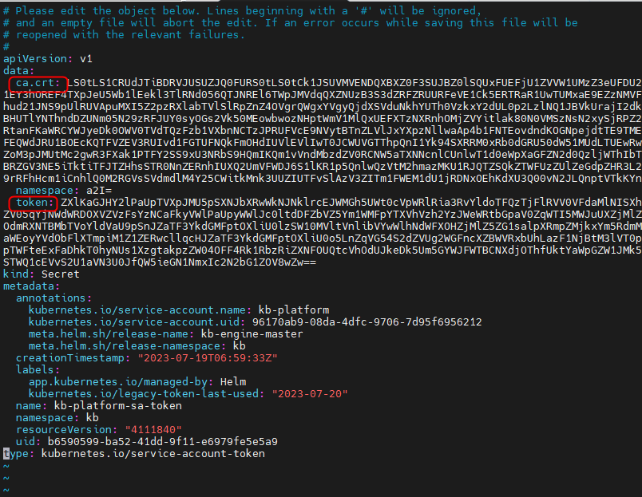
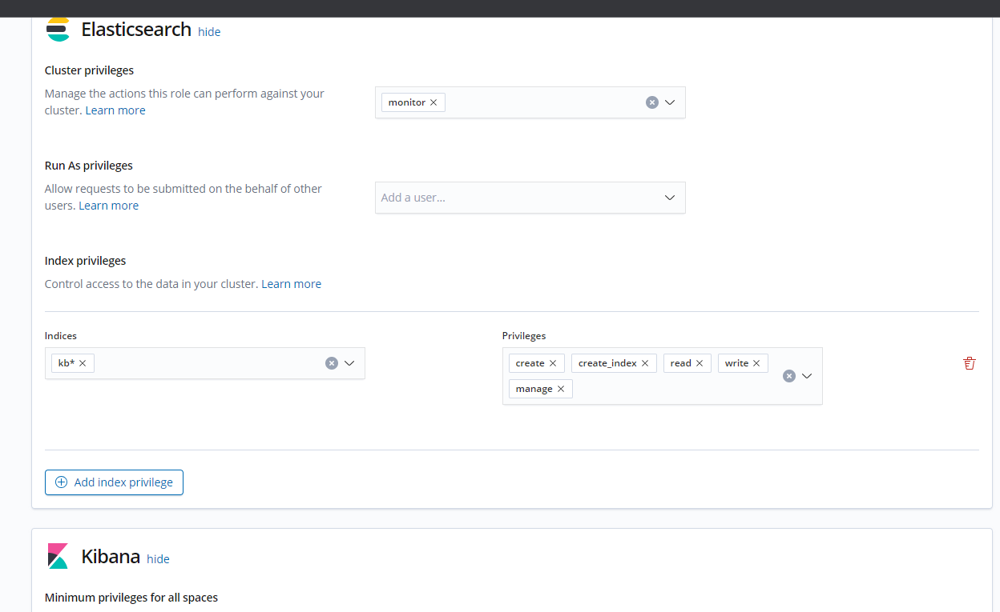
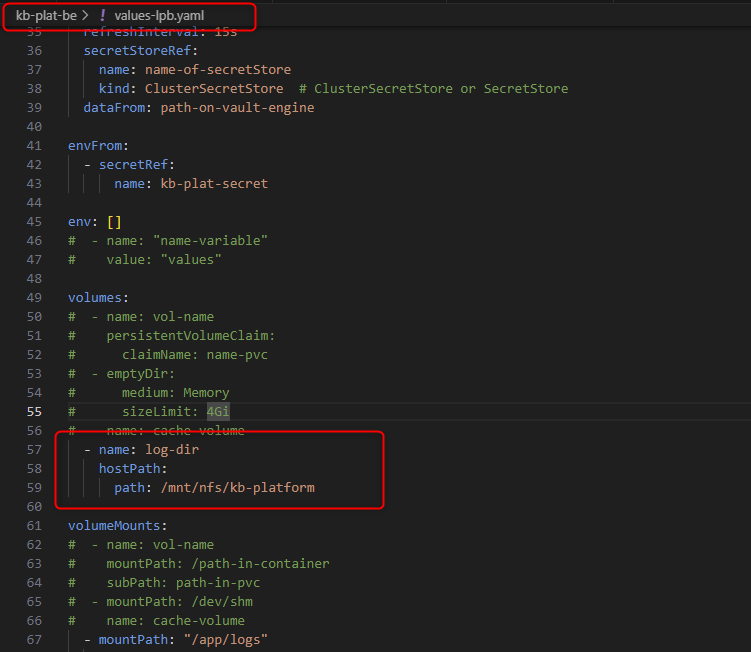

<h1 style="color:orange">Note Deploy kb</h1>
Triển khai kb service trên cụm k8s bằng helm.

Link code helm của kb: https://gitlab.bcnfpt.com/ops/k8s-manifest/tree/master/applications/kb

<br>
KB sẽ có các service: engine-master, plat-backend, plat-frontend,...<br>
Luồng dịch vụ của kb sẽ là: user gọi vào frontend -> gọi backend -> gọi engine-master -> engine-master gọi vào API host để tạo pod engine-worker.

<h2 style="color:orange">2. Deploy biến secret của cụm kb</h2>
Trên cụm kb có sẵn (đã deploy), copy secret của cụm cũ, đổi biến và apply sang cụm mới.

<br>
- Lưu ý những secret có type là 0paque là tự tạo tay
- kb-platform-sa-token là token để access cluster bằng service account (cả service account và token đều được deploy bằng helm). Tuy nhiên hiện tại chưa tạo service account do chưa dùng helm deploy.
- kb-registry-secret là secret tạo từ file ~/.docker/config.json. Để tạo kết nối đến registry của gcloud:

      # gcloud auth configure-docker us-central1-docker.pkg.dev
Sau khi copy và sửa file sẽ có 3 file sau:
<br>
Lưu ý, những file yaml trước khi apply vào cụm k8s phải encode bằng bas64 trước. Link encode: https://www.base64encode.org/<br>
Nếu muốn giải mã có thể dùng base64 decode.
<h3 style="color:orange">2.1. file kb-engine-master</h3>

- config K8S_CA_CRT và K8S_SERVICE_ACCOUNT_TOKEN là crt và token của service account mà helm deploy.<br>
- SYS_CALL_API_KEY: là random string bất kì yêu cầu phải giống nhau giữa các file
- K8S_HOST: mặc định là ip:port của control plane cụm k8s (port 6443). Tuy nhiên với cluster k8s của gcloud là port 443. VD: https://172.16.0.2:443 (IP external)

Lưu ý: Phải deploy kb-engine-master trước mới có thể lấy 2 biến K8S_CA_CRT và K8S_SERVICE_ACCOUNT_TOKEN

    # helm install -f values-lpb.yaml kb-engine-master ./ -n lpb-kb
Lấy ca.crt và token từ kb-platform-sa-token và update vào file kb-engine-master-secret.yaml (2 biến K8S_CA_CRT,  K8S_SERVICE_ACCOUNT_TOKEN)

    # kubectl get kb-platform-sa-token -o yaml
<h3 style="color:orange">2.2. file kb-plat</h3>

- Tạo bucket cho KB
- biến `SECRET_KEY`: là biến dùng đễ mã hóa, có thể dùng 1 string bất kì
<h2 style="color:orange">3. Deploy bằng helm</h2>
Vào từng folder, chạy lệnh:

<br>

    # helm install -f <file-value> <release-name> ./ -n <name-space>
    # helm install -f values-hcid.yaml kb-platform ./ -n kb
    các handy command khác
    # helm delete values-hcid.yaml
    # helm upgrade -f values-hcid.yaml kb-platform ./ -n kb      #để update biến
    # helm list
Sau khi deploy bằng helm cho tất cả các service:<br>
<br>
Pod kb-engine-worker được tạo ra khi vào domain của cụm kb tạo worker.

Lưu ý: khi triển khai helm sẽ tạo 1 service account, 1 role và 1 rolebinding để bind service account vào role đó (role là tập hợp các quyền để thực hiện với cluster)<br>

    # k edit secret kb-platform-sa-token
<br>
Crt của cluster và token của service account.

Link tham khảo: https://kubernetes.io/docs/tasks/configure-pod-container/configure-service-account/

Vào pod kb-plat-fe

    # kubectl exec --stdin --tty kb-plat-fe -- /bin/bash
    chạy lệnh
    # python manage.py migrate    #để tạo bảng trong mysql
<h2 style="color:orange">4. Trouble shooting</h2>

1. Lỗi không kết nối được giữa các pod: check lại rule firewall VPC network của gcloud (hoặc firewall nào đang sử dụng)
2. Lỗi elasticsearch.unauthorized 403 -> do user của elasticsearch chưa đủ quyền
<br>
3. Lỗi cannot connect remote -> check lại K8S_HOST: mặc định là ip:port của control plane cụm k8s (port 6443). Tuy nhiên với cluster k8s của gcloud là port 443. VD: https://172.16.0.2:443 (IP external)

<h2 style="color:orange">5. Checklist deploy kb</h2>
Code is acquired from this git project 

1. Create namespace "kb" on k8s-manage for dedicated environment
2. Acquire passwords of kb user for mysql, elasticsearch and password for redis from huynp19
3. Acquire credential client keycloak for kb client from huynp19
4. Push image to registry (gcr.io, registry.fci.vn, ...)
5. Create kb-registry-secret to be able to pull image with this secret
       
       # kubectl create secret generic kb-registry-secret --from-file=.dockerconfigjson=~/.docker/config.json --type=kubernetes.io/dockerconfigjson -n <kb_namespace>
6. Clone secrets from previous project and replace corresponding configs (kb-engine-master-secret, kb-engine-worker-secret, kb-plat-secret)
7. Deploy kb-engine-master
   
       helm install -f values-lpb.yaml kb-engine-master ./ -n lpb-kb
8. Acquire ca.crt và token from kb-platform-sa-token and update into kb-engine-master-secret.yaml file (these 2 variables K8S_CA_CRT,  K8S_SERVICE_ACCOUNT_TOKEN)

       kubectl get kb-platform-sa-token -o yaml
9. Ask huynp19 to create corresponding nfs for kb-plat-be service
<br>
10. Deploy services with helm:
```
helm install -f values-lpb.yaml kb-engine-master ./ -n lpb-kb
helm install -f values-lpb.yaml kb-plat-be ./ -n lpb-kb
helm install -f values-lpb.yaml kb-plat-fe ./ -n lpb-kb
helm install -f values-lpb.yaml kb-plat-rq-high-worker ./ -n lpb-kb
helm install -f values-lpb.yaml kb-plat-rq-worker ./ -n lpb-kb
```
11. Deploy filebeat

        # kubectl apply -f filebeat-manifest-lpb.yaml
12. Create tables in mysql

        # kubectl exec --stdin --tty <kb-plat-fe-podid> -- /bin/bash
        run command:
        # python manage.py migrate    #to create tables in mysql
Handy command:
```
helm install -f <file-value> <release-name> ./ -n <name-space>
helm install -f values-hcid.yaml kb-platform ./ -n kb
helm delete values-hcid.yaml
helm upgrade -f values-hcid.yaml kb-platform ./ -n kb      #to update variables
helm list
```