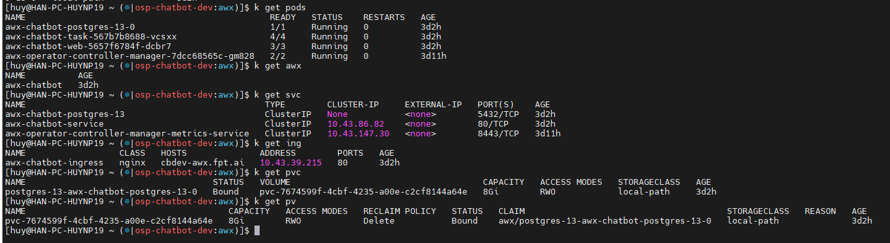
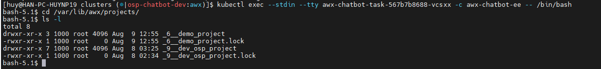
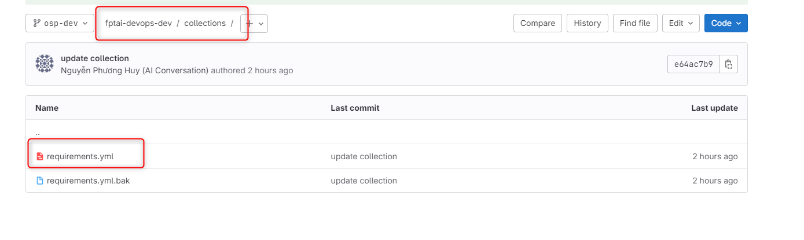
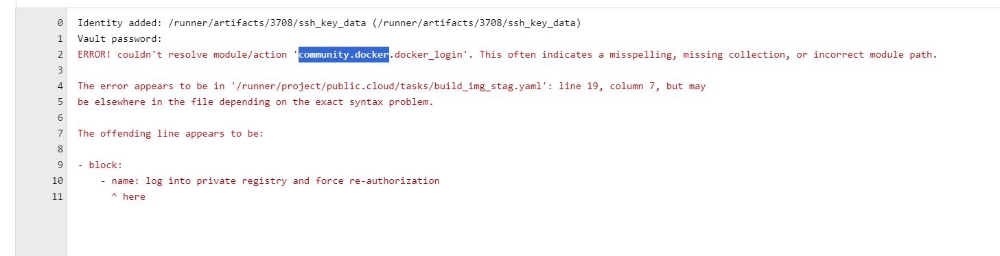
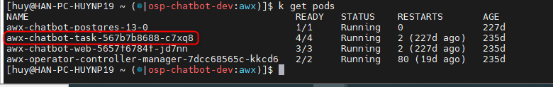

<h1 style="color:orange">Deploy awx trên cụm k8s</h1>
Yêu cầu, cài kustomize: 

    $ curl -s "https://raw.githubusercontent.com/kubernetes-sigs/kustomize/master/hack/install_kustomize.sh"  | bash
Cài iexec:

    $ kubectl krew install iexec
<h2 style="color:orange">1. Tạo file cần thiết</h2>
Tạo file awx-chatbot.yml

    $ vim awx-chatbot.yml
    
    ---
    apiVersion: awx.ansible.com/v1beta1
    kind: AWX
    metadata:
      name: awx-chatbot
    spec:
      service_type: clusterip
      ingress_type: ingress
      hostname: cbdev-awx.fpt.ai
 
    ##################################################
    #### Not in use, intended for reference only #####
    ##################################################
    # service_type: nodeport                         #
    # nodeport_port: 30080                           #
    # ingress_type: route                            #
    # route_host: cbdev-awx.fpt.ai                   #
    # route_tls_termination_mechanism: Passthrough   #
    # route_tls_secret: custom-route-tls-secret-name #
    # ingress_type: ingress                          #
    # hostname: cbdev-awx.fpt.ai                     #
    ##################################################
Tạo file kustomization.yml

    $ vim kustomization.yml

    ---
    apiVersion: kustomize.config.k8s.io/v1beta1
    kind: Kustomization
    resources:
      # Find the latest tag here: https://github.com/ansible/awx-operator/releases
      - github.com/ansible/awx-operator/config/default?ref=2.5.0
      - awx-chatbot.yml
 
    # Set the image tags to match the git version from above
    images:
      - name: quay.io/ansible/awx-operator
        newTag: 2.5.0
 
    # Specify a custom namespace in which to install AWX
    namespace: awx
<h2 style="color:orange">2. Chạy lệnh để deploy</h2>

Tham khảo: https://github.com/ansible/awx-operator/blob/devel/docs/installation/basic-install.md

    $ kubectl create ns awx

    # Deploy `awx-operator-controller-manager` and `awx-chatbot`
    $ kustomize build . | kubectl apply -f -
 
    ###########################################################################
    # Allow some time to get the images pulled and for the database migration #
    ###########################################################################
    --------------------------------
    # View running process logs
    $ kubectl logs -f deployments/awx-operator-controller-manager -c awx-manager
    --------------------------------
    # Check resources (add `-l "app.kubernetes.io/managed-by=awx-operator"` or `-w` if required)
    # For example:
    $ kubectl get pods -l "app.kubernetes.io/managed-by=awx-operator" -w

    $ kubectl apply -f awx-chatbot.yml
    $ kubectl apply -f https://raw.githubusercontent.com/rancher/local-path-provisioner/master/deploy/local-path-storage.yaml
    $ kubectl patch sc local-path -p '{"metadata": {"annotations":{"storageclass.kubernetes.io/is-default-class":"true"}}}'
    $ kubectl get sc
 
    $ kubectl ns awx
Check
<br>
<h2 style="color:orange">3. Lấy password</h2>

    $ kubectl get secret awx-chatbot-admin-password -n awx -o jsonpath="{.data.password}" | base64 --decode
Đăng nhập vào browser awx bằng user admin và pass vừa lấy được
<h2 style="color:orange">4. Check sâu hơn với awx</h2>

    # List all containers in `awx-chatbot` pod
    $ kubectl get pods awx-chatbot-task-774f658b87-d5xh9 -o jsonpath='{.spec.containers[*].name}*'
    --------------------------------
    # Enter `awx-chatbot-task` container to check information
    $ kubectl iexec OR $ kubectl-iexec
    # then choose your desired pod and container, and run: awx-manage version && awx-manage check_db
    --------------------------------
    # Enter `awx-chatbot-web` to create a new superuser or change user's password
    $ kubectl iexec OR $ kubectl-iexec
    # then choose your desired pod and container, and run commands:
    #   awx-manage createsuperuser
    #   awx-manage createsuperuser --user admin
    #   awx-manage changepassword admin
    --------------------------------
    # Enter `awx-chatbot-ee` to use Ansible commands (e.g., install Ansible role or collection, etc.)
    $ kubectl iexec OR $ kubectl-iexec
    # then choose your desired pod and container, and run commands:
    #   ansible --version
    #   ansible-galaxy collection install community.general
    #   ansible-galaxy collection install community.docker

Các project được lưu trong `/var/lib/awx/projects/` trong pod `awx-chatbot-task`, trong container awx-chatbot-ee

    # kubectl exec --stdin --tty awx-chatbot-task-567b7b8688-vcsxx -c awx-chatbot-ee -- /bin/bash
    # cd /var/lib/awx/projects/
<br>

Lưu ý: nếu viết file ansible có sử dụng `community.docker` thì khi đẩy lên awx phải tạo file collections define các community collection trên git repo:
<br>

```
collections:
- name: community.general
- name: community.docker
```
nếu không sẽ có lỗi này khi deploy:
<br>
Tuy nhiên, mỗi khi chạy template deploy, awx sẽ tải các file community này từ internet về. Để khiến các file này static và không tốn thời gian deploy:

Thực hiện đẩy file thủ công vào container chạy project deploy:
<br>

```
$ kubectl cp ./community-general-9.0.1.tar.gz awx-chatbot-task-567b7b8688-c7xq8:/runner -c awx-chatbot-ee
$ kubectl cp ./community-docker-3.10.3.tar.gz awx-chatbot-task-567b7b8688-c7xq8:/runner -c awx-chatbot-ee
$ kubectl cp ./community-library_inventory_filtering_v1-1.0.1.tar.gz awx-chatbot-task-567b7b8688-c7xq8:/runner -c awx-chatbot-ee
```
Các file này tải từ:
- https://galaxy.ansible.com/api/v3/plugin/ansible/content/published/collections/artifacts/community-docker-3.10.3.tar.gz<br>
- https://galaxy.ansible.com/api/v3/plugin/ansible/content/published/collections/artifacts/community-library_inventory_filtering_v1-1.0.1.tar.gz<br>
- https://galaxy.ansible.com/api/v3/plugin/ansible/content/published/collections/artifacts/community-general-9.0.1.tar.gz<br>

Thay nội dung file requirements từ
```
collections:
- name: community.general
- name: community.docker
```
thành
```
collections:
  - name: /runner/community-docker-3.10.3.tar.gz
    type: file
  - name: /runner/community-general-9.0.1.tar.gz
    type: file
  - name: /runner/community-library_inventory_filtering_v1-1.0.1.tar.gz
    type: file
```

<h2 style="color:orange">5. Xóa awx</h2>

    # Delete AWX objects
    kubectl delete awx awx-chatbot
    --------------------------------
    # Delete PVC !!!!
    kubectl delete pvc postgres-13-awx-chatbot-postgres-13-0
    --------------------------------
    # Delete Operator and CRDs associated
    git clone https://github.com/ansible/awx-operator.git
    cd awx-operator
    make undeploy
        /usr/local/bin/kustomize build config/default | kubectl delete -f -
        namespace "awx" deleted
        customresourcedefinition.apiextensions.k8s.io "awxbackups.awx.ansible.com" deleted
        customresourcedefinition.apiextensions.k8s.io "awxrestores.awx.ansible.com" deleted
        customresourcedefinition.apiextensions.k8s.io "awxs.awx.ansible.com" deleted
        serviceaccount "awx-operator-controller-manager" deleted
        role.rbac.authorization.k8s.io "awx-operator-awx-manager-role" deleted
        role.rbac.authorization.k8s.io "awx-operator-leader-election-role" deleted
        clusterrole.rbac.authorization.k8s.io "awx-operator-metrics-reader" deleted
        clusterrole.rbac.authorization.k8s.io "awx-operator-proxy-role" deleted
        rolebinding.rbac.authorization.k8s.io "awx-operator-awx-manager-rolebinding" deleted
        rolebinding.rbac.authorization.k8s.io "awx-operator-leader-election-rolebinding" deleted
        clusterrolebinding.rbac.authorization.k8s.io "awx-operator-proxy-rolebinding" deleted
        configmap "awx-operator-awx-manager-config" deleted
        service "awx-operator-controller-manager-metrics-service" deleted
        deployment.apps "awx-operator-controller-manager" deleted
    --------------------------------
    # Delete namespace (if necessary)
    kubectl delete ns awx