<h1 style="color:orange">Setup awx với gitlab</h1>
Tham khảo: https://baptiste.bouchereau.pro/tutorial/setup-awx-with-gitlab/

Hướng dẫn thực hiện trên awx 22.5.0
<h2 style="color:orange">1. Tạo gitlab key</h2>
Trong hướng dẫn thực hiện clone code gitlab bằng https. Do đó, phải tạo Personal Access Tokens thay vì SSH key nếu clone bằng ssh.

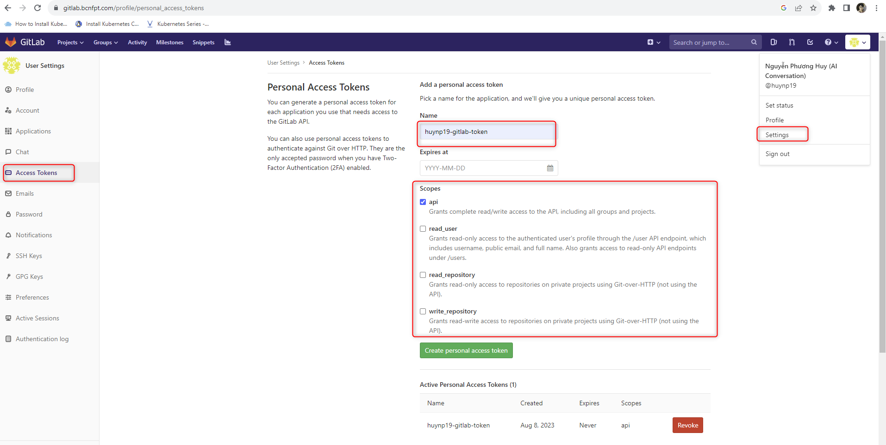 
User Settings -> Access Tokens -> gõ name cho PAT (personal access tokens) -> chọn scope (quyền) -> create PAT. Lưu ý, lưu lại mã được gen ra, vì mã này sẽ không xuất hiện lại khi reload trang, phải tạo lại PAT khác.
<h2 style="color:orange">2. Tạo Source Control credential cho gitlab trên AWX</h2>

Trên awx: Resources -> Credentials -> Add.  
Tạo key: Name, Credential Type: Source Control, Username: user có quyền pull từ repo, Password: là PAT vừa được tạo 
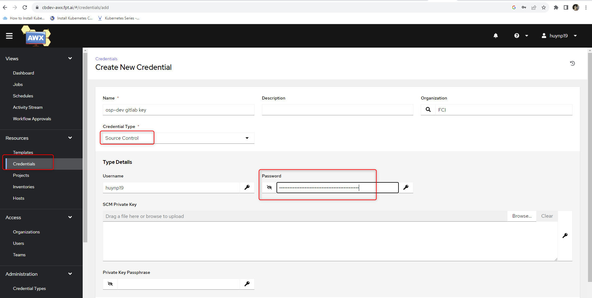 
<h2 style="color:orange">3. Tạo project</h2>

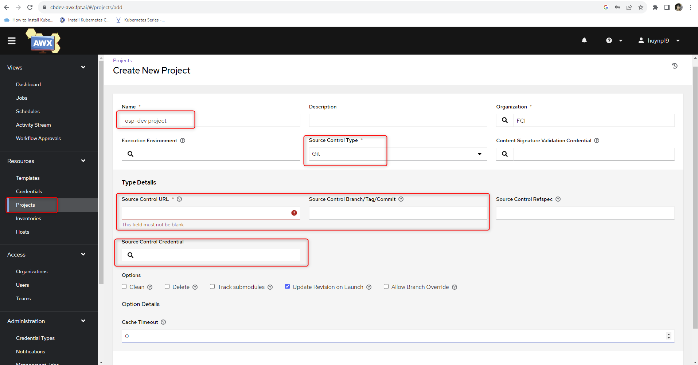 
Resources -> Projects -> Add 
Thêm name,  
Soure Control Type: git  
Source control URL: link https của repo git 
Chọn branch 
Options: Update Revision on Launch - để cho trước khi launch, awx sẽ pull code từ git về nếu có thay đổi
Source Control Credential: source control credential vừa tạo ở bước 2

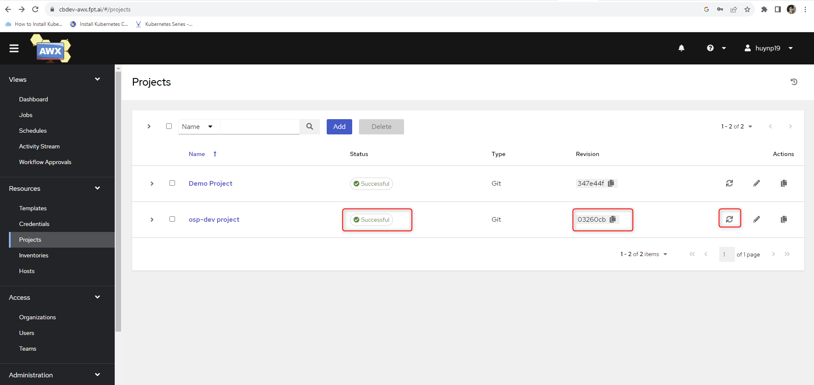 
Sau khi tạo xong project, ấn sync phải cho ra status `Successful` có nghĩa là AWX pull thành công code từ git, Revision là hash ID của commit của git
<h2 style="color:orange">4. Tạo inventory</h2>
Bây giờ AWX đã có thể fetch Ansible files từ Gitlab, import host và variables.

Lưu ý: Variable được locate trong folder đặt tên là group_vars hoặc host_vars. Nếu đặt tên khác sẽ có thể ko chạy. 
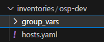 

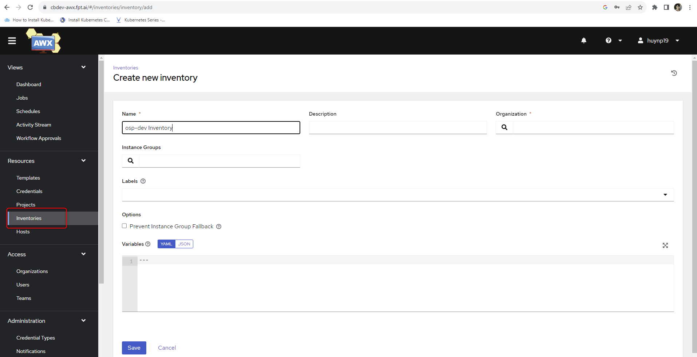 
Resource -> Inventories. Tạo name cho Inventory -> Save 
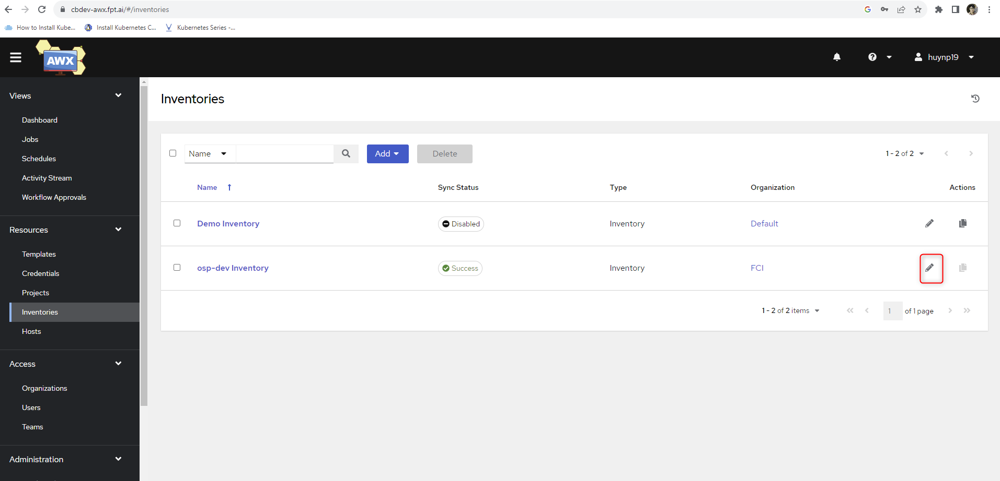 
Edit inventory vừa tạo: Sources -> Add: 
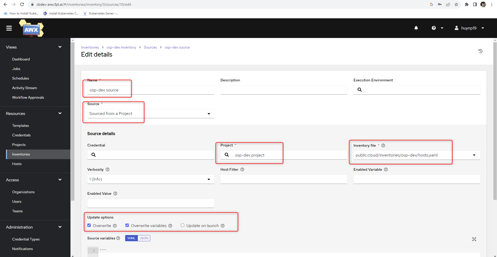 
Name project 
Source: Sourced from a Project 
Project: Project vừa tạo 
Inventory file: define path đến Inventory file trên code git 
Update Options: Overwrite, Overwrite variables 
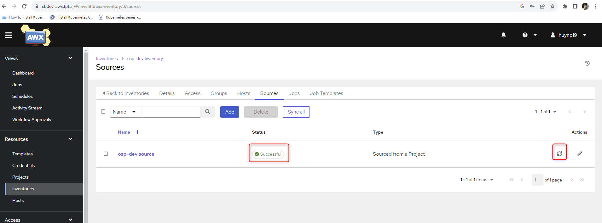 
Sync trả về result successful.

Khi đó, file Hosts trong Resource và variable trong Inventories sẽ tự động được tạo.

<h2 style="color:orange">5. Credential</h2>

- Nếu host để chạy code ansible cần ssh_key thì tạo thêm credential type machine
- Nếu playbook có mã hóa bằng ansible_vault thì phải tạo thêm credential type Vault
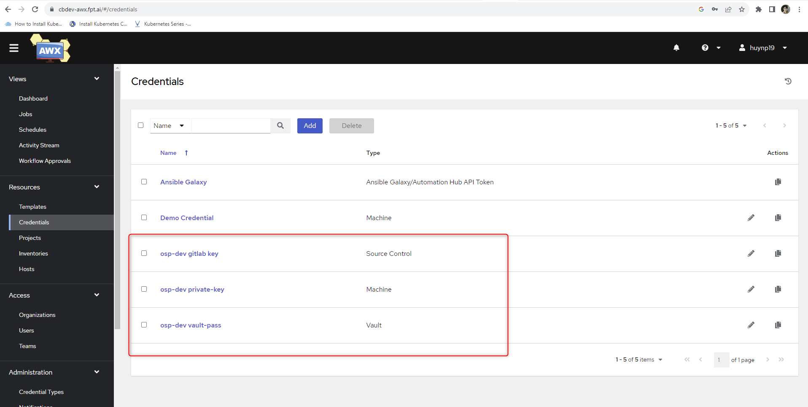 
<h2 style="color:orange">6. Tạo template</h2>

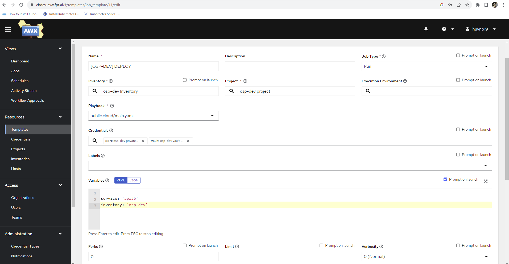 
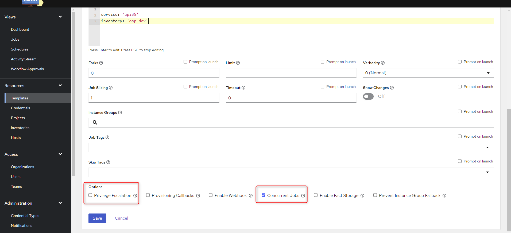 
Lưu ý không chọn trường `Privilege Escalation` này