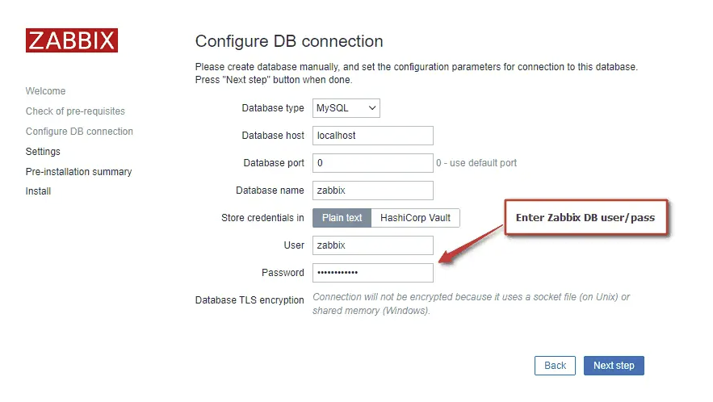
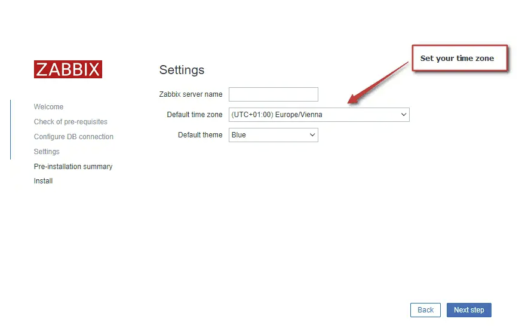

<h1 style="color:orange">Cài đặt Zabbix</h1>
Chuẩn bị: server ubuntu 20.04: 10.51.0.253 
server mysql là db cho zabbix: 10.51.0.15
<h2 style="color:orange">1. Trên Zabbix-server</h2>
Cài zabbix repo

    # wget https://repo.zabbix.com/zabbix/6.4/ubuntu/pool/main/z/zabbix-release/zabbix-release_6.4-1+ubuntu20.04_all.deb
    # dpkg -i zabbix-release_6.4-1+ubuntu20.04_all.deb
    # apt update
Cài zabbix
    
    # apt install zabbix-server-mysql zabbix-frontend-php zabbix-nginx-conf zabbix-sql-scripts zabbix-agent2 zabbix-agent2-plugin-*
<h2 style="color:orange">2. Trên mysql</h2>

    # mysql -uroot -p
    mysql> create database zabbix character set utf8mb4 collate utf8mb4_bin;
    mysql> create user zabbix@localhost identified by 'password';
    mysql> grant all privileges on zabbix.* to zabbix@localhost;
    mysql> set global log_bin_trust_function_creators = 1;
    mysql> quit;
Chuyển file sau từ zabbix server sang chạy trên mysql

    # scp /usr/share/zabbix-sql-scripts/mysql/server.sql.gz root@10.51.0.15:/root/
Trên mysql-server:

    # zcat /root/server.sql.gz | mysql --default-character-set=utf8mb4 -uzabbix -p zabbix
Câu lệnh sẽ chạy patch và tạo table trong database zabbix của mysql

    # mysql -uroot -p
    mysql> set global log_bin_trust_function_creators = 0;
    mysql> quit;
<h2 style="color:orange">3. Config database cho zabbix server</h2>

    # vim /etc/zabbix/zabbix_server.conf
    paste vào
    DBHost=10.51.0.15
    DBName=zabbix
    DBUser=zabbix
    DBPassword=password

    # config java-gateway
    JavaGateway=10.51.0.253    #ip node zabbix-server
    JavaGatewayPort=10052
    StartJavaPollers=5
    LogSlowQueries=3000
    StatsAllowedIP=127.0.0.1
<h2 style="color:orange">4. Config PHP cho zabbix frontend</h2>

    # vim /etc/zabbix/nginx.conf
    uncomment các dòng sau

    # listen 8080;
    # server_name example.com;
Start zabbix

    # systemctl restart zabbix-server zabbix-agent2 nginx php7.4-fpm
    # systemctl enable zabbix-server zabbix-agent2 nginx php7.4-fpm
Lưu ý mở port 10050 (zabbix-agent), 10051 (zabbix-server), 80 và 8080 (nginx)
<h2 style="color:orange">5. Đăng nhập vào zabbix để setup</h2>
Trên web-browser, đăng nhập vào địa chỉ 10.51.0.253:8080 để setup zabbix

 
 
Sau khi setup xong, đăng nhập vào zabbix bằng user mặc định Admin / zabbix
<h2 style="color:orange">6. Tối ưu zabbix</h2>

    # vim /etc/zabbix/zabbix_server.conf
    StartPollers=100
    StartPollersUnreachable=50
    StartPingers=50
    StartTrappers=10
    StartDiscoverers=15
    StartPreprocessors=15
    StartHTTPPollers=5
    StartAlerters=5
    StartTimers=2
    StartEscalators=2
    CacheSize=128M
    HistoryCacheSize=64M
    HistoryIndexCacheSize=32M
    TrendCacheSize=32M
    ValueCacheSize=256M

    # systemctl restart zabbix-server
<h2 style="color:orange">7. Install zabbix-java-gateway</h2>
zabbix-java-gateway để giám sát ứng dụng chạy bằng java

    # apt update -y
    # apt install -y zabbix-java-gateway
Cấu hình zabbix-gateway, sau khi install zabbix_java_gateway xong thì sẽ có file zabbix_java_gateway.conf trong phần vùng /etc/zabbix/

    # vim /etc/zabbix/zabbix_java_gateway.conf
    sửa các dòng
    LISTEN_IP="0.0.0.0"
    LISTEN_PORT=10052
    PID_FILE="/var/run/zabbix/zabbix_java_gateway.pid"
    START_POLLERS=5
    TIMEOUT=3

    # systemctl restart zabbix-java-gateway
<h2 style="color:orange">8. Note cấu hình agent cho các module</h2>
Cài đặt zabbix-agent2: 

Link tham khảo: https://www.zabbix.com/download?zabbix=6.4&os_distribution=ubuntu&os_version=20.04&components=agent_2&db=&ws=

<h3 style="color:orange">8.1. Cấu hình mysql</h3>

    # vim /etc/zabbix/zabbix_agent2.d/plugins.d/mysql.conf

    Plugins.Mysql.Sessions.MySql1.Uri=unix:/var/run/mysqld/mysqld.sock
    Plugins.Mysql.Sessions.MySql1.User=zbx_monitor
    Plugins.Mysql.Sessions.MySql1.Password=<password>
Tạo user zbx_monitor trên mysql:

    mysql> CREATE USER 'zbx_monitor'@'%' IDENTIFIED BY '<password>';
    mysql> GRANT REPLICATION CLIENT,PROCESS,SHOW DATABASES,SHOW VIEW ON *.* TO 'zbx_monitor'@'%';
Tạo macro trong phần host macro:

    Macro: {$MYSQL.DSN}
    Value: MySql1
Lưu ý, giá trị macro phải trùng với giá trị trong file plugins.d/mysql.conf
<h3 style="color:orange">8.2. Cấu hình mongo</h3>

Install plugin mongo: link tham khảo: https://repo.zabbix.com/zabbix/6.4/ubuntu/pool/main/z/zabbix-agent2-plugin-mongodb/ 

    # dpkg -i ./zabbix-agent2-plugin-mongodb_6.4.0-1+ubuntu20.04_amd64.deb
Sau khi install xong sẽ có file mongodb.conf trong /etc/zabbix/zabbix_agent2.d/plugins.d/mongodb.conf 
Cấu hình file plugin.d cho mongo:

    # vim /etc/zabbix/zabbix_agent2.d/plugins.d/mongodb.conf
    paste vào
    Plugins.MongoDB.Sessions.MongoDevdb1.Uri=tcp://127.0.0.1:27017
    Plugins.MongoDB.Sessions.MongoDevdb1.User=zbx_monitor
    Plugins.MongoDB.Sessions.MongoDevdb1.Password=<password>
Tạo user mongo và phân quyền

    use admin;
    db.createUser({user: "zbx_monitor", pwd:  "<password>", roles: [{role: "userAdminAnyDatabase", db: "admin"}, {role: "clusterMonitor", db: "admin"}]});
    db.getUser("zbx_monitor");
Tạo macro trên host mongo (zabbix):

    Macro: {$MONGODB.CONNSTRING}
    Value: MongoDevdb1
Lưu ý, giá trị macro phải trùng với giá trị trong file plugins.d/mongodb.conf
<h3 style="color:orange">8.3. Cấu hình redis</h3>

    # vim /etc/zabbix/zabbix_agent2.d/plugins.d/redis.conf

    Plugins.Redis.Sessions.RedisDev1.Uri=tcp://127.0.0.1:6379
    Plugins.Redis.Sessions.RedisDev1.Password=<password>
Tạo macro:

    Macro: {$REDIS.CONN.URI}
    Value: RedisDev1
<h3 style="color:orange">8.4. Cấu hình elasticsearch</h3>
Tạo trên elasticsearch
    
    POST /_security/user/zbx_monitor
    {
      "password" : "<p@ssw0rd>",
      "roles" : [ "remote_monitoring_collector" ],
      "full_name" : "Zabbix Monitor User",
      "email" : null,
      "metadata" : { },
      "enabled" : true
    }
Tạo macro:

    Macro: {$ELASTICSEARCH.USERNAME}
    Value: zbx_monitor
    Macro: {$ELASTICSEARCH.PASSWORD}
    Value: <p@ssw0rd>
<h3 style="color:orange">8.5. Cấu hình kafka</h3>

    # vim /usr/local/kafka/kafka-broker.env

    KAFKA_JMX_OPTS="-Dcom.sun.management.jmxremote=true \
                -Dcom.sun.management.jmxremote.authenticate=false \
                -Dcom.sun.management.jmxremote.ssl=false \
                -Djava.rmi.server.hostname=<server_IP> \
                -Dcom.sun.management.jmxremote.port=9999"
    
    # systemctl restart kafka
Tạo macro:

    Macro: {$KAFKA.USER}
    Value:
    Macro: {$KAFKA.PASSWORD}
    Value: